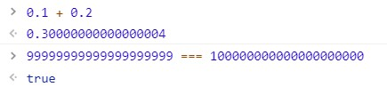
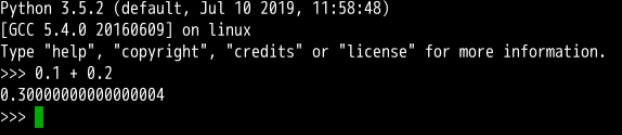

看几道小学算术题：
[1]. 0.1 + 0.2 === 0.3
[2]. 99999999999999999999 === 100000000000000000000

等号两边是相等的吗？

在 js 中这两个简单的数学题是有违认知的。
口说无凭，试一试

这里放截图


从结果可以看出，第一个算术题是不等的，而第二个算术题竟然是正确的。我的数学观崩塌了。。。

我没读过多少书，你他喵不要骗我呀。

两个数明明不一样，咋就相等了勒？

这是为什么，难道是 js 的问题，运用控制变量法，换一个编程语言碰一碰。

Python3 的测试结果如图：


这俩儿货莫非是串通好的？

那么，从 Python3 的测试结果来看，可以推测发生这个状况是与具体的编程语言无关的。那这口锅谁来背？

---

搜索 一下，看来问这道题的人有很多呀。


嗯，这个问题其实会涉及到大学学的《计算机组成原理》这门课的部分知识。

往简单了的解释就是：遵循 IEEE 754 标准的语言都有这个问题。这个锅应该它来背。

往复杂了说，这里面牵扯到进制转换和对阶运算。精度缺失就发生在这两个阶段，因为标准位数的限制，0.1 和 0.2 在转换成二进制数时，多余的位会被截胡，这是已经就会损失一部分精度。再者，在不同指数位数的数字间进行运算时，需要先进行对阶运算，这个操作也是会有精度损失的。

---
知道了问题产生的原因，那么如何解决这个问题嘞？

对于第1个算术题，这是浮点运算精度的问题。
正确的比较方法是比较最小精度：
```js
Math.abs(0.1 + 0.2 - 0.3) <= Number.EPSILOW
```

---
嗯，第一个问题解决了，那么第二个问题勒。

两个肉眼可见不同的数字，居然返回 true。

这不是睁眼说瞎话吗？

这个问题产生的原因是，数字太大，超出了 js 所能控制的范围 Number.MAX_SAFE_INTEGER。那我就是要比较要怎么搞嘞？

办法还是有的，就是使用 ES6 中的 BigInt 类型，来比较，简单来说，把 `n` 加到数字的后面。
```js
99999999999999999999n === 100000000000000000000n
// false
```

嗯，这两道算术题真他喵的简单。

看样子，还是要抽空复习一下《计算机组成原理》的。

美好的周末又开始了。


