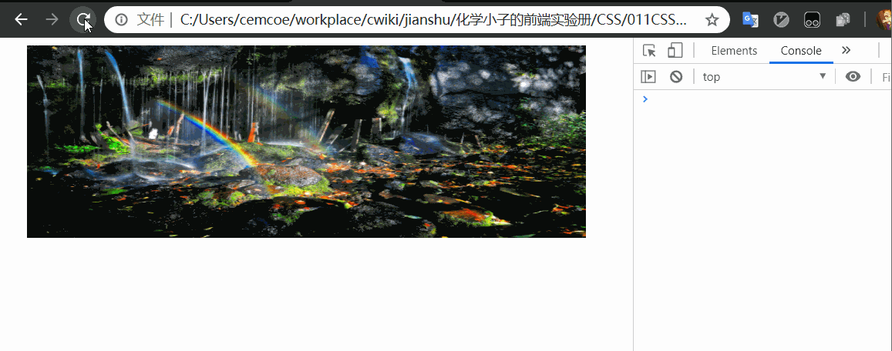

轮播图也是一种常见的网页效果，多使用在网页的中上部的显著位置，用于吸引用户注意力。

轮播图和前面写的 [CSS 效果 | tab 选项卡](https://www.jianshu.com/p/fdd58caea73f) 有一定的相通之处，技术点有一定的重合。

来看看一个轮播图：


猛然发现明天是个节日，各位节日快乐。

看图来分析（瞎掰）一波：先分析网页元素，通过瞧一瞧和看一看可以发现有两种网页元素，一种是尺寸一致的图片，另一种是下方的小圆白点。


接着来分析这些元素的行为，在没有操作时，每隔一段时间图片就会换一张，以达到轮播的效果，真是一个成熟的轮播图，已经会自己动了。另外，选择小白点同样可以快速地切换到与其对应的图片。

结合以上瞎掰，可以知道触发图片轮播的方式有两种，分别是：
- 装作没看见，不要理他，等一段时间让系统自己切换
- 主动点击（hover），快速切换到自己想看的图片

---

先从简单的情况，即不去理他开始，成熟的轮播图，自已要会动。


这里假定HTML 结构是这样的：
```html
<div class="container">
    <div class="wrap">
        
        
        
    </div>
</div>
```
图片素材来自[这](http://www.polayoutu.com/collections)

按皮影戏来类比的话，其中 container 是一个大的框框，wrap 是表演的幕布，图片就是上台纸片人儿。


怎么演好一场皮影戏呢？不是，怎么写好一个轮播图呢？

现在的情况是道具准备好了，那么接下来要做的就是拿起纸片人，排排坐吃果果。

如何用代码实现呢，其实要运用布局，利用浮动将图片换到同一行，并将盒子设置超出部分隐藏。

幕布暗处是不能让观众看到的。

当然，将图片换到一行也可以使用其他的法子，各显神通就好。

利用布局 float 可以 flex 也行，反正就是把原本一列的东西换成一行，再借助定位改变 left 值切换图片。

```css
.container {
    position: relative;
    width: 600px;
    height: 200px;
    overflow: hidden;
}
.wrap {
    position: absolute;
    width: 1800px;
    /* 图片宽度 * 个数 */
    height: 200px;
    /* left: 10px; */
}
.wrap img {
    float: left;
    width: 600px;
    height: 200px;
}
```

在控制台模拟一下


没错，是我们想要的结果，一开始各个纸片人放在桌子上，我们想方法把他们排成一排，你方唱唱罢我登场。

其中展示哪个图片可以通过控制 wrap 的 left 值来更改。

---

下面来理一理 js 的逻辑，即实现隔一段时间就换图的功能，用控制台手动改 left 值肯定是不行的呀。

```js
// 我的任务是定时改变 wrap 的 left 值
// 先获取 wrap
const wrap = document.querySelector(".wrap")

//需要用到定时器
setInterval(() => {
    wrap.style.left = parseInt(wrap.style.left) - 60 + 'px'
    console.log(parseInt(wrap.style.left))
}, 1000)
```


第一种简单的情况基本搞定。
第二种和 [CSS 效果 | tab 选项卡](https://www.jianshu.com/p/fdd58caea73f) 类似，需要将小白点和图片进行绑定，这里就不展开了。

---

通过预览可以发现，现在基本的逻辑已经打通了，目前而言，仍存在以下问题：
- 当 left 的绝对值过大时会没有图片可供显示
- 切换效果有点生硬，看着不流畅
- 涉及大量的宽度和高度的计算，改一个数字，其他都要重新计算

工作中直接使用框架就好，目前用的较多的轮播图组件是https://github.com/nolimits4web/swiper

至于上面提到的存在的问题咋个解决，有空再写吧。我好懒呦。


