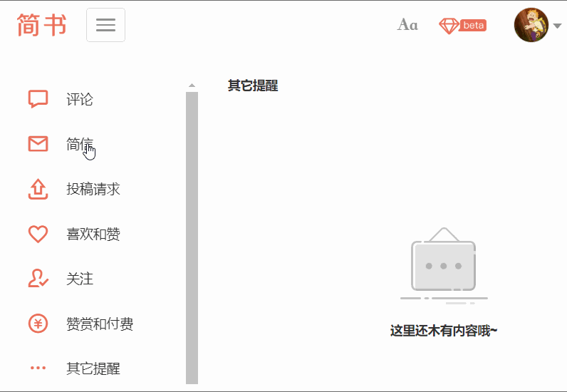
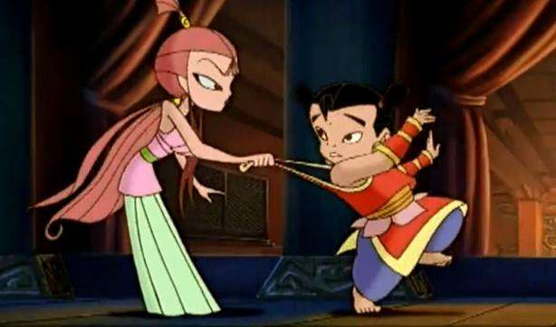
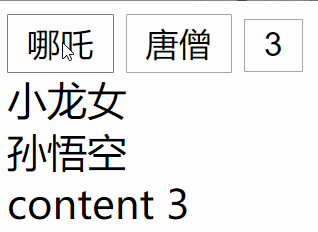
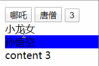

tab 选项卡效果是页面中常见的网页效果，技术点在于，如何将控制区的元素和响应区的元素一一绑定或者说是建立羁绊。

在 jianshu 网页版就有一个类似的左右结构的 tab 效果。

在这个例子中左侧为控制区域，右侧为响应区域。至于为什么没有显示内容，是因为我故意点的有点快了。

----
来试一试如何实现类似的效果，这里先假定 HTML 文档结构是这样的

```html
<button>哪吒</button>
<button>唐僧</button>
<button>3</button>
<div>小龙女</div>
<div>孙悟空</div>
<div>content 3</div>
```

3个 button 是控制区域，3个 div 是响应区域。

控制区域的 button 被点击时，响应区与之绑定的 div 就要做出响应的动作。

先把这个问题转化抽象，每个按钮和每个内容区应该是绑定的，成对的，这样在一个按钮被点击时，与之绑定的内容区才能显示出来。

而现在的问题是：结构上六个元素是并列的关系，每个元素都是独立的个体。那么，我们的首要任务是想办法让这些元素产生羁绊。这本该是月老的活。

举几个例子，在小龙女和哪吒之间，这个羁绊就是小海螺；在唐僧和孙悟空之间，紧箍咒就是。

想一下，小龙女的小海螺，如果把按钮当成哪吒，被点击当成遇到危险，遇到危险要吹小海螺，小龙女听到海螺的声音后，立马出现。完事以后就幸福的在一起。




关于小海螺的百科：
> 还未完全修成人形的石矶施展部分已修成的法力，将白雪皑皑的冬天变成夏天，雪瞬间全部化掉，变成大水后一泻千里，一座城瞬间被淹没，难民随处可见。雷震子被淹没在水中，设法求助，跑出来玩的哪吒和恰巧发现他求助的小龙女一起出现救了他，于是哪吒与小龙女认识了，三人一起合伙想办法解救这些难民。这之后太乙真人施法将水定住，难民们得救。哪吒与小龙女成为好伙伴，二人分开之时，小龙女送了他一个小海螺，告诉他以后只要一吹小海螺，她就会出现。


将上述过程分解，可以得到如下步骤：
- 在茫茫人海中找到两人
- 在两者之间建立羁绊，赠送小海螺，或者紧箍咒
- 遇到危险，吹小海螺或者念紧箍咒(嗯，好像有点不妥)


当然，上面分析的是一对的情况，程序擅长重复性的工作，这里我们暂时假定有3对。


---

下面分析如何用代码来实现这个事情。

复习一下，需要用到的知识点
- 如何使用 JavaScript 选取元素 | querySelectorAll()
- 如何将按钮和内容一一对应 | index
- 如何使用 JavaScript 给元素添加 CSS 属性 | ele.style.color = "#f40"
- 如何控制元素地显示和隐藏 | display：none
- 如何使用 JavaScript 改变元素的 class 数组


下面逐个实现：
第一个过程，点击按钮，由用户触发，我们就无需关心了。
第二个过程，人物呼救，我们这里抽象为按钮在控制台输出响应的信息。

将所有的按钮放到数组里，js 选择元素的方法， byid 老了 mdn 推荐querySelectorAll()。

点击喊出自己的编号，先用for in 实现，这里 ES5 的 var 会有作用域的问题，使用ES6 中的 let 完成。

现在要让小龙女听到呼救，这里将听到呼救的小龙女背景色变成海的蓝色。

```js
const buttons = document.querySelectorAll('button')
const divs = document.querySelectorAll("div")

for (let i = 0; i < buttons.length; i++) {
    buttons[i].onclick = () => {
        console.log(i)
        divs[i].style.backgroundColor = 'blue'

    }
}
```

然而这里有一个问题，就是三个按钮点一遍，发现响应区全蓝了，

如图：



嗯，这不是我们想要的结果。

so, 问题在于点击的时候要先将世界恢复和平。先将所有响应区恢复，并将 i 元素变蓝。

将响应区元素放到一个数组里，并改进代码：
```js
const buttons = document.querySelectorAll('button')
const divs = document.querySelectorAll("div")

for (let i = 0; i < buttons.length; i++) {
    buttons[i].onclick = () => {
        console.log(i)
        for (let i = 0; i < divs.length; i++) {
            divs[i].style.backgroundColor = "#fff"
        }
        divs[i].style.backgroundColor = 'blue'

    }
}
```


这样，在不考虑UI美感，代码可读性，可维护性并兼顾效率的情况下，需求的逻辑已经大致完成了。




---

目前存在的问题
- 行为和样式未分离，下次要让内容边长，还有到 js 中去修该尺寸
- for in 有更好的方法
- 不够抽象 可以改成一个函数，接受两个参数数组

那么如何搞嘞？
有时间再填这个坑。


看一下开源代码都时如何写的，
学习学习。。。