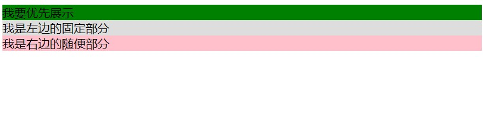
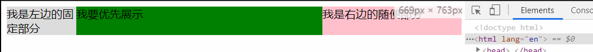

需求：
左右固定中间自适应，浏览器窗口变宽时中间部分要随之变宽，反之类似。
常见于网页头部，和整体部分。

例子：
远的不说，其实 Chrome 浏览器的地址栏就是这种布局，中间的搜索框就是自适应的。

结构分析：
需要三个 div，left right center 是并列关系，需要 center 优先展示，也就是说在 HTML 结构中并不是想当然的 left center right 的顺序关系，而是 center left right 的顺序关系，要保证 center 的内容最先加载完成。

HTML 结构：
```
  <div class="wrapper">
    <div class="center">我要优先展示</div>
    <div class="left">我是左边的固定部分</div>
    <div class="right">我是右边的随便部分</div>
  </div>
```
搞点颜色：
```css
  .left {
    background: #ddd;
  }

  .center {
    background: green;
  }

  .right {
    background: pink;
  }

```


按照两栏布局的思路，可以推出三栏布局肯定是要把三个元素放到同一行的。
给 container 来个 flex 布局，让三个 div 排到一排。
```css
  .wrapper {
    display: flex;
  }
```


好的，下面是瓜分地盘环节，left right 不妨分别搞成 100px 和 200px 看看，让 center 自适应。有了[两栏布局](https://www.jianshu.com/p/7c6a613ae487)的经验，这里就直接写。

```
  .left {
    flex: 0 0 100px;
  }
  .right {
    flex: 0 0 200px;
  }
  .center {
    flex: 1;
  }
```


从上图的结果来看好像已经符合了要求，不妨回头看下需求。

这里还有一个点要解决，就是这三个元素的站位不合适。“我要优先展示”应该C位出道，现在站在边上。怎么搞？

让 center 回归 C 位，也就是让 left 回到 center 的左边。对于 flex 布局而言，就是设置一个属性的事情。
```
  .left {
    order: -1;
  }
```



来个总结：
布局应该是CSS中的一块很重要的点，三栏布局和两栏布局相比，新增了一个中间内容优先展示地需求，其余地部分两个还是很相似的，先将元素搞到一排，然后分田地就好了。

什么时候可以安全地使用 grid 布局哩。

附上核心代码：
```html
<style>
  .left {
    background: #ddd;
  }

  .center {
    background: green;
  }

  .right {
    background: pink;
  }
  .wrapper {
    display: flex;
  }
  .left {
    flex: 0 0 100px;
  }
  .right {
    flex: 0 0 200px;
  }
  .center {
    flex: 1;
  }
 
</style>

<body>
  <div class="wrapper">
    <div class="center">我要优先展示</div>
    <div class="left">我是左边的固定部分</div>
    <div class="right">我是右边的随便部分</div>
  </div>
</body>
```


