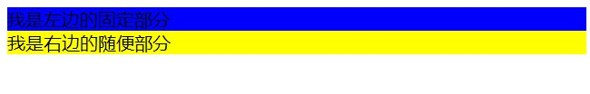
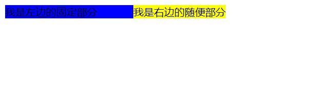

瞎掰：
上面的效果术语是两栏布局，常见于网页顶部的位置。你动我不动，我看着你动，做人就要能屈能伸，保持本心。

需求分析：
左右两栏，左边固定，右边配合左边自适应。

分析布局：
两个部分，左和右两部分是并列的关系。

------------
2020年了都，直接使用 flex 技术方案。
网页结构如下：
```html
  <div class="wrapper">
    <div class="left">我是左边的固定部分</div>
    <div class="right">我是右边的随便部分</div>
  </div>
```
不妨先给他们上个色，看一波。
```css
  .left {
    background: blue;
  }

  .right {
    background: yellow;
  }
```


左右两部分都是 block 元素，一行只能允许一个 block 元素，右侧被挤到下一行。我们要实现两栏布局，先将两者搞到同一行。
```css
  .wrapper {
    display: flex;
  }
```
在给父盒子设置 flex 布局后，两个块级元素就被搞到一行了。


下面就是分宽度了，根据需求，要给左边元素一个固定的宽度，不妨假设为 200px。
```css
 .left {
      flex: 0 0 200px; 
  }
```


关于 flex 的说明
>flex: flex-grow flex-shrink flex-basis; 
flex-grow: 定义项目放大比例，默认0，如果存在剩余空间也不放大
flex-shrink: 定义项目缩小比例，默认为1，如果空间不足，项目缩小
flex-basis: 设定项目的固定大小


完成了左侧固定值后，下面来看右侧自适应，即右侧要占据剩余的宽度这个需求要如何实现。
```css
  .right {
      flex: 1;
  }
```


下面总结一波：
要实现两栏布局，首先想办法将块级元素搞到同一行，将左侧设置为固定宽度，最后想办法让右侧占据剩余的宽度。核心代码如下：
```html
<style>
  .left {
    background: blue;
  }

  .right {
    background: yellow;
  }

  .wrapper {
    display: flex;
  }

  .left {
    flex: 0 0 200px;
  }

  .right {
    flex: 1;
  }
</style>

<body>
  <div class="wrapper">
    <div class="left">我是左边的固定部分</div>
    <div class="right">我是右边的随便部分</div>
  </div>
</body>
```


还有一些常规手段，我就先不写了，flex 布局真香。

