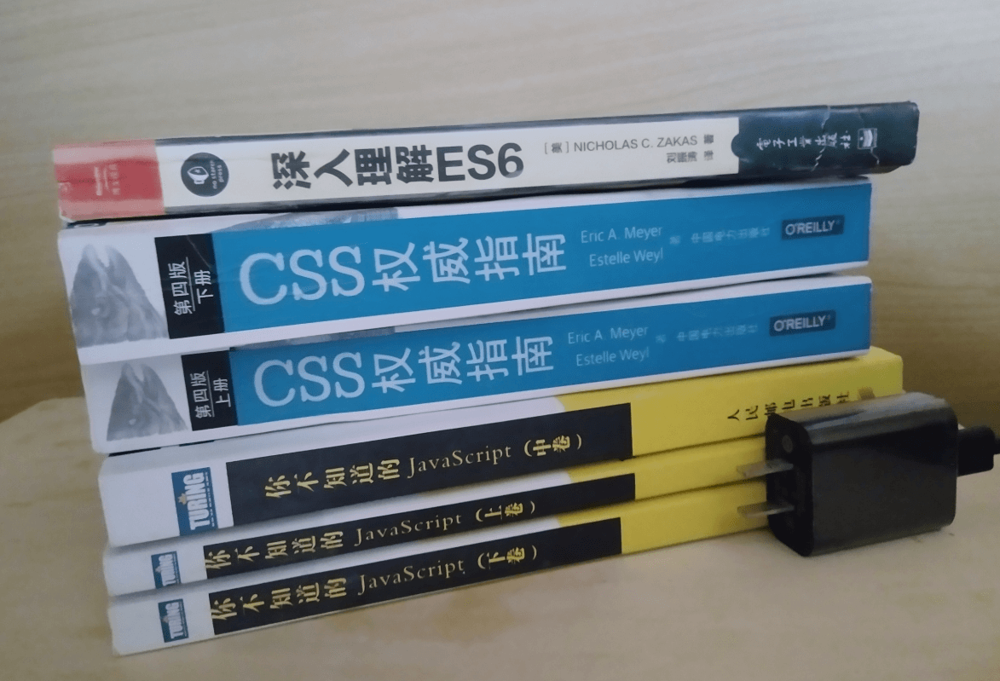

前段时间企图通过 [以四条链串一串前端的那些事儿](https://www.jianshu.com/p/69c6243fa013)，经过一番尝试后我发现我串不起来。

我太菜了。。。

那就换个思路，用一些题一些书和一些博客来串一串前端那些事儿。

以题为引，以书为源，以博客为令箭来探一探前端的路。

参考的书籍包括但不限于以下几本：
- 《JavaScript高级程序设计》大而全
- 《你不知道的JavaSript》没有DOM和BOM相关内容
- 《深入理解ES6》
- 《HTTP权威指南》
- 《CSS权威指南》

本文只会提供回答题目的大致的方向，且会提供较为口语化的内容。

严谨的内容请参考相应的书籍，若本文中内容与书不同，不要怀疑，请相信书上的。

文字可能没有什么分量，看一下我前几天到的书吧。虽说只有四本书，但《你不知道的JavaSript》有三册，《CSS权威指南》有两册。

文字的厚重电子书是无法感知的，而纸质书可以让你真切地感受到这份重量。




本文档会随着本人的自我成长而不断完善。

鉴于前端发展迅猛的特点，规范的定制会存在一定的滞后性，在 “规范” 的解决方案出现之前，社区可能会出现一些“技巧”性解决方法。

比如 jsonp 在跨域中的应用。padding-bottom实现等比例布局。

虽然 jsonp 和 padding-bottom 都是比较 “hack” 的手段，但两者的处境还是有区别的，跨域现在已经有了比较规范的解决方法 cors 可以替代，但在普通元素实现固定宽高比这个问题上，目前而言，
padding-bottom 还是比较常用的方式，规范化的解决方案 `aspect-ratio` 还在草案阶段。

这些“技巧”性解决方法在一定的时间维度内可能是仅能使用的方案，但这里只会提到“规范”的解决方案。

兼容性问题这里也会尽量少地涉及，一些过渡性的解决方案也会一笔带过。

可能，大概，也许，今天的理解在未来的某个时间点发生变化。

## 考察的大方向

从网上找来的宏观考察点。先来确定大方向，大方向不要错。枪在手，跟我走。

- 基础知识（HTML、CSS、JS）重点在JS
- 积极性（开源项目、博客积累等）
- 视野（新技术的了解和学习）
- 高级部分（源码、优化等）

## 自我介绍

基本信息：我叫xxx， 我 2019 年毕业于xxx，我大学的专业是xxx。

项目经验：学习途径主要是在 B站 看视频教程和在蓝桥的实验楼网站练习，有使用 Vue 开发项目的经验，技术栈是 Vue 全家桶。

近期活动：同时最近在尝试学习 Node，想着能自己做一些 api 接口，期望借此能够更好地理解前后端分离开发的模式。

面试目的：这次我想找一份前端开发的工作。


## HTML
单独考察 HTML 的题目不是很多，常常配合 CSS 和 JS 来考察。很有可能直接跳到 JS。

### 1. HTML5新特性，语义化？
子问题，对语义化的理解？HTML5新增的标签？

使用合适的标签书写合适的内容，避免使用过多无意义的标签。说说而已，大多数时候还是 div span 一把梭。

## CSS

不向那些低版本浏览器低头。

这部分的参考资料主要是 《CSS权威指南第四版》，会给出页码。

知识点包括盒模型，选择器，居中方案，浮动，flex，grid。

其他的东西用到了查文档就好了，不必强行记忆。

### 1. [盒模型P316](https://developer.mozilla.org/zh-CN/docs/Learn/CSS/Building_blocks/The_box_model)


盒模型应该是一个在 CSS 中比较基础的概念点，很多问题由它而产生。

最权威的资料在这里[css-box-3](https://www.w3.org/TR/css-box-3/)。

#### 1.1 两种盒模型


```md
box-sizing：content-box   //标准盒模型，默认值
box-sizing：border-box    //怪异盒模型
```

content-box：元素的宽度等于元素的 width+padding+border 宽度。加 padding border 会撑开。

margin 不计入实际大小，当然，它会影响盒子在页面所占空间，但是影响的是盒子外部空间。盒子的范围到边框为止，不会延伸到 margin。

border-box：元素宽度就是元素的 width 宽度，加 border 会往里凹。虽然它叫怪异盒模型，但可能这种模式更加符合人的心理预期。

两种模式的区别在于添加 padding 和 border 时，去占用自身的空间还是去扩展新的边界。下图展示的是两种模式切换对盒子的影响。

在使用 JavaScript 获取盒子的各种 width 时会产生影响，详见 [understanding offsetwidth clientwidth scrollwidth and height](https://stackoverflow.com/questions/21064101/understanding-offsetwidth-clientwidth-scrollwidth-and-height-respectively)。


为了更加直观地看出两者的差别，不妨借用 setInterval 来写一个动画。

假设每隔1s border的度量加6，分别看一下 content-box 和 border-box 的效果。


````html
<style>
  #app {
    box-sizing: content-box;
    box-sizing: border-box;
    width: 100px;
    height: 100px;
    border: 10px solid #f40;
    background-color: rgb(0, 0, 0);
    position: fixed;
    top: 50%;
    left: 50%;
    transform: translate(-50%, -50%);
  }
</style>
<div id="app">
  
</div>
<script>
  const app = document.querySelector('#app')
  let pa = 10

  const intervalId = setInterval(() => {

    if (pa <= 60) {
      pa += 6
      app.style.borderBottom = `${pa}px solid #f40`

    } else {
      clearInterval(intervalId)
    }

  }, 1000);
</script>
````


两者在被添加 border padding 时发生了不同的变化，border-box 是弹簧的压缩过程，content-box 是弹簧的复原的过程。

#### 1.2 margin相关问题(p380)

上面是盒模型中 border 和 padding 相关的问题，接下来看一下和 margin 相关的问题，同样借助 setInterval 来展示。

```html
<body>
  <style>
    #app, #app1 {
      width: 100px;
      height: 100px;
      border: 10px solid #f40;
      /* background-color: rgb(0, 0, 0); */
    }
    #app1 {
      margin-top: 40px;
    }
  </style>
  <div id="app">
    
  </div>
  <div id="app1">
    margin-top: 40px;

  </div>
  <script>
    const app = document.querySelector('#app')
    let pa = 10

    const intervalId = setInterval(() => {

      if (pa <= 60) {
        pa += 6
        app.style.marginBottom = `${pa}px`
        app.innerHTML = `margin-bottom: ${pa}px;`

      } else {
        clearInterval(intervalId)
      }

    }, 1000);
  </script>

</body>

```


可以看到最开始时，下面的方块有个 margin-top 属性，而上面的方块的 margin-bottom 属性在不断地增加，而两者的距离并没有随着margin-bottom 的增加而增加。

两个方块的距离并不是由两者的 margin 的和来决定的，而是两者中的较大值来决定。这种现象被称为 margin重叠。这种现象只会发生在垂直方向，水平方向两者的距离就是两者的 margin 和。

这个例子中 margin 重叠产生的问题可能还不是那么的难以解决，大不了换一套计算规则罢了，但如果两个盒子是父子关系，问题就有点难办了。


上面的例子两个盒子是分离的，如果将一个盒子套一个盒子，那么 margin 就会出现另一个现象。

```html
<style>
  #app {
    width: 200px;
    height: 200px;
    background-color: rgb(92, 86, 86);
  }
  #app1 {
    width: 50px;
    height: 50px;
    margin-top: 40px;
    background-color: rgb(235, 217, 217);
  }
</style>
<div id="app">
  <div id="app1">
    margin-top: 40px;
  </div>
</div>
```


代码的本意是使里面的小盒子相对于大盒子顶部距离 40px，最终产生的效果确是整个大盒子相对于顶部有40px，这个东西可以称为 margin 塌陷，这个东西就需要解决一下了。这里先给出一个解决方案就是给父元素添加属性，overflow:hidden，具体可看 BFC 相关问题。

#### 2.3 百分比问题(p378)

border padding 可用单位很多，这里提一下使用百分比时注意的问题。

按照一般的逻辑来想话，左右内外边距按照父元素的宽度来，上下的按照高度来，但，其实规范规定都按照宽度来。

使用百分比时是相对于父元素的宽度来，border-bottom border-top 也是相对于宽度来的。这是需要注意的点。

鉴于此，可以借助这个特性实现成比例地盒子。比如长宽2：1的盒子。

在div的width为固定的情况下，设置height为0，使内容自然溢出，再通过设置padding-bottom使元素有一定高度。
```css
.element {
  /* height: 0px, 防止矩形被里面的内容撑出多余的高度*/
  width: 100vw; 
  height: 0px; 
  padding-bottom: 50%;
  background: blue;
}
```


### 2. CSS选择器特指度权重问题p106

一句换总结，指向越具体，权重越高。
```md
通配符：* 无
ID选择器：#ID 0，1，0，0
类选择器：.class 0. 0，1，0
元素选择器：p、a 0，0，0，1

伪类选择器：a:hover 0，0，1，0
属性选择器：input[type="text"]  0，0，1，0
```

### 3. 伪类和伪元素
伪类用于当已有元素处于某个状态时，为其添加对应的样式，这个状态是根据用户行为而动态变化。
a标签用户访问前后。动态的。

设计伪元素的目的就是去选取诸如元素内容第一个字（母）、第一行，选取某些内容前面或后面这种普通的选择器无法完成的工作。
```css
a:link{
  color: blue;
}
a:visited{
  color: yellow;
}
a:hover{
  color: red;
}
a:active{
  color: pink;
}
```

伪元素用于创建一些不在文档树中的元素，并为其添加样式。伪元素是对元素中的特定内容进行操作。静态的。
一句话的第一个字母。
```css
h6::first-letter {
  font-size: 24px;
}
```


### 4. BFC是什么，如何产生，有何作用

BFC 权威资料 [block-formatting](https://www.w3.org/TR/CSS21/visuren.html#block-formatting)

前面提到 margin 塌陷的问题，如果这些盒子没有父子关系，我们可以不用管，但如果两者是父子关系，这个问题对布局的影响就比较大，我们就应该做点什么了。

拿上面的例子来将，通常第一时间会想到使用 position:absolute 配合 top left 属性来实现想要的效果。

其实在不知情的情况下就触发了 BFC 的规则，你大可不必必须知道这个东西触发了 BFC ，但为了增加自己的专业素养(和人侃大山)，了解以下还是可以的。


BFC 全称 Block formatting context ，是一个独立的渲染区域，一个实验环境，哪怕发生了爆炸，也只对内部产生影响。

你可能不知道这个概念，但使用了其中的解决方案，如果你使用了下面规则之一其实就触发了BFC：


1.根元素(整个页面就是一个大的BFC)；

2.position为 absolute | fixed；

3.float为 left | right；

4.overflow为 hidden | auto | scroll；

5.display为 inline-block | table-cell | table-caption | flex | inline-flex；


BFC最大的一个作用就是：在页面上有一个独立隔离容器，容器内的元素和容器外的元素布局不会相互影响。

关上门称王称霸。这东西不难，你往往在不知情的情况下就触发了它，只是可能不知道它的名字。


### 5.清除浮动

浮动会导致的问题：


1.文字围绕浮动元素排版，但我们可能希望文字排列在浮动元素下方。


2.浮动元素排版超出了其父级元素，父元素的高度出现了塌缩，若没有文字高度的支撑，不考虑边框，父级元素高度会塌缩成零。


解决方案：不使用浮动布局（不是）。

只要我够穷，就没人能骗我，只要我不用浮动，我就不需要清除浮动，逻辑无懈可击。

还是要正经看一下的，给到不想受到浮动影响的元素添加 clear 属性。使用伪类和伪元素使用的原理还是clear，只是添加的位置不同。

当然了，你也可以触发BFC，来解决浮动带来的问题。

最好的解决方案就是不要使用浮动布局(狗头保命)，flex，grid布局不香吗？


### 6. 响应式布局，响应式背后的浏览器原理
根据浏览器或设备的分辨率可以计算获取到相应的尺寸，通过不同的尺寸可以动态的修改html元素或者盒子在浏览器中的大小，从而实现响应式。

响应式解决方案：
- 百分比
- [移动端页面开发适配 rem布局原理](https://segmentfault.com/a/1190000007526917)
- [使用Flexible实现手淘H5页面的终端适配](https://github.com/amfe/article/issues/17)
- 媒体查询


rem是根据根的font-size变化，而em是根据父级的font-size变化。


### 7. 水平垂直居中
[CSS | 绝对的固定C位](https://www.jianshu.com/p/41b9318839d8)

被居中的元素是inline或者inline-block元素
```css
.container{
  width: 600px;
  height: 600px;
  display: table-cell;
  text-align: center;
  vertical-align: middle;
}
```


transfrom
```css
.container{
  width: 100%;
  height: 600px;
  position: relative;
}
.center{
  position: absolute;
  top: 50%;
  left: 50%;
  transform: translate(-50%, -50%);
}
```

flex 布局
```css
.container{
  width: 100%;
  height: 600px;
  display: flex;
  justify-content: center;
  align-items: center;
}
```

grid 布局
```css
.container {
  display: grid;
  place-items: center;
} 
```
### 8. 常见布局解决方案
[两栏布局那些事](../css-two-column-layout/)

[只要一行代码，实现五种 CSS 经典布局](http://www.ruanyifeng.com/blog/2020/08/five-css-layouts-in-one-line.html)

实现左边定宽，右边自适应布局

（1）左盒子左浮动，右盒子width=100%

（2）左盒子左浮动，右盒子margin-left=左盒子宽度

（3）左盒子左浮动，右盒子右浮动，设置width: calc（100% - 左盒子宽度）

（4）父容器设置display：flex，右盒子flex：1

[三栏布局那些事](../css-three-column-layout/)

实现中间自适应宽度，左右两栏固定宽度布局


### 9. dom树和cssom树原理
这个问题有点深了，其实也是从浏览器输入url到页面显示经历了什么？问题的一部分。

先放一个链接
[constructing the object model](https://developers.google.com/web/fundamentals/performance/critical-rendering-path/constructing-the-object-model?hl=zh-cn)


### 10. CSS3新特性

```md
1.过渡 transition
2.动画 animation
3.形状转换 transform
4.阴影 box-shadow
5.滤镜 filter
6.颜色 rgba
7.栅格布局 gird
8.弹性布局 flex
```

### 11. 浏览器是怎样解析CSS选择器的？

dom树和cssom树原理中的知识点，需要数据结构相关的知识储备。

CSS选择器的解析是从右向左解析的，为了避免对所有元素进行遍历。

若从左向右的匹配，发现不符合规则，需要进行回溯，会损失很多性能。

若从右向左匹配，先找到所有的最右节点，对于每一个节点，向上寻找其父节点直到找到根元素或满足条件的匹配规则，则结束这个分支的遍历。

两种匹配规则的性能差别很大，是因为从右向左的匹配在第一步就筛选掉了大量的不符合条件的最右节点（叶子节点），而从左向右的匹配规则的性能都浪费在了失败的查找上面。

而在 CSS 解析完毕后，需要将解析的结果与 DOM Tree 的内容一起进行分析建立一棵 Render Tree，最终用来进行绘图。在建立 Render Tree 时（WebKit 中的「Attachment」过程），浏览器就要为每个 DOM Tree 中的元素根据 CSS 的解析结果（Style Rules）来确定生成怎样的 Render Tree。


总结一下，CSS 中一个概念盒模型，两个问题 margin 塌陷，浮动清除，三种布局，常规布局，flex，grid布局。核心是如何布局。


## JavaScript

主要参考书籍《你不知道的JavaScript》

### 0. JavaScript的执行过程
预编译+生成可执行代码

[02-1 | 读JavaScript 高程 | 解释](https://www.jianshu.com/p/7abebcc75978)
- 创建 AO 对象 Activation Object 执行期上下文
- 找形参和变量声明，将变量和形参的名挂上，并赋值undefined
- 将形参和实参相统一
- 找函数声明，赋值函数体


### 1. 数据类型8种，类型检测，类型转换
[03 | 读JavaScript 高程](https://www.jianshu.com/p/c9fe9227ce12)

基本类型和引用类型的区别是什么？

number 也是对象么？字符串也是对象么？

0.1 + 0.2 精度问题？

'cemcoe'.length 字符串为什么可以像对象一样拥有属性？

### 2. 数组方法排序，遍历，去重，深浅拷贝
在数组中经常会出现“茴字的n种写法”类似的题目。

#### 数组方法

```
indexOf / lastIndexOf(value, fromIndex): 查找数组项，返回对应的下标
forEach: 无法break，可以用try/catch中throw new Error来停止
slice(start, end): 返回截断后的新数组，不改变原数组
filter: 过滤
splice(start, number, value...): 返回删除元素组成的数组，value 为插入项，改变原数组
concat: 连接数组，不影响原数组， 浅拷贝
sort(fn) / reverse: 排序与反转，改变原数组
join: 通过指定连接符生成字符串
reduce / reduceRight(fn(prev, cur)， defaultPrev): 两两执行，prev 为上次化简函数的return值，cur 为当前值(从第二项开始)
map: 遍历数组，返回回调返回值组成的新数组
some: 有一项返回true，则整体为true
every: 有一项返回false，则整体为false
push / pop: 末尾推入和弹出，改变原数组， 返回推入/弹出项【有误】
unshift / shift: 头部推入和弹出，改变原数组，返回操作项【有误】
```

#### 数组去重
数组去重方案


0. 借助扩展运算符和set数据类型。推荐该方案。

1. push 增加方案，新建一个数组，使用includes或者indexOf拿原数组中的每个元素和新数组比较，如果在新数组中找不到，就将该元素push到新数组中。
 

2. splice 删除方案，遍历拿数组元素和该元素后面的元素比较，如果有相同的将该元素删掉，并将遍历的索引减一，防止出现越界行为。核心是，如果有重复的，那留最后一次出现的那个。

3. 借助对象属性名的唯一性。


```js
// 去重
// 第一种： 通过ES6新特性Set()
// 例如： var arr = [1, 2, 3, 1, 2]; var newArr= [...new Set(arr)]


// 利用对象属性存在的特性，如果没有该属性则存入新数组。

function unique3(arr) {
  var obj={}
  var newArr=[]
  for (let i = 0; i < arr.length; i++) {
    if (!obj[arr[i]]) {
        obj[arr[i]] = 1
        newArr.push(arr[i])
    }   
  }
  return newArr
}
console.log(unique2([1, 1, 2, 3, 5, 3, 1, 5, 6, 7, 4]));
```


#### 深浅拷贝
浅拷贝：浅拷贝通过ES6新特性 `const returnedTarget = Object.assign(target, source);` 或者通过扩展运算法 `...`来达到浅拷贝的目的。

缺点是浅拷贝只能拷贝第一层的数据，且都是值类型数据，如果有引用型数据，修改副本会影响原数据。

深拷贝：通过利用 `JSON.parse(JSON.stringify())` 来实现深拷贝的目的。

这个代码`JSON.parse(JSON.stringify())`很有意思，先将对象搞成字符串，而后又将字符串搞了回去。这一来一回就完成了深复制，看起来好像是吃饱了撑的没事干。

就好像将水放到冰箱里冻成冰，然后又将冰化成了水。有点多此一举。

这一来一回的转化，其实是斩断对象的烦恼丝。


但利用JSON拷贝也是有缺点的，当要拷贝的数据中含有undefined/function/symbol类型是无法进行拷贝的，当然我们想项目开发中需要深拷贝的数据一般不会含有以上三种类型，如有需要可以自己在封装一个函数来实现。

#### 数组扁平化


### 3. 闭包

函数A 里面包含了 函数B，而 函数B 里面使用了 函数A 的变量，那么 函数B 被称为闭包。

又或者：闭包就是能够读取其他函数内部变量的函数。


闭包的优点是可以避免全局变量的污染，缺点是闭包会常驻内存，会增大内存使用量，使用不当很容易造成内存泄露。

在js中，函数即闭包，只有函数才会产生作用域的概念。ES6中新增块级作用域。

使用闭包主要是为了封装对象的私有属性和私有方法。

### 4. JS作用域及作用域链
[04 | 读JavaScript 高程](https://www.jianshu.com/p/b6f6c6bc6c7b)


### 5. 原型和原型链

new 操作符做了什么？

[06-1 | 读JavaScript 高程](https://www.jianshu.com/p/6bfd709aa441)

### 6. this 上册82

#### 绑定规则

- 默认绑定

- 隐式绑定 对象

- 显示绑定 apply call bind

- new


#### apply、call和bind的区别

在JS中，这三者都是用来改变函数的this对象的指向的。

call和apply都是对函数的直接调用，而bind方法返回的仍然是一个函数，因此后面还需要()来进行调用才可以。


### 7. 异步代码解决方案

- 回调函数
- setTimeout setIntervel
- Promise
- generator
- async await

很多资料说 Promise 最大的作用就是解决了回调地狱，但 Promise 难道不是又带来了"链式地狱"。

本质上，Promise是将回调附加到的返回对象，而不是将回调传递到函数中。

在《你不知道的JavaScript》中册173 中的 [观点](https://github.com/getify/You-Dont-Know-JS/blob/f6e1e05bc2fb212bc38acfeb7461804d48975728/sync-async/ch2.md) 是这样的。


> The most troublesome problem with callbacks is *inversion of control* leading to a complete breakdown along all those trust lines.

回调最大的问题是信任链断裂，这也是 Promise 为 Promise 的原因（双关）。

async / await 是 generator 的语法糖，是基于 Promise 的。有了async 还是要会 Promise。

如何使用以及api这里就不展开了。


### 8. 函数

[防抖和节流](https://juejin.im/post/6844904073829810190)

箭头函数和普通函数的区别

```
1,箭头函数是匿名函数，不能作为构造函数，不能使用new

2,箭头函数不绑定arguments，取而代之用rest参数...解决

3,箭头函数不绑定this，会捕获其所在的上下文的this值，作为自己的this值

4,箭头函数通过 call() 或 apply() 方法调用一个函数时，只传入了一个参数，对 this 并没有影响。

5,箭头函数没有原型属性

6,箭头函数不能当做Generator函数,不能使用yield关键字
```


### 9. 事件相关，事件循环event loop，事件队列，事件委托
[JavaScript 运行机制详解：再谈Event Loop](http://www.ruanyifeng.com/blog/2014/10/event-loop.html)

[Eventloop不可怕，可怕的是遇上Promise](https://juejin.im/post/6844903808200343559)

JS的执行顺序是先同步 再异步；同步执行完成之前 异步不会执行

先执行微任务，然后在执行宏任务；
JS中的宏任务：setTimeout setIntervel ajax
JS中的微任务：Promise.then  Promise.catch   await(可以理解成Promise.then)


### 10. 客户端持久化存储
请描述一下 cookies，sessionStorage和 localStorage的区别？

主要从作用，大小，存储位置，何时销毁回答。

[https://jerryzou.com/posts/cookie-and-web-storage/](https://jerryzou.com/posts/cookie-and-web-storage/)

### 11. 算法
。。。。
。。。。
。。。。

防抖函数debounce原理：在事件被触发n秒后再执行回调，如果在这n秒内又被触发，则重新计时。
多次事件一次响应的情况
```js
// 函数防抖
var timer = false;
document.getElementById("debounce").onscroll = function(){
    clearTimeout(timer); // 清除未执行的代码，重置回初始化状态

    timer = setTimeout(function(){
        console.log("函数防抖");
    }, 300);
};  

```


节流函数throttle原理：规定一个单位时间，在这个单位时间内，只能有一次触发事件的回调函数执行，如果在同一个单位时间内某事件被触发多次，只有一次能生效。
大量事件按时间做平均分配触发。
```js
// 函数节流
var canRun = true;
document.getElementById("throttle").onscroll = function(){
    if(!canRun){
        // 判断是否已空闲，如果在执行中，则直接return
        return;
    }

    canRun = false;
    setTimeout(function(){
        console.log("函数节流");
        canRun = true;
    }, 300);
};
```
[https://www.jianshu.com/p/b73c2acad696](https://www.jianshu.com/p/b73c2acad696)

## DOM
。。。
。。。
。。。

### 1. 如何选取元素
```md
query
选择器选择一个元素：querySelector()
选择器选择一组元素:querySelectorAll()
get
通过ID获取：document.getElementById('id')
通过标签获取：document.getElementsByTageName()
通过class获取：document.getElementsByClassName('class')
通过name获取: document.getElementsByName('name')
```
## Vue

### 0. 什么是组件化
[Vue | 组件化 | 基本操作](../vue-com-base-operation/)

组件就是将一段UI样式和其对应的功能作为独立的整体去看待，无论这个整体放在哪里去使用，它都具有一样的功能和样式，从而实现复用，这种整体化的细想就是组件化。不难看出，组件化设计就是为了增加复用性，灵活性，提高系统设计，从而提高开发效率。

### 1. MVVM


MVVM(Model-View-ViewModel)
Model(模型):数据层，负责存储数据。

View(控制器):就是ViewController层，他的任务就是从ViewModel层获取数据，然后显示。

ViewModel(视图模型):就是View和Model层的粘合剂，封装业务逻辑处理，封装网络处理，封装数据缓存。

### 2. 生命周期

#### 2.1 生命周期的理解：
Vue 实例从创建到销毁的过程，就是生命周期。

也就是从开始创建、初始化数据、编译模板、挂载Dom→渲染、更新→渲染、卸载等一系列过程，我们称这是 Vue 的生命周期。

它可以总共分为8个阶段：创建前/后, 载入前/后,更新前/后,销毁前/销毁后。


#### 2.2 特定的时间做特定的事情：

第一次页面加载时会触发 beforeCreate, created, beforeMount, mounted 这几个钩子。

DOM 渲染在 mounted 中就已经完成了。

beforecreate : 可以在这加个loading事件，在加载实例时触发。

created : 初始化完成时的事件写在这里，如在这结束loading事件，异步请求也适宜在这里调用。

mounted : 挂载元素，获取到DOM节点。

updated : 如果对数据统一处理，在这里写上相应函数。

beforeDestroy : 可以做一个确认停止事件的确认框。

nextTick : 更新数据后立即操作dom better-scroll。

### 3. 简述 Vue 的响应式原理

当一个 Vue 实例创建时，Vue会遍历 data 选项的属性，用 Object.defineProperty 将它们转为 getter/setter 并且在内部追踪相关依赖，在属性被访问和修改时通知变化。

每个组件实例都有相应的 watcher 程序实例，它会在组件渲染的过程中把属性记录为依赖，之后当依赖项的 setter 被调用时，会通知 watcher 重新计算，从而致使它关联的组件得以更新。

Vue3 的响应式原理Vue3.0和2.x的双向数据绑定（object.definePorperty和Proxy）

Vue2 不能检测到以下数组的变动
利用索引直接修改一个数组的选项时
```js
vm.items[indexOf] = newValue
// 通过set
// Vue.set(vm.items,indexOf,newValue)
// this.$set(this.items,indexOf,newValue)
```

当修改数组的长度时
```js
vn.length = newLength
// this.$items.splice(newLength)
```
### 4. Vue如何解析template模板，diff算法？
key

### 5. 组件通信
[Vue | 组件化 | 基本操作](https://www.jianshu.com/p/283cd29b80e4)
[Vue | 组件化 | 组件通信](https://www.jianshu.com/p/44935cdd12e9)

1.props和$emit
2.vuex(官方推荐状态管理器)

### 6. new Vue 发生了什么
[new Vue](https://ustbhuangyi.github.io/vue-analysis/v2/data-driven/new-vue.html)

### 7. 为什么data推荐函数，而不是对象形式？
```js
data = vm._data = typeof data === 'function'
? getData(data, vm)
: data || {}
```
源码告诉你这里可以是函数也可以对象，推荐函数是为了解决组件实例共用同一个 data 的问题。

为了保证数据之间是互相独立的，互不影响的，使用 return 即函数，而不是对象，因为对象是内存引用。

### 8. Vue-Router


### 9. Vuex

### 10. axios

借助 axios 的拦截器实现 Vue.js 中登陆状态校验

配合路由导航守卫一起使用

页面发送http请求，很多情况我们要对请求和其响应进行特定的处理。

例如每个请求都附带后端返回的token，拿到 response 之前 loading 动画的展示等。

在这种情况下，axios为开发者提供了这样一个API：拦截器。

拦截器分为 请求（request）拦截器和 响应（response）拦截器。

[https://www.imooc.com/article/25167](https://www.imooc.com/article/25167)

一例
```js
import axios from 'axios'
axios.defaults.headers.common['Authorization'] = `Bearer ${sessionStorage.getItem('token')}` || ''

// 多环境配置
let apiUrl
if (process.env.NODE_ENV == 'production') {
  //线上
  apiUrl = 'http://demo.cemcoe.com/jianshu_api'
} else if (process.env.NODE_ENV == 'development') {
  //本地
  apiUrl = 'http://localhost:3000'
} else {
  //预发布
  apiUrl = 'http://localhost:3000'
}

export function request(config) {
  // 1. 创建axios实例
  const instance = axios.create({
    baseURL: apiUrl,
    timeout: 10000, // 设置超时时间10s
  })
  // 2. 请求拦截器，添加jwt token

  instance.interceptors.request.use(config => {
    // config.headers.Authorization = `Bearer ${sessionStorage.getItem('token')}` || ''
    return config
  }, err => {

  })
  // 3. 响应拦截
  instance.interceptors.response.use(res => {
    return res.data
  }, err => {

  })

  // 4. 发送真正的网络请求
  return instance(config)
}
```

### 11. 如何设计一个自己的组件库
。。。

## 网络
参考书籍主要是《HTTP权威指南》
### 0. 输入url到看到页面，发生了什么？


### 0. http特性以及状态码


### 0. get与post请求区别

### 0. 三次握手，四次挥手
[跟着动画学习TCP三次握手和四次挥手](https://mp.weixin.qq.com/s/pSrKbVryn71kDVIXUtpXMA)
三次握手:   
第一次握手：客户端向服务端发送SYN码数据包，表示客户端要求和服务端建立连接；
第二次握手：服务端收到客户端的连接请求后，会发送ACK数据包给客户端，表示你的连接 请求已经收到，询问客户端是否真的需要建立连接；
第三次握手：客户端收到ACK码以后会检验是否正确，如果正确，客户端会再次发送ACK码给 服务端，表示确认建立连接； (三次握手都成功以后才会建立连接，然后才会发送数据；)
四次挥手：
第一次挥手：当客户端发送数据结束后，会发送FIN码数据包给服务端，表示告知服务端客 户端的数据已经传递完了。
第二次挥手：当服务端收到FIN后，会发送ACK给客户端，表示服务端已经知道客户端传完 了。客户端收到ACK以后就会把传递数据给服务端的通道关闭；
第三次挥手：当服务端把响应的数据发送完毕后，会发送一个FIN给客户端，告知客户端响 应的数据已经发送完毕；
第四次挥手：当客户端收到FIN后，会发送一个ACK码数据包给服务端，告知服务端客户端已 经知道数据发送完毕；服务端收到ACK码后，可以安心的把数据传递通道关闭掉。 

### 1. 如何解决跨域问题
CORS 需要浏览器和后端同时支持。浏览器会自动进行 CORS 通信，实现 CORS 通信的关键是后端。只要后端实现了 CORS，就实现了跨域。服务端设置 Access-Control-Allow-Origin 就可以开启 CORS。
```js
// koa cors 并放行options预检请求
ctx.set("Access-Control-Allow-Origin", "*");
  ctx.set("Access-Control-Allow-Methods", "POST, GET, OPTIONS, DELETE");
  ctx.set("Access-Control-Max-Age", "3600");
  ctx.set("Access-Control-Allow-Headers", "x-requested-with,Authorization,Content-Type,Accept");
  ctx.set("Access-Control-Allow-Credentials", "true");
  if (ctx.request.method == "OPTIONS") {
    ctx.response.status = 200
  }
  console.log(`Process ${ctx.request.method} ${ctx.request.url}`);
  try {
    await next();
    console.log('handler通过')
  } catch (err) {
    console.log('handler处理错误')
    ctx.response.status = err.statusCode || err.status || 500;
    ctx.response.body = {
      message: err.message
    };
  }
```


### 2. 登录流程？


安全性： Session 比 Cookie 安全，Session 是存储在服务器端的，Cookie 是存储在客户端的。
存取值的类型不同：Cookie 只支持存字符串数据，想要设置其他类型的数据，需要将其转换成字符串，Session 可以存任意数据类型。
有效期不同： Cookie 可设置为长时间保持，比如我们经常使用的默认登录功能，Session 一般失效时间较短，客户端关闭（默认情况下）或者 Session 超时都会失效。
存储大小不同： 单个 Cookie 保存的数据不能超过 4K，Session 可存储数据远高于 Cookie，但是当访问量过多，会占用过多的服务器资源

### 3. 前端鉴权

鉴权主要分为四种：

- HTTP Basic Authentication (HTTP基本认证)
- session-cookie
- Token 验证(包括JWT,SSO)
- OAuth(开放授权)

我们普通网站常用的认证就是session-cookie的方式，用户向服务端发生请求，服务端会创建session并保存相关身份信息，并向客户端下发一个sessionId,大家如果用心的话，会发现跟JAVA交互的时候，浏览器会有一个JSESSION_ID，跟PHP交互的时候，会有一个PHPSESSION_ID;后面的每次请求，客户端都会自动带上这个cookie跟服务端通信。

> 实际上大家要明白每一种方式的作用；SSO主要用来做单点登录；OAuth主要用来做第三方网站授权；JWT就是一种便于扩展的跨域认证解决方案，通常会考察这个。

### 4. 试从域名解析原理的角度简单分析，域名劫持是怎么发生的？有什么危害？

### 5. WebSocket

### 6. http2有什么改进？

## 前端工程化
### 0. 前端模块化规范AMD CMD CommonJS

## 性能优化
初级而已，不要计较太多
浏览器渲染机制、重绘、重排


## 开发工具
- VScode
- nodemon
- Git

## 闲聊

[面试被问项目经验不用慌，按这个步骤回答绝对惊艳](https://juejin.im/post/6844904102795706375)

### 0. 你是如何学习前端知识的？


### 1. 哪个项目让你最满意、代表你的最高水平？如何做的？
项目能访问


项目能访问，这个隐含的东西可多了。如果这个是你自己做的，这说明你起码舍得为技术花钱、会配置服务器、会部署前后端项目、有使用 linux 的经验、愿意证明项目是真的而不是嘴遁。

基础和项目穿插：问到基础可以穿插项目，这样才真实，而不是个只会背答案的复读•莫得感情•机。随便举个例子，比如问到状态码，你说“⋯⋯301 重定向，我之前做的一个项目地址改了，于是在 nginx 里配置的时候就用到了 ⋯⋯ 它和 302 也是有区别的，⋯⋯”。
独立封装了什么什么组件，提高了代码的复用率，减少了冗余代码；


### 2. 让你印象最深刻的一个（技术）难点，害的你搞了很久，最后怎么解的，有什么心得？

### 3. 你做的时间最久的一个项目（或产品），你看到这个项目有哪些问题，你能做什么？

### 4. 你能给我们团队或者产品带来什么？

这些问题不是硬性的，主要看平时是不是除了技术还琢磨点别的，特别是在阿里好多 BU 产品基本形态成型的基础上，要做试错、创新、提效、求精、找方向，这种情况下，只具备（完成刚性需求的）技术能力已经远不够了，而更需要辩证的执行。


### 5.轻松一下
一个段子
```
这些都很基础。
然后我面试的时候是这样的：
[好奇]：用过vue的那个路由吗，就是那个路由。
[惊喜]：你说vue-router是吧，用过。默认是hash模式，原理大概是通过监听hashchange事件获取当前路径去匹配对应的路由然后更新试图。
[思考]：你说什么？会发请求吗。
[发呆]：会的，ajax请求的核心模块是XMLhttprequest，内部实现原理不晓得。也可以用axios库，把原生ajax请求做了一些封装和处理。
[撇嘴]：额，什么？我们这里一周上六天班，早八晚六，最多能给6k。
[衰]：你赢了。我简历都是吹的，还给我吧。
```

又一个段子
```
某些面试官居然自己构造专业名词问别人，比如你知道什么是CDYSB么，啊？不知道？！这就是层叠样式表的拼音缩写啊，就是css啊，你是不是搞前端的啊！
```

## 一些tip
- 项目中的公共样式千万别去动！！
- 工作难的不是开发是改bug，一定及时沟通！！ 需求不明确问产品，字段不确定问后端 不问卡在那 最后担责任的还是自己
- 学会定义全局变量和常量，看能否少写请求，减少代码冗余，不然codeRivew的时候会被鄙视死
- 拿到项目，先把全局看下，能否拆分出组件，抽取出公用JS，不然后期再去拆很痛苦
- 学会看数据库，自己学着去看自己处理的东西，尤其是后端定义的字段
- 写业务先想清楚,接口文档及时要,数据结构会影响代码设计的
- UI库常用组件进行二次封装
- 按钮要加防抖


## 参考

- [掘金 | 小明同学哟 | 初中级前端面试题](https://juejin.im/post/5d87985d6fb9a06add4e6ac3)
- [掘金 | 只会番茄炒蛋 | 2020 前端面试 第一波面试题总结](https://juejin.im/post/5e3d898cf265da5732551a56)
- [知乎 | 小潘 | 2019前端面试题](https://zhuanlan.zhihu.com/p/60832562)
- [掘金 | 是云息呀 | 21 届前端暑期实习 BAT 面试之路，已上岸阿里（万字长文）](https://juejin.im/post/5ea01c776fb9a03c337f93af)
- [大前端面试宝典 - 图解前端](https://lucifer.ren/fe-interview/)

