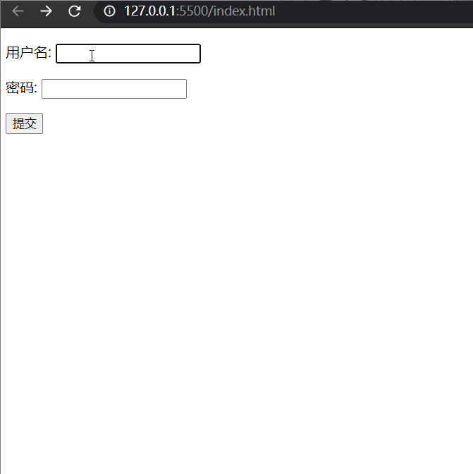
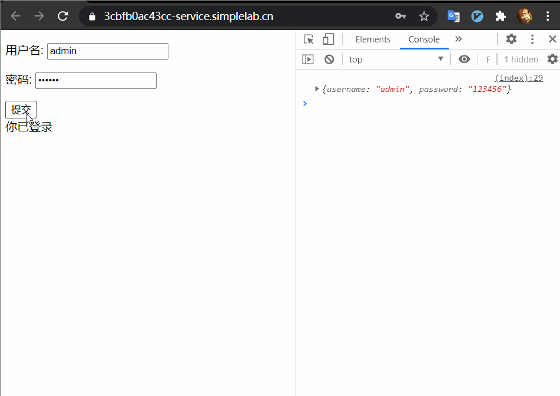
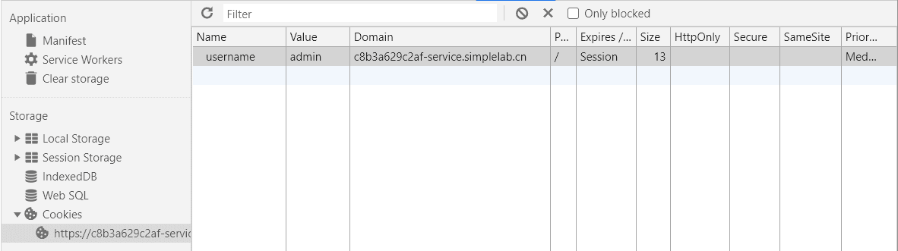
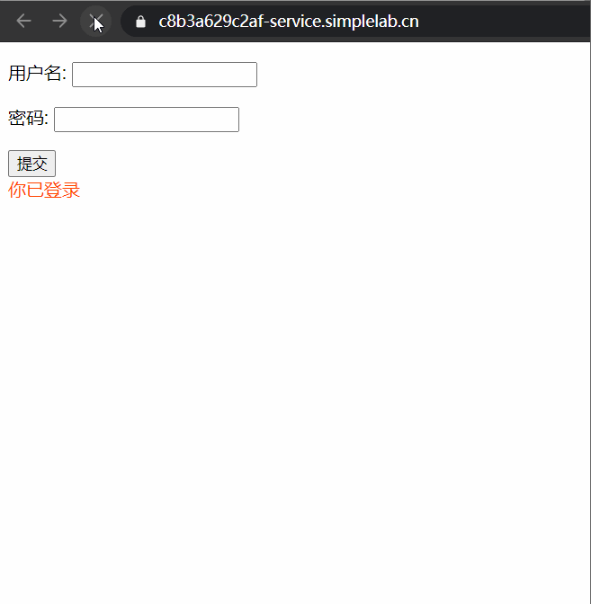
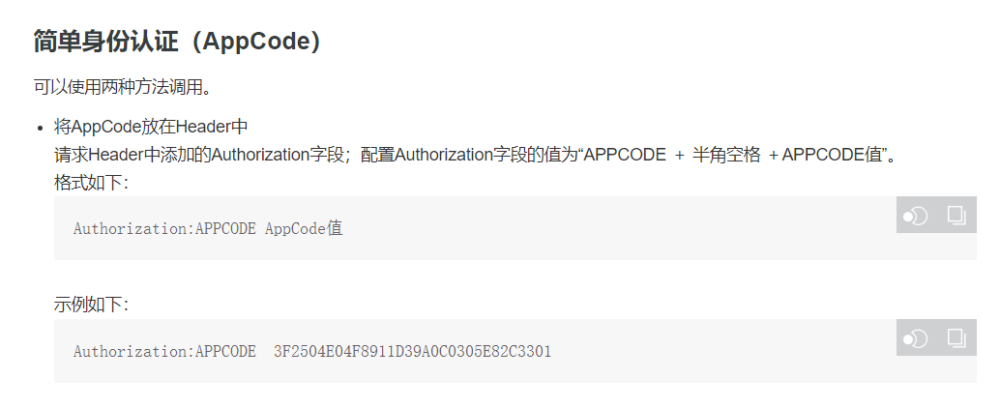

注册和登录现在可以说是网站的基本配备了，谁还没个管理系统呢。

那么在登录注册中前端要做的事情是什么呢？

网上有很多的前端教程，但登录这部分内容在视频教程中的内容很少。

个人认为主要有两部分的原因。

其一是网上的多数前后端分离的项目的教程的后端接口是模拟的，并没有真实的后端环境，鉴权等的一些操作也就无从谈起。如果连带后端一起，课程体系会及其的庞大。

其二，登录操作涉及用户管理，是一个中后台项目，或者说是一个用户管理系统，用户管理系统的 UI 要求不高，页面无需考虑美观性，前端的工作需求不是很大，这应该也是一部分原因。

基于这部分教程相对较少的原因，我现在对于 POST 请求的了解很有限，对于登录方面的内容也知道的不多。今天呢就来看一看这里的道道。

---

首先为什么要登录呢？这个其实是为了验证身份，为了更好的用户体验（好卖用户信息）。

再登录系统看来，你是谁不重要要，重要的是你提供的信息或者是凭证能证明你是谁？

这个凭证在现实世界可能是古代的虎符，在前端这个凭证就是 账号密码 或者 cookie 或者是 token。


由Antolavoasio - 自己的作品，CC BY-SA 4.0，https://commons.wikimedia.org/w/index.php?curid=65939556


> 虎符是源于中国的金属制的虎形调兵凭证，后来传至朝鲜、越南。传说是西周姜子牙所发明，在中国古代皇帝制度中是军权的象征。虎符由中央政府发给掌兵大将，其背面刻有铭文，分为两半，右半存于朝廷，左半发给统兵将帅或地方长官，调兵时需要两半合对铭文才能生效。虎符专事专用，每支军队都有相对应的虎符。成语窃符救赵的符，意思等同是虎符。

至于前文提到的你是谁不重要，重要的是你提供的凭证，那么假设现在我们窃取到了虎符，可以调兵吗？

> 《史记》中记载，战国时期的公元前257年，秦国白起围困赵国国都邯郸，赵平原君因夫人为魏信陵君之姊，乃求援于魏王及信陵君，魏王使老将晋鄙率10万军队救援赵国，但后来又畏惧秦国的强大，转而命令驻军观望。信陵君魏无忌为了驰援邯郸，遂与魏王宠姬如姬密谋，使如姬在魏王卧室内窃得虎符，并以此虎符夺取了晋鄙的军队，大破秦兵，救了赵国。

还真可以，同理，你将视频网站的 vip 账号密码分享给朋友，撇开道德规范，仅从技术方面考虑，朋友也是可以使用的。当然这个过程你是知情的。

前文提到的 cookie 也是可以作为登录凭证的，历史上也发生过 [用户cookie被窃取的情况](http://jehiah.cz/a/xss-stealing-cookies-101)。


---

下面进入技术环节，登录这个点主要是验证身份。就像虎符有两半，登录也需要两端配合，单一信源是不可靠的。

基本逻辑是，用户告诉前端用户名和密码，前端负责将用户信息传给后端，后端拿着账号和密码去数据库中进行比对，比对成功就允许登录，比对失败就拒绝登录。


登录注册是一个比较复杂的点，它复杂的地方在于涉及的面很广，首先，需要前端和后端的配合。

其次，涉及的知识点包括但不限于表单，跨域，ajax，异步，get，post，HTTP，MySQL，安全，cookie，session。

不妨采用渐进增强（新学的一个词）的方式，实现一波注册登录。

## 表单演示版

为了使演示不过于复杂，后端先不写，使用在线 mock 平台先来 mock 一个用户管理接口：
```js
{
  "code": "0000",
  "data": {
    "verifySuccess": function({_req, Mock}) {
      let body = _req.body;
      return body.username === 'admin' && body.password === '123456';
    },
    "userInfo": function({_req, Mock}) {
      let body = _req.body;
      if (body.username === 'admin' && body.password === '123456') {
        return Mock.mock({
          username: "admin",
          email: "@email",
          address: "@address"
        });
      } else {
        return null;
      }
    },
  },
  "desc": "成功"
}
```

当用户名为 admin，密码为 123456 的用户登录时 verifySuccess 返回true，并将用户名，邮箱和地址返回。否则返回null。

接下来的重点是前端如何将用户输入的信息传给后端。

不妨先使用表单提交实现一下。
```html
   <form
      action="https://www.fastmock.site/mock/1c2683c3c61f37ffe8ba85d1c5187d01/logindemo/login"
      method="POST"
      name="post提交"
    >
      <p>用户名: <input type="text" name="username" /></p>
      <p>密码: <input type="password" name="password" /></p>
      <input type="submit" value="提交" />
    </form>
```

这里有一个问题，点击提交会发生页面的跳转，这可不是我们想要的。



这里还有一个问题，用 form 将信息提交到另一个域名之后，原页面无法获取响应的内容。这里也就搞不到用户是否登录成功的状态。

当然，这些问题有解决方案，但实际上也很少使用这种方式，这里就不墨迹了，现在用 ajax 来搞。提交的过程还是我们来控制比较好。

---

## 使用 fetch 提交用户信息
忘记表单提交的例子，使用 ajax 请求的 DOM 结构是这样的：
```html
    <form method="POST">
      <p>用户名: <input type="text" name="username"></p>
      <p>密码: <input type="password" name="password"></p>
      <button id="submit">提交</button>
    </form>
```
可以看到，和使用表单相比，这里请求的接口没有放到 form 中，提交也被换成了 button，这样就解决了页面跳转的问题了吗？还有一个问题就是拿到返回的数据。

```html
<body>
    <form>
      <p>用户名: <input type="text" name="username"></p>
      <p>密码: <input type="password" name="password"></p>
      <button id="submit" type="button">提交</button>
    </form>
  </body>
  <script>
    const subBtn = document.querySelector('button')
    const usernameInput = document.querySelector("input[name='username']")
    const passwordInput = document.querySelector("input[name='password']")
    subBtn.addEventListener('click', () => {
      const username = usernameInput.value
      const password = passwordInput.value
      const userInfo = {
        username,
        password
      }
      console.log(userInfo)
    })

  </script>
```

上面的代码是前端拿到用户输入的用户信息，但有一段代码有点奇怪。
```html
 <button id="submit" type="button">提交</button>
```
button 里面又添加了一个 type="button" 是干什么？去掉可以吗？这里其实是防止页面的跳转，表单提交会发生页面的跳转，这里我们前面已经知道是 submit 的问题。需要明确一点在 form 中如果不给 button 指定类型那么，默认会是 submit 类型，页面还是会发生跳转，所以这里的 type="button" 是为了防止页面发生跳转且不可省略。当然了，你也可以使用js来禁止掉默认事件。


不急先拿到用户填写的信息。为了演示的简洁性这里就使用fetch发请求了。

```js
subBtn.addEventListener("click", () => {
  const username = usernameInput.value;
  const password = passwordInput.value;
  const userInfo = {
    username,
    password,
  };
  console.log(userInfo);
  // 将数据发送到后端
  const url =
    "https://www.fastmock.site/mock/1c2683c3c61f37ffe8ba85d1c5187d01/logindemo/login";
  fetch(url, {
    method: "POST",
    body: JSON.stringify(userInfo),
    headers: new Headers({
      "Content-Type": "application/json",
    }),
  })
    .then((res) => res.json())
    .then((response) => console.log(response));
  });
```

POST 请求是 HTTP 请求的一种，另一种常用的请求方式是 GET。

既然两种是一类东西，那就难免要被放在一起进行比较。

首先从字面上来看 GET 是从服务器请求资源，POST 是将资源传给服务器。

另一个显著的区别是可见性，使用 GET 请求查询字符串在 URL 中是可以看见的。比如一些常见的搜索接口。

基于可见性一些敏感数据如用户名密码就不适合使用 GET 进行处理。

这里还有一点就是 headers 和 body，这里并非值 html 中的标签，而是 HTTP 消息的结构。

其实呢， HTTP/1.1 并没有说一定要使用什么编码方式。理论上，你可以自己搞 body 的格式。

但鲁迅说过世上本没有路走的人多了，也就有了。

下面来看大家使用什么格式提交数据。这是一个人从众的世界。

对于浏览器原生的 form 表单，enctype 的值不指定的话，默认就是 `application/x-www-form-urlencoded`，另一种是 `multipart/form-data`，当要传文件时用它就好。

现在用的最多的是这个格式 `application/json`，毕竟 `json` 是前端娱乐圈的当红小生。

那当红小生非 json 莫属，它抢了 ajax 中的 XML，顺道抢了数据格式的饭碗。


## 判断密钥
下面来判断是否登录成功，为了展示，我们假定登录成功将内容搞成红色。

```js

const divContent = document.querySelector("div");
subBtn.addEventListener("click", () => {
  // 将数据发送到后端
  const url =
    "https://www.fastmock.site/mock/1c2683c3c61f37ffe8ba85d1c5187d01/logindemo/login";
  fetch(url, {
    method: "POST",
    body: JSON.stringify(userInfo),
    headers: new Headers({
      "Content-Type": "application/json",
    }),
  })
    .then((res) => res.json())
    .then((response) => {
      // 登录成功
      if (response.data.verifySuccess) {
        divContent.style.color = "#f40";
      }
    });
});
```



好嘞，现在我们已经将登录的基本盘搞好了，现在的问题，当页面刷新时，用户登录信息就消失了，很明显，这是不好的用户体验，如果一个网站你刷新一下就要重新登录，估计要扎电脑。


## 会话状态管理

为什么刷新页面会导致用户登录信息的消失？

这个锅是 HTTP 的，HTTP 协议无状态，刷新页面断开连接，谁都不爱。


HTTP 活脱脱的就是个渣男，甭管见多少面都不知道你是谁。

问题来了，要维持登录状态要真么搞呢？一个思路，将登录信息存起来。

先试着放到 cookie 中，cookie 是服务器发送到用户浏览器并保存到本地的一块数据。数据类型是字符串。


它会在浏览器向服务器发请求时被携带并发到服务器。
使用场景是告知服务器两个请求来自同一浏览器。
- 会话状态管理
- 个性化设置
- 浏览器行为追踪。

往往 cookie 要和 session 来打交道，那就是服务器的知识了，将用户密码直接存到cookie 肯定是不安全的，实际上存的是服务器 session 返回的 sessionid，在第二次请求时逮 cookie，服务端判断 sessionid 判断是哪个货。

到这里我们可以丰富一下我们前面的登录流程。

用户输入密钥，前端取到用户输入的值，规范数据格式，使用 ajax axios fetch 等方式使用 post 方式并设置格式为json，
后端将受到的信息进行拆解比对，并创建 session，将 session 以及登录成功的信息传给前端。
前端拿到登录成功的信息后对用户展示特定的信息，并在本地设置cookie，用户下次维持登录使用。。

照理说，设置 cookie 的工作是后端来的，比如下面使用 koa 编写的例子。

```js
// koa 例子
ctx.cookies.set(
  'cid', 
  'hello cookie',
  {
    domain: 'localhost',  // 写cookie所在的域名
    path: '/index',       // 写cookie所在的路径
    maxAge: 10 * 60 * 1000, // cookie有效时长
    expires: new Date('2020-07-03'),  // cookie失效时间
    httpOnly: false,  // 是否只用于http请求中获取
    overwrite: false  // 是否允许重写
  }
)
```

理论上，cookie 应该交给后端去设置，在退出登录时，后端删除掉 cookie。

但因为展示的接口是 mock 出来的，我无法更改后端的代码，这里设置 cookie 的工作就交给前端。
```js
if (response.data.verifySuccess) {
  divContent.style.color = "#f40";
  // 设置cookie
  document.cookie = `username=${userInfo.username}`
}

// 获取cookie中的用户名
const username = document.cookie.split('=')[1]
console.log(username)
if (username === 'admin') {
    divContent.style.color = "#f40";
}
```
当然，实际开发中是要和服务端配合的。cookie 也是是放到请求头中，这里后端没有对 cookie 的处理逻辑，就在本地展示了。




这样子，只要不删除cookie，你就一直是登录状态。



看一下百度的 cookie，实际的 cookie 设置因为安全的考虑也不会起一些能让你看出来代表意义的名字。


既然扯到了 cookie 那就好好看一看。


## JWT
还有一个货是 JWT，和 JSON 也有关系，这货的全称为 JSON Web Token。

流程是用户提交账号密码，服务端进行验证。验证成功服务端用自己的密钥将用户信息加密成 Token返回前端。

前端拿到 token 后保存，一般放到 Local Storage 里，每次服务端发送请求时在 Request 的 Header里面带上。格式如下：
```md
Authorization: bearer token...
```

以前使用的阿里云的一个接口就是这样的验证方式。


[调用API商品](https://help.aliyun.com/document_detail/157953.html?spm=a2c4g.11186623.6.779.64fd1080v9dVnx)

服务端用自己的密钥解析 token，如果解析成功就是自己认证的用户。

就这。


