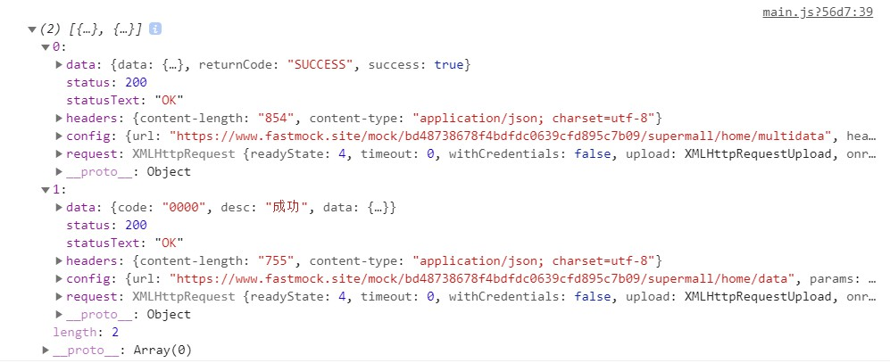
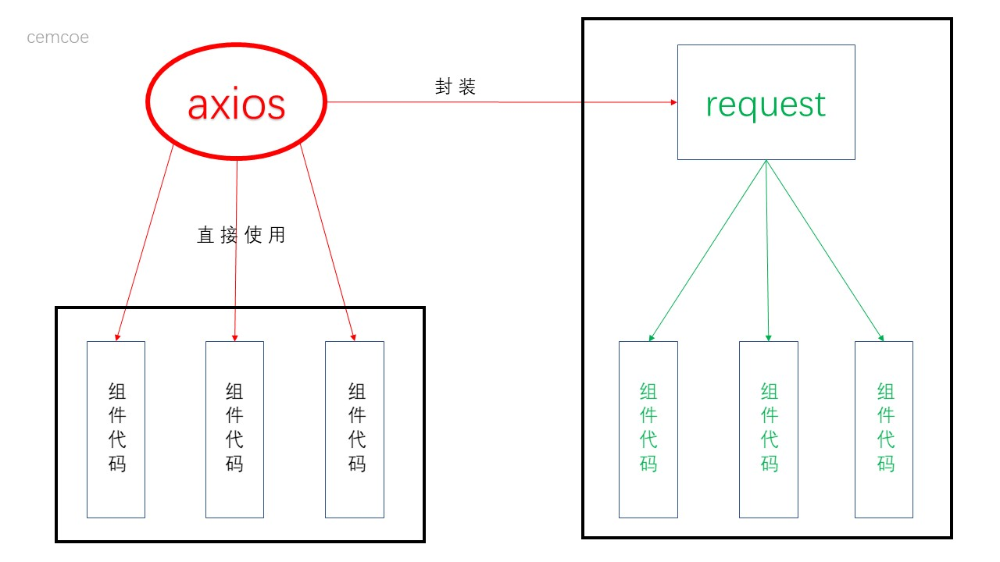

axios 是个框架。

## 来几个例子上手
### 直接的 GET 请求
```js
const config = {
  url: 'https://www.fastmock.site/mock/bd48738678f4bdfdc0639cfd895c7b09/supermall/home/multidata'
}
axios(config).then(res => console.log(res))
```
上面是一个及其简洁的例子，参数只传了一个 url 而已。

`axios` 语法和 `fetch` 有点像，用 `fetch` 做相同的事情是下面这样子的。
```js
const options = {
  method: "GET",
}

fetch('https://www.fastmock.site/mock/bd48738678f4bdfdc0639cfd895c7b09/supermall/home/multidata', options)
  .then(response => response.json())
  .then(result => console.log('fetch', result))
```
上手还是蛮简单的。

### 有参数的情况如何处理？
上面是简单的 GET 请求，其实还有一种常见的场景就是带参数请求数据。

有参数的请求常见于商品详情页等，那么这种有参数的情况要如何处理呢？

很容易想到的一种法子是，我把参数直接添加到请求的url中不就好了吗？我真是个小机灵鬼。

于是就有类似下面的代码。
```js
const config = {
  url: 'https://www.fastmock.site/mock/bd48738678f4bdfdc0639cfd895c7b09/supermall/home/data?type=pop',
}
axios(config).then(res => console.log(res))
```
说实话，上面的代码有点憨憨，等参数改变了还要找到 url 的末尾修改。


更加科学的方案是使用 `axios` 中的 `params` 字段。
```js
const config = {
  url: 'https://www.fastmock.site/mock/bd48738678f4bdfdc0639cfd895c7b09/supermall/home/data',
  params: {
    type: 'pop'
  }
}
axios(config).then(res => console.log(res))
```
在传参这块有个要注意的点：当请求方式是 GET 时传参使用 `params` 字段，
当请求方式是 POST 时传参这个字段要改成 `data` 。


-------------


## 如何处理并发请求？
经过上面的上手练习，发单个请求就问题不大了。

那么如何发送多个请求，一个场景就是只有请求都完成时才进入下一步？

`axios` 同样贴心的为我们搞好了，这时可以使用 `axios.all` 并为其传入数组。
```js
axios.all([axios({
  url: 'https://www.fastmock.site/mock/bd48738678f4bdfdc0639cfd895c7b09/supermall/home/multidata'
}), axios({
  url: 'https://www.fastmock.site/mock/bd48738678f4bdfdc0639cfd895c7b09/supermall/home/data',
  params: {
    type: 'pop'
  }
})])
  .then(result => {
    console.log(result)
})
```


并发请求时只有上述两个请求都完成时才会进入下一步。

## 全局？实例？
抽离一波，请求的 url 前置重复。
```md
https://www.fastmock.site/mock/bd48738678f4bdfdc0639cfd895c7b09/supermall/home/multidata
https://www.fastmock.site/mock/bd48738678f4bdfdc0639cfd895c7b09/supermall/home/data
```
上面两个接口地址有一部分是重复的，可以使用 `axios.defaults` 抽离一波。
```js
axios.defaults.baseURL = 'https://www.fastmock.site/mock/bd48738678f4bdfdc0639cfd895c7b09/supermall'
axios.defaults.timeout = 5000

axios.all([axios({
  url: '/home/multidata'
}), axios({
  url: '/home/data',
  params: {
    type: 'pop'
  }
})])
  .then(result => {
    console.log(result)
})
```


有时后端并不是在一台服务器上，这时接口的 `baseURL` 就不能像上面那么搞了。

这里其实和 Vue 类似，我们可以搞一个 `axions` 实例，有几个 `baseURL` 搞几个实例，老板大气，但一般小的项目一个实例就够了。
```js
const instance = axios.create({
  baseURL: 'https://www.fastmock.site/mock/bd48738678f4bdfdc0639cfd895c7b09/supermall',
  timeout: 5000
})
instance({
  url: '/home/data',
  params: {
    type: 'pop'
  }
}).then(res => console.log(res))
```

## 封装一波
经过上面的一波，对 `axios` 也有了一波了解，下面进入激动人心的封装环节。
`/network/request.js`
```js
import axios from 'axios'

export function request(config) {
  // 1. 创建 axios 实例
  const instance = axios.create({
    baseURL: 'https://www.fastmock.site/mock/bd48738678f4bdfdc0639cfd895c7b09/supermall',
    timeout: 5000
  })

  // 3. 发送真正的网络请求
  return instance(config)
}
```
当其它文件需要向服务器请求时可以向下面这样进行使用。

```js
import {request} from './network/request'

request({
  url: '/home/data',
  params: {
    type: 'pop'
  }
})
  .then(res => console.log(res))
  .catch(err => console.log(err))
```

封装完成后项目代码只对我们封装的 `request` 存在依赖，当 `axios` 出现重大 bug 或者我们有了新欢比如 `fetch` 时，只需再次对新框架进行对应的封装完全无需更改其他代码。

这就是封装的好处了。


## 拦截器，前面那个家伙站住
axios 拦截器预处理，请求前拦截网络请求和响应干啥？
1. config 中的一些不符合要求，对其变更，不符合规格。
2. 每次发送网络请求时在界面显示加载动画。
3. 某些网络请求比如登录，必须携带一些特殊的信息toket，否则跳转到登录界面。

请求拦截的小例子。
```js
// 2. 拦截
instance.interceptors.request.use(config => {
 console.log(config)
 // 我来干点啥
 return config // 一定还给我呀。。
}, err => {
 console.log(err)
})
```

yep。


