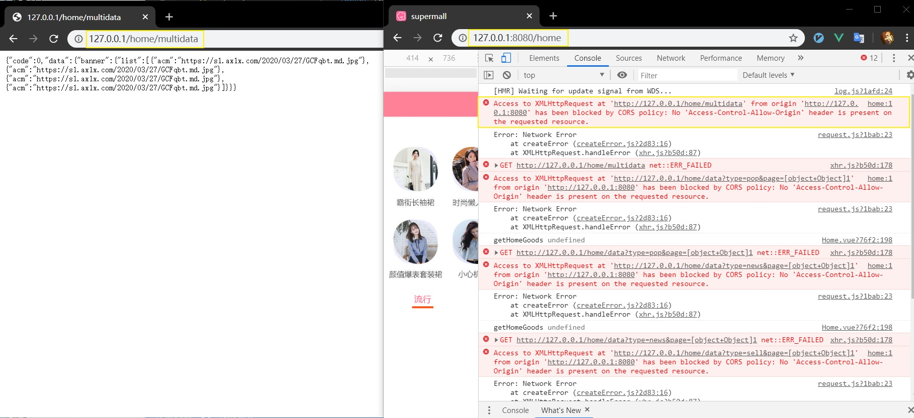

现在的自媒体平台很多，对于喜欢折腾的可能会在多个平台搞。

这里就会出现一个麻烦的点，就是图片的问题。

拿 jianshu 来说，目前(2020.4.21)是支持图片外链的，也就是说，将在 jianshu 写的 markdown 文件直接放到 GitHub 上，图片是可以正常显示的。

有一段时间经常在网上看到下面的信息，一般是某小编将在某平台编辑的 markdown 文件直接粘贴到了另一个平台，而图片存放在原来的服务器，此时图片就挂了。
> 此图片来自XXX平台未经允许不可引用

当你想要将博客迁移到另一个平台时，比如从 jianshu 迁移到 GitHub，如果 jianshu  不支持图片外链的话，那么迁移图片就是一个大工程。

## 为什么？

为什么会出现图片禁止引用呢？其实这只是一种情况，向上推，他的术语叫禁止外链，包括但不限于图片视频等。

这些问题一般会在跨域的时候出现，什么是跨域？简言之，你不是我家的人，你不能来吃我家大米。


统一资源定位符的标准格式如下：
> [协议类型]://[服务器地址]:[端口号]/[资源层级UNIX文件路径][文件名]?[查询]#[片段ID]
哪些情况是跨域呢？端口不同就已经是跨域了，往右如果不同就不会涉及到跨域，往左不行。


在前端开发时往往要解决跨域问题，数据访问不到还写个吉尔。不能一刀切，都不能访问还有什么用。

```js
// 前端：
http://127.0.0:8080/home
// 后端
http://127.0.0:80
```
两者的端口是不同的，此时已经跨域。

当前端进行 ajax 请求时，会触发跨域警告并且拿不到我们需要的数据。


## 分析(甩锅)
理智分析一波，出现这个情况究竟是前端的问题还是后端的问题？


嗯，

解决方法很多。
这里采用后端背锅的方案
```js
// koa
// 处理跨域
router.all('*', async (ctx, next) => {
  ctx.set("Access-Control-Allow-Origin", "*")
  ctx.set("Access-Control-Allow-Headers", "X-Requested-With")
  ctx.set("Access-Control-Allow-Methods","PUT,POST,GET,DELETE,OPTIONS")
  ctx.set("X-Powered-By",' 3.2.1')
  ctx.set("Content-Type", "application/json;charset=utf-8")
  next()
})
```

在线 mock 平台，也是后端解决了跨域问题。这样的话，所有的域都可以访问这个接口了，当然，工作中可能接口只对特定的域开放。


