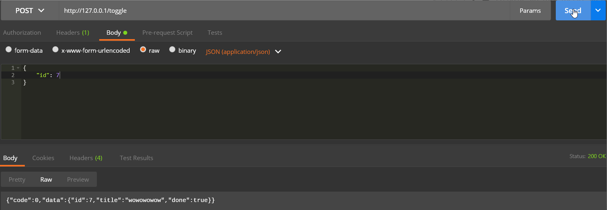

直接说前端渲染和后端渲染的区别，难免进入到对概念的纠结上。
不妨以一个 todolist 例子来看前端渲染 VS 后端渲染的区别。


## todolist功能拆分
抛开前端渲染和后端渲染的技术选型先不谈，对于这个 todolist 小项目进行功能拆分。
- 任务列表展示，展示信息
  - 统计信息（已完成，未完成）
- 任务列表的状态变更
  - 添加新任务
  - 完成任务
  - 取消完成，将任务状态改为未完成
  - 删除任务
- 用户系统


## 后端渲染
先看后端渲染，又称服务器端渲染，通过页面刷新，表单提交来进行数据更新。
- 首页：/
- 添加：/add
- 任务状态改变：/change/:id
- 删除：/remove:/id

发请求时如何带数据？通过 url 中 querystring 传递地址以外的数据。当 methods 为 GET 时，url 中会有 `name=表单值`。

url 长度是有限制的，querystring 也是有限制的，数据量大的内容不推荐 querystring 方式。GET 请求会缓存url，历史记录，会有安全问题。POST 不会放到历史记录里面。

后端渲染版本，需要模板进行渲染，输出一个完整的HTML文件。

### 模板文件编写
模板文件存放在 views 文件夹中，作为使用过 Hexo 推荐的 ejs 模板语法的人，下面的代码就很好理解了。下面是使用 swig 语法写的模板引擎。
```html
<!-- ./views/index.html -->
<ul>
  
  
  <li class="done">
    <input type="checkbox" checked>
    {{task.id}}--{{task.title}}--{{task.done}}
    <a href="#">删除</a>
  </li>
  
  <li>
    <input type="checkbox">
    {{task.id}}--{{task.title}}--{{task.done}}
    <a href="#">删除</a>
  </li>
  
  
</ul>
```

别看模板看上去花里胡哨的，渲染后就是静态的 HTML 文件，百分号啥的就没了。


### 设置模板等静态文件的存放位置
```js
// app.js
const Swig = require('koa-swig')
const co = require('co')
// 设置模板引擎
app.context.render = co.wrap(Swig({
  root: __dirname + '/views',
  autoescape: true,
  cache: false,
  ext: 'html'
}))
```

### 测试数据
不妨先将测试数据保存在变量中。
```js
// app.js
// 存储测试数据，当前数据存储在服务器内存中
let datas = {
  maxId: 3,
  appName: 'TodoList',
  tasks: [
    { id: 1, title: '整理一个博客', done: false },
    { id: 2, title: '学习Vue', done: true },
    { id: 3, title: '干撒', done: false }
  ]
}
```


### 将数据插到模板文件中
将上面定义的数据传到模板文件中。
```js
// app.js
// 首页，展示任务清单
// async await
router.get('/', async ctx => {
  ctx.body = await ctx.render('index.html', {
    datas
  })
})
```

### POST请求
```js
// ./views/add.html
<form action="/posttask/" method="POST">
  <input type="text" name="title" id="">
  
  <button>添加</button>
</form>
```
对应的后端代码
```js
// app.js
// 添加，处理通过添加页面提交的数据
router.post('/posttask', async ctx => {
  let title = ctx.request.body.title || ''
  // ctx.body = '接收提交的新任务' + title
  if (!title) {
    ctx.body = await ctx.render('message', {
      msg: '任务添加失败，请输入任务标题',
      href: 'javascript:history.back();'
    })
    return
  } else {
    datas.tasks.push({
      id: ++datas.maxId,
      title: ctx.request.body.title,
      done: false
    })
    ctx.body = await ctx.render('message', {
      msg: '任务添加成功',
      href: '/'
    })
  }
})
```
可以看到后端渲染，使用模板的数据的拼接是由后端完成的。

### 后端渲染总结
万维网刚开始时就是为了传递文本信息的，内容才是网站的重点，搜索引擎也是喜欢内容的，而网页中的脚本对于部分搜索引擎是无意义的。

这样后端渲染就由 SEO 友好的优点了。

有一个很熟悉的点就是常用的博客程序其实不管是 Hexo 还是 VuePress 都是将 md 根据博客主题渲染成对应的 HTML 文档，可以从其中领会一些后端渲染的东西。

后端渲染思路：
- 请求一个 HTML，模板文件，常用模板引擎 ejs，swig
- 后端查数据库，找到数据
- 服务器根据模板和数据渲染文档
- 服务端将搞好的文档给到客户端

缺点，写起来很别扭，百分号很烦。同时占用服务器资源。
后端渲染适合数据变化不大的页面，频繁进行数据更新的页面推荐前端渲染。


## 前端渲染版本
下面来看一下前端渲染的版本，也是我们熟悉的方式。在今天信息爆炸的时代，数据几乎是实时都在进行着变更。前端渲染，前后端分离不断被提及。

简单来说，前端渲染分工更加明确。后端提供 restful 数据接口，前端根据接口请求数据，前端根据从接口拿到的数据对页面进行渲染。

前端的工作不再仅仅是写页面，还要有一些数据的处理转化，当然，对于数据的处理还是主要集中在后端。

那么问题来了，如何使用 koa 设计一个接口嘞？
首先来看一个接口需要哪些技术。
1. 要有接口地址，需要 HTTP 服务，可以架设到服务器或本地--> Koa
2. 对于不同的地址返回对应的接口，需要用到后端路由--> koa-router
3. 需要解析前端传来的数据--> koa-bodyparser
4. 数据增删改查，需要用到数据库语句，作为一个小项目，暂时将数据放到 json 文件中--> mysql ?? json
5. 基于将文件存储在json文件中，我们需要对文件进行读取操作--> fs


### 测试数据
```json
{"_id":6,"appName":"TodoList","todos":[]}
```
主意json的数据格式。

### 测试数据文件读取
为了拿到并更改 json 里的数据我们引入 fs 文件
```js
const fs = require('fs')
// 读文件并转换数据格式
let datas = JSON.parse(fs.readFileSync('./data/data.json'))
// 更改json文件
fs.writeFileSync('./data/data.json', JSON.stringify(datas))
```


### 无参 GET 接口设计
来看接口的具体操作，一个接口要有地址，数据，参数。
```js
const Router = require('koa-router')
const router = new Router()
router.get('/todos', ctx => {
  // ctx.body = {x:1, y:2} => {"x": 1, "y": 2}
  // ctx.body = datas.todos

  ctx.body = {
    code: 0,
    data: datas.todos
  }
})

app.use(router.routes())
```
todos 接口是一个简单的没有参数的get请求接口


### 有参数 POST 接口设计
下面来一个 POST 请求的例子，来个 BodyParser。
```js
const BodyParser = require('koa-bodyparser')

// body 解析
app.use( BodyParser() )

router.post('/toggle', async ctx => {
  let id = ctx.request.body.id || 0
  if(!id) {
    ctx.body = {
      code: 1,
      data: '请输入id'
    }
    return
  }
  
  let todo = datas.todos.find(todo => todo.id == id)
  todo.done = !todo.done

  ctx.body = {
    code: 0,
    data: todo
  }

  fs.writeFileSync('./data/data.json', JSON.stringify(datas))
})
```

用这个post接口接收一个id参数，会将该id对应的任务状态改变，有完成改为未完成或者反过来。
用 postman 来发一波请求。


就这？

前端如何根据接口地址进行渲染这里就不多说了，毕竟是前端熟悉的地方了。


### 前端渲染总结
在前端渲染下，前端请求数据，用户更改数据后前端将数据发到后端，后端对数据进行相应的更改后将更新的数据给到前端，前端根据数据更新页面。

两者在数据填充上有很大的区别，后端渲染直接将数据填充到 HTML 后传给前端，前端渲染则是通过 fetch || ajax || axios 等从后台接口拿数据再自己填充或进行其他数据操作，进而渲染界面。

和后端渲染相比更麻烦了有没有？


---

## api接口设计
开发前沟通好接口的数据结构
开发前沟通好接口的数据结构
开发前沟通好接口的数据结构

不要一上来就莽代码。


