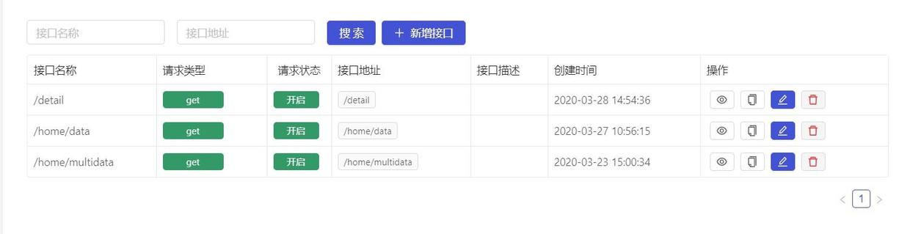
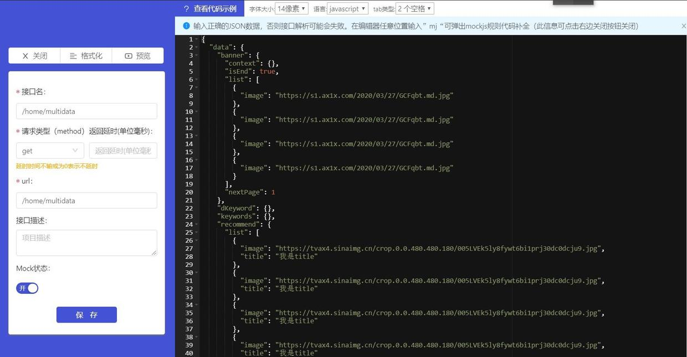
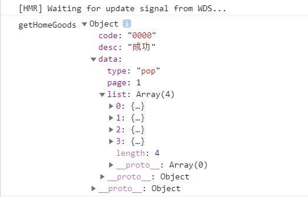
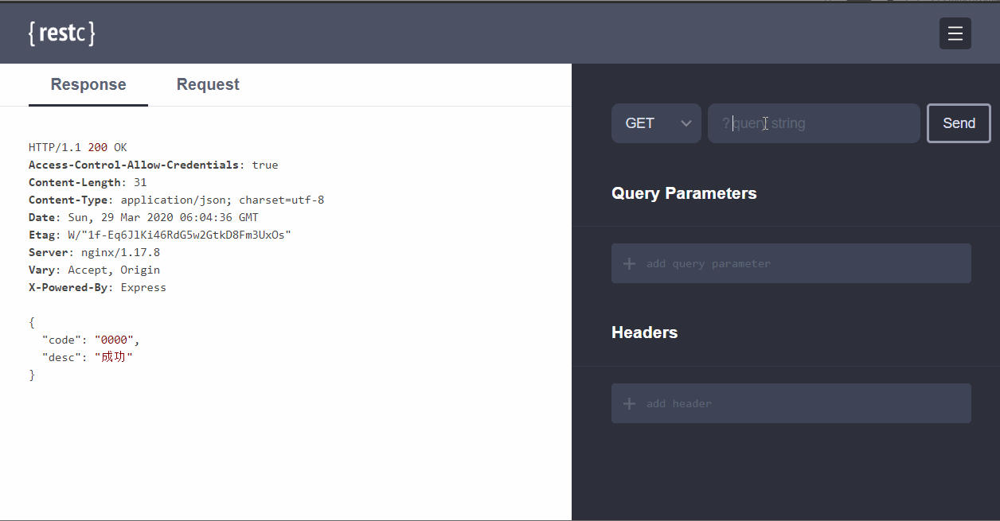

按理来说在开发时，前端先从后端请求数据，然后通过一些花里胡哨的技术将数据在页面上进行展示。这是一个很好的流程，但事实往往是前后端并行开发，前端在调页面时后端 API 还没有搞好，总不能干等着吧。这时就需要对数据进行一个模拟了。

没有后端接口的情况很常见，比如想学一项前端网络请求相关的知识，不管是 fetch 还是 ajax，多少会需要一个后端接口，没有数据怎么请求。再比如在网上看到一个前端视频教程，跟着做了之后极大概率会发现后端接口挂了，这时咋办？

对于前端而言，没有接口时还是有很多解决方案的。

最硬核的解决方案是自己写一个后端接口，前后端的逻辑方式还是有很大不同的，这种方案需要花费极大的时间成本和学习成本。同时还有点费力不讨好，就好像是巧妇难为无米之炊，结果巧妇为了解决这个困境开始尝试种起了稻米。当然，前后端都能搞定的全栈还是很厉害的。

再来看最不硬核的方案，那就是在页面里把数据写死，等后端把接口搞好以后再更改。这种方法就有点不科学了，等接口好了之后，前端工作量会激增。

----

目前来讲 Mock 数据这种方式更好，[mockjs](http://mockjs.com/) 文档有点东西。

现在更加倾向于在线 Mock
- 网易[计划开源] https://nei.netease.com/
- 去哪儿前端 https://github.com/ymfe/yapi
- 阿里妈妈前端 https://github.com/thx/rap2-delos
- https://apiary.io/

---

目前在B站看一个[Vue教程](https://www.bilibili.com/video/BV15741177Eh)，因为时间等原因，接口挂了，就想着如何模拟一波，从此接口不求人。

最近使用的是 [https://www.fastmock.site/](https://www.fastmock.site)




目前模拟了三个接口：
- /home/multidata
- /home/data
- /detail



不妨用 axios 请求一波看下结果。
```js
const instance = axios.create({
    baseURL: 'https://www.fastmock.site/mock/bd48738678f4bdfdc0639cfd895c7b09/supermall',
    timeout: 5000
})
```



很好数据请求成功，等到后端接口搞好以后，更改一下 axios 中的 `baseURL` 就可以无缝连接了。

下面是 `/home/multidata` 的 mock 文件：
```json
{
  "data": {
    "banner": {
      "context": {},
      "isEnd": true,
      "list": [
        {
          "image": "https://s1.ax1x.com/2020/03/27/GCFqbt.md.jpg"
        },
        {
          "image": "https://s1.ax1x.com/2020/03/27/GCFqbt.md.jpg"
        },
        {
          "image": "https://s1.ax1x.com/2020/03/27/GCFqbt.md.jpg"
        },
        {
          "image": "https://s1.ax1x.com/2020/03/27/GCFqbt.md.jpg"
        }
      ],
      "nextPage": 1
    },
    "dKeyword": {},
    "keywords": {},
    "recommend": {
      "list": [
        {
          "image": "https://tvax4.sinaimg.cn/crop.0.0.480.480.180/005LVEk5ly8fywt6bi1prj30dc0dcju9.jpg",
          "title": "我是title"
        },
        {
          "image": "https://tvax4.sinaimg.cn/crop.0.0.480.480.180/005LVEk5ly8fywt6bi1prj30dc0dcju9.jpg",
          "title": "我是title"
        },
        {
          "image": "https://tvax4.sinaimg.cn/crop.0.0.480.480.180/005LVEk5ly8fywt6bi1prj30dc0dcju9.jpg",
          "title": "我是title"
        },
        {
          "image": "https://tvax4.sinaimg.cn/crop.0.0.480.480.180/005LVEk5ly8fywt6bi1prj30dc0dcju9.jpg",
          "title": "我是title"
        }
      ]
    }
  },
  "returnCode": "SUCCESS",
  "success": true
}
```
上面的数据比较简单，在开发时还有一种常见的场景就是前端传向后端数据，后端根据前端传回的数据返回对应的结果。简言之，根据入参返回数据。

在 `/home/data` 接口中就有对应的需求。


从图中可以看出，流行，新款，精选是整个组件，每个组件对应一个参数，当用户点击时，对应的参数传给后端接口，后端根据传回来的是 pop，news 还是 sell，决定给前端返回什么数据，前端在拿到数据后进行页面展示。



附上入参 mock
```js
{
  "code": "0000",
  "data": function({_req, Mock
  }) {
      if(_req.query.type === "pop") {
        return {
        "type": "pop",
        "page": 1,
        "list": [
          {
            "show": {
              "img": "https://tvax4.sinaimg.cn/crop.0.0.480.480.180/005LVEk5ly8fywt6bi1prj30dc0dcju9.jpg"
            },
            "title": "pop 我来凑字数",
            "price": 114,
            "cfav": 66,
            "iid": "cemcoe_1"
          },
          {
            "show": {
              "img": "https://tvax4.sinaimg.cn/crop.0.0.480.480.180/005LVEk5ly8fywt6bi1prj30dc0dcju9.jpg"
            },
            "title": "pop 我来凑字数",
            "price": 114,
            "cfav": 66,
            "iid": "cemcoe_2"
          },
          {
            "show": {
              "img": "https://tvax4.sinaimg.cn/crop.0.0.480.480.180/005LVEk5ly8fywt6bi1prj30dc0dcju9.jpg"
            },
            "title": "pop 我来凑字数",
            "price": 114,
            "cfav": 66,
            "iid": "cemcoe_3"
          },
          {
            "show": {
              "img": "https://tvax4.sinaimg.cn/crop.0.0.480.480.180/005LVEk5ly8fywt6bi1prj30dc0dcju9.jpg"
            },
            "title": "pop 我来凑字数",
            "price": 114,
            "cfav": 66,
            "iid": "cemcoe_4"
          }
        ]
      }
    } else if(_req.query.type === "news") {
      return {
        "type": "news",
        "page": 1,
        "list": [
          {
            "show": {
              "img": "https://upload.jianshu.io/users/upload_avatars/3750332/77e3a7d9-a1a3-43da-9ea0-4728826017ba.jpg?imageMogr2/auto-orient/strip|imageView2/1/w/240/h/240"
            },
            "title": "new 我来凑字数",
            "price": 114,
            "cfav": 66
          },
          {
            "show": {
              "img": "https://upload.jianshu.io/users/upload_avatars/3750332/77e3a7d9-a1a3-43da-9ea0-4728826017ba.jpg?imageMogr2/auto-orient/strip|imageView2/1/w/240/h/240"
            },
            "title": "new 我来凑字数",
            "price": 114,
            "cfav": 66
          },
          {
            "show": {
              "img": "https://upload.jianshu.io/users/upload_avatars/3750332/77e3a7d9-a1a3-43da-9ea0-4728826017ba.jpg?imageMogr2/auto-orient/strip|imageView2/1/w/240/h/240"
            },
            "title": "new 我来凑字数",
            "price": 114,
            "cfav": 66
          },
          {
            "show": {
              "img": "https://upload.jianshu.io/users/upload_avatars/3750332/77e3a7d9-a1a3-43da-9ea0-4728826017ba.jpg?imageMogr2/auto-orient/strip|imageView2/1/w/240/h/240"
            },
            "title": "new 我来凑字数",
            "price": 114,
            "cfav": 66
          }
        ]
      }
    } else if(_req.query.type === "sell")
      return {
      "type": "sell",
      "page": 1,
      "list": [
        {
          "show": {
            "img": "https://tvax4.sinaimg.cn/crop.0.0.480.480.180/005LVEk5ly8fywt6bi1prj30dc0dcju9.jpg"
          },
          "title": "sell 我来凑字数",
          "price": 114,
          "cfav": 66
        },
        {
          "show": {
            "img": "https://tvax4.sinaimg.cn/crop.0.0.480.480.180/005LVEk5ly8fywt6bi1prj30dc0dcju9.jpg"
          },
          "title": "sell 我来凑字数",
          "price": 114,
          "cfav": 66
        },
        {
          "show": {
            "img": "https://tvax4.sinaimg.cn/crop.0.0.480.480.180/005LVEk5ly8fywt6bi1prj30dc0dcju9.jpg"
          },
          "title": "sell 我来凑字数",
          "price": 114,
          "cfav": 66
        },
        {
          "show": {
            "img": "https://tvax4.sinaimg.cn/crop.0.0.480.480.180/005LVEk5ly8fywt6bi1prj30dc0dcju9.jpg"
          },
          "title": "sell 我来凑字数",
          "price": 114,
          "cfav": 66
        }
      ]
    }
  },
  "desc": "成功"
}
```

上面展示的是一些简单的模拟，只涉及了 "GET" 操作，Mock.js 语法没有用到太多，主要是我还没有看怎么写抽空看一下 Mock.js。


