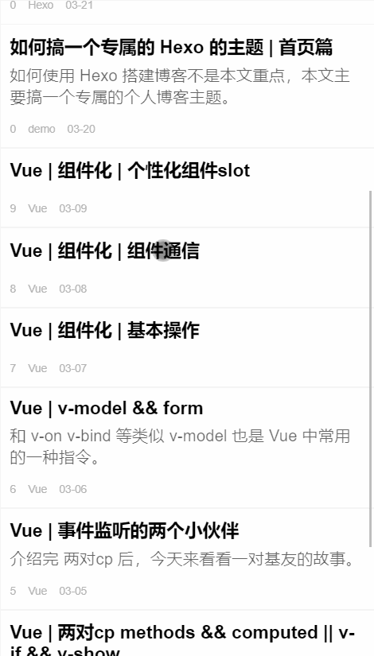

如何使用 Hexo 搭建博客不是本文重点，本文主要是要搞一个专属的个人博客主题。

## 了解 Hexo
关于什么是 Hexo，推荐使用关键词 `hexo github` 进行了解。

最近瞧上了 [连载](https://www.jianshu.com/nb/40206736) 的 UI，想着照着搞一个Hexo 博客主题玩一玩。

时间有限，来看一下粗糙版本的预览图。


---

已完成的功能点：
- 首页文章列表展示
- 文章详情页
- 右侧目录正序排列

---

待完成的功能点
- 右侧目录逆序排列
- tag 系统
- 代码高亮
- 上一页 下一页
- 底部的目录功能
- 响应式设计
- 白天夜晚模式切换
- 字体大小切换
- 字数统计

可以点击 [在线预览](https://cemcoe.com/blog/chemer-fe-test/index.html)，目前没有对电脑端进行适配，UI有点搓，字体比例有点不协调，抽空看一些设计的书籍。

---

## 首页任务拆分
接下来是一些记录，先对首页页面进行划分，往大了分可以分为上部用户信息和下部文章列表部分。

先抛开 CSS 样式不谈，先来看一看内在美（主要目前不想调样式），来找一找我们要用到的数据和内在交互逻辑。

下面依次来看。

---

### 用户信息区
在上部的用户信息区可以看到包含用户头像，用户名，用户介绍等部分。
这些数据大都定义在 `_config.yml ` 中，下面对着文档来找一找数据。
```md
# Site
title: 化学小子的前端实验册
subtitle: ''
description: ''
keywords:
author: cemcoe
author_intro: 略懂化学和代码
language: zh
timezone: ''
```
知道了数据存放在哪里，那么问题来了如何拿到并使用这些数据？

如果在 Vue 中是可以使用双大括号语法拿到 data 中我们需要的值。
```md
{{ message }}
```

可这里是 Hexo，入乡随俗，这里有什么法子搞到数据。

这里要用到模板引擎，推荐 `ejs`，若想了解可以查看文档，这里是 [文档](https://ejs.bootcss.com/)。

为了简化流程（懒）,我这里写了两个模板，分别是对应首页和文章详情页。

本文主要是对首页的记录。

---

目录结构是这样的：
```md
- layout
  - index.ejs
  - post.ejs
- source
  - css
    - index.css
    - post.css
  - imgs
  - js
- README.md
```

layout 文件夹中存放的就是模板文件了，先看 `index.ejs` 即首页模板。
```html
<div id="user-info">
  <div class="background">
    
  </div>
  <div class="avatar">
    
  </div>
  <div class="author-info">
    <div class="name"><%= config.author %></div>
    <div class="follow-meta">
      <span>文章数: <%= site.posts.length %></span>
    </div>
  </div>
  <div class="intro">
    <%= config.author_intro %>
  </div>
</div>
```


其实和 html 没多大的差别，仔细看一下，两者的不同可能在百分号上，随便拎出来一个：
```md
<%= config.author %>
```
嗯，是不是很容易想到 Vue 的双大括号语法。
```md
// ejs：
<%= config.author %>
// Vue:
{{ config.author }}
```

翻看 `ejs` 的文档可以发现，尖括号和百分号是模板标签，这里主要用到四种：
```md
<% '脚本' 标签，用于流程控制，无输出。
<%= 输出数据到模板（输出是转义 HTML 标签）
<%- 输出非转义的数据到模板
%> 一般结束标签
```

如前面看到的 `index.ejs` 的代码使用的就是 `<%=`，看一下index.ejs 中用到的数据：
```md
- config.author 用户名
- config.author_intro 用户简介
- site.posts.length 文章数
```
前两条数据都好理解，他们都存储在上文提到的 `_config.yml` 中，最后一条数据的 `site` 是哪里来的。

不妨打印一下先，将 `<% console.log(site) %>` 添加到首页，并刷新首页可以看到类似结果。
```js
{
  posts: _Query {
    data: [
      [_Document], [_Document],
      [_Document], [_Document],
      [_Document], [_Document],
      [_Document], [_Document],
      [_Document], [_Document]
    ],
    length: 10
  },
  pages: _Query { data: [], length: 0 },
  categories: _Query { data: [], length: 0 },
  tags: _Query { data: [ [_Document], [_Document] ], length: 2 },
  data: {}
}
```
查 [Hexo 文档](https://hexo.io/zh-cn/docs/variables#%E7%BD%91%E7%AB%99%E5%8F%98%E9%87%8F) 可以发现，`site.posts` 存储着网站的所有文章，并且通过测试打印的数据可以发现 `site.posts` 本身是一个对象，其拥有的一个属性 `length` 存储着文章的数量，这些都是 Hexo 定义好的，用户信息项的分析到此就完了。


### 文章列表项
看完用户信息项，不妨再来看一看文章列表项。
```html
<div class="flow-list-container">
  <% page.posts.each(function (post) { %>
  <ul class="flow-list-ul">
    <li class="note-flow">
      <a class="content" href="<%- url_for(post.path) %>">
        <div class="summary">
          <h6 class="title"><%= post.title %></h6>
          <div class="abstract">
            <%- post.excerpt %>
          </div>
          <div class="meta">
            <span><%= post.order %></span>

            <% post.tags.data.forEach(function (tag) { %>
            <span><%- tag.name %></span>
            <% }) %>

            <span class="time"><%- date(post.date, "MM-DD") %></span>
          </div>
        </div>
      </a>
    </li>
  </ul>
  <% }) %>
</div>
```

比用户信息项更简单了有没有？并没有。

有了用户信息项的经验，这里我们可以找一找 `ejs` 模板标签。
这里出现了三类模板标签：
```md
<%- url_for(post.path) %>

<% page.posts.each(function (post) { %>
<% }) %>

<%= post.title %>
```
先看 `<%- url_for(post.path) %>`，是的，它出现了，这不就是 `v-for` 吗？
准确地说是`v-bind` 和 `v-for` 的结合体，因为它是被插入到了元素属性 `href` 中。

再来看第二个，就是一个遍历操作，`page.posts` 的数据结构和 `site.posts` 类似。

来看一看用到的数据：
```md
- post.path 文件路径
- post.excerpt 文章摘要
- post.order 文章次序
- post.tags.data 这里需要注意遍历post.tags是拿不到tag的
- post.date 写文章时间
```

同时用到了两个 Hexo 的[辅助函数](https://hexo.io/zh-cn/docs/helpers)
```md
- url_for()
- date()
```

首页就是这些东西了。


## 文章详情页
来看一看文章详情的模板如何写？

先进行功能点拆分：
- 文章元信息如标题，时间，tags 等的展示问题
- 如何拿到文章内容的主体数据
- 如何处理文章里出现的代码，图片等特殊资源

---

### 文章元信息
现在看一下使用 `forEach` 遍历 tags，来看一下 tag 的数据结构。
```md
_Document {
  name: 'Hexo',
  _id: 'ck82sbm4z000fkoie38def1hh',
  slug: [Getter],
  path: [Getter],
  permalink: [Getter],
  posts: [Getter],
  length: [Getter]
}
```

嗯，我们需要的数据是 `tag.name`，开始遍历。
```html
<% page.tags.data.forEach(function (tag) { %>
<span class="tags"><%- tag.name %></span>
<% }) %>
```

### 文章内容数据
拿到文章主体数据：
```html
<%- page.content %>
```

### 右侧目录排序功能点
```html
<ul>
    <% site.posts.data.forEach( function(post){ %>
    <li style="order: <%- post.order %>;"><a
      href="<%- url_for(post.path) %>"><%- post.order %>---<%- post.title %></a></li>
    <% }) %>
</ul>
```
在这里使用 flex 布局中的 order 进行正序排列。

在这里有个坑，在 `site.posts.data` 中的数组是按照文件在系统中的排序，而不是创建时间，就很迷，看了好久不知道排序的依据是啥。


### 代码等特殊资源的处理
接下来看一看如何处理文章里出现的代码，图片等特殊资源。
被 ` 包裹会被渲染成 code 标签，双大括号会报错。


下面列举一些 md 搭配 html 标签的例子用于添加样式：
```md
``     ===> code
>      ===> blockquote
`````` ===> figure.[hihlight plain]

```

<!-- 小小目录功能涉及的点
数组排序
遮罩问题
滚动条的使用 -->
```css
pre {
  overflow-x: auto;
}
```
防止代码撑开页面

代码高亮 https://prismjs.com/download.html

整体上这个 Hexo 主题大致就搞好了，还剩一些边边角角。

已转投 VuePress，真香。
