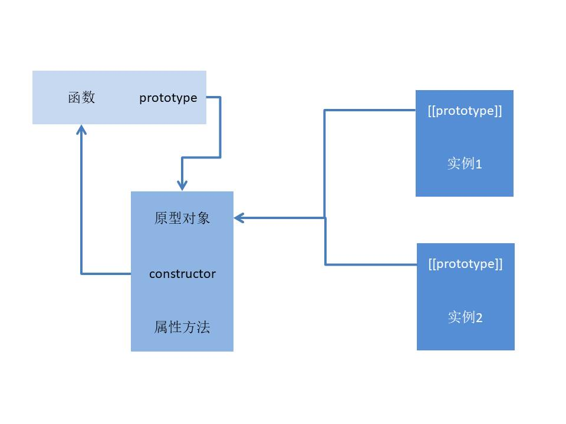

## 读JavaScript高级程序设计

## 第一章 缘起
最近吧，总感觉自己的前端知识体系不是很系统。

自己像个咸鱼一般，对于一些原理层面的东西不是很熟悉，有点拿来就用或现用现查的“毛病”，也可能是代码写的还不够多的原因。

于是立一个flag，看一下这本《JavaScript高级程序设计（第3版）》，再写点笔记。

从书的目录来看呢，第三版有些东西在 2020 年可能已经无需再多关注。
比如关于 IE 兼容方面的内容。但不可否认，在知识体系结构方面是本好书。

笔记会以 QA 的方式为主的方式进行总结，会掺杂个人的理解。


主要参考 [第三版](https://book.douban.com/subject/10546125/)，第四版中文版预计 2020 下半年出，但那是 2019 年的计划，赶上今年这个事应该会推迟，从 [图灵社区](https://www.ituring.com.cn/book/2472)
来看，目前的状态是`正在排版`。[英文版](https://www.amazon.com/Professional-JavaScript-Developers-Matt-Frisbie-ebook/dp/B07YP276S1/) 已经在亚马逊上架了，网上也有流出英文版本。


认认真真读一本书，在知识爆炸的今天，这个书呀还是信息噪点最低的一个途径的。好好看书还是很有必要的。

我曾经妄图通过看网上的文章学东西，但这些文字吧有极大部分是培训班不知从哪里copy的文章，难受的是还没有复制全，这种途径的信息噪点太大。

使用手机学东西，经过反反复复的循环过程，我放弃了。诱惑是在是太多或者说这些 APP 被创造出来就是要故意勾引我，这些 APP 是真的狗。最终还是回到了读书这种方式。

读书的时候呢，思想跟着作者，站在作者角度去思考，没准会有新的发现。


很久很久以前，有一个城堡。。。

### 1. 远古的故事
> 今天来看第一章，JavaScript简介。

很久以前人们上网就是为了获取信息，这里的信息更多的是文本，没有视频什么的。网站也没有什么用户体验的考量。能用就完事了。


据说当时在布局方式上使用表格tr td布局，为了解决布局问题诞生了很多的 hack 手段，不要问我有什么 hack 手段，我还年轻。。。也没有什么意义。

那些年浏览器的兼容问题令人头疼，然而历史的车轮滚滚向前，人类却从未从历史中吸取过教训。

现在的各种小程序又何尝不是让人感到又有那味儿了呢？好不容易跳出了一个坑，转身又跳进了另一个。

在苹果发布手机时，提了一个概念叫做用户体验，洋名是 User Experience，简称UE/UX，此时互联网公司也开始注意到网页与用户的交互问题。

对了，几天前苹果在 iOS14 发布会上又搞出来一种 APP Clip，嗯，浏览器大战换成了小程序大战。

据不完全统计，现在的平台有微信小程序，支付宝小程序，百度小程序，字节跳动小程序，QQ小程序，快应用，360小程序，PWA，APP Clip。

以前前端开发要解决浏览器兼容问题，现在，嗯，十多种小程序环境还有部分的浏览器问题，加一块简直不要太他喵的酸爽。

兼容性是前端一生之敌。抽空看一看uni-app，据说这货可以跨端开发。但总隐约觉得不靠谱。


### 2. JavaScript组成部分
通常所说的 JavaScript 其实包含三部分，ECMAScript | DOM | BOM。

BOM 因为早期对窗口的滥用，浏览器做了很多的安全限制，现在相对于 DOM 使用的不是很多。

而随着 MVVM 框架的出现，现在也很少直接操作 DOM。

JavaScript拢共也就就三部分，现在其中的两个都因部分原因不被重视，所以我们学习的重点应该放在 ECMAScript 上，现在每年都会推出新的规范，现在最新的是 ECMAScript 2020，属于广义上的ES6。


### 3. 制定规范时参考标准
这些人在制定规范时参考的标准
- 将和浏览器相关的代码删除
- 全面支持 Unicon 标准
- 对象和平台无关

98 年标准发布到 2020，12年了。

所以，重点应该放在对 ECMAScript 的使用上，这是重点重点重点。

---

## 第二章 在 HTML中使用 JavaScript


### 1. script 标签属性的变化
首先是 script 标签的属性问题，在第三版中提到有 6 个属性，在第四版中已经变成了 8 个。
```md
// 第三版
async charset defer language src type
// 第四版
async charset crossorigin defer intergrity language src type src type
````

可以看出多出来的两个属性是 crossorigin intergrity。

然而并没什么，废话了这么多，实际上使用最多的就是一个 `src` 属性。

### 2. 运行流程预编译
在 p11 中有那么一句话。

> 包含在 script 元素内部的 JavaScript 代码将被从上至下依次解释。

解释？何为解释？ 

对于 JavaScript，预编译 + 执行 = 解释，这里展开会有很多内容，涉及变量提升，作用域等高阶知识，有空单独写。

请看第二章番外何为解释？


### 3. 标签放哪里 
js代码会阻断代码运行，通常会将 script 放到文档底部。

那么有没有情况一定要放到前面？ 

你别说，还真有，比如 Vue，[demo](https://github.com/vuejs/vuejs.org/blob/master/src/v2/examples/vue-20-hello-world/index.html)，在这里，例子里 script 放到了 head 里面，这是因为后面要用到，如果将 script 放到文档的底部，那么在该 js 文件未加载前是无法使用 Vue 的。
```html
<!DOCTYPE html>
<html>
<head>
  <title>My first Vue app</title>
  <script src="https://unpkg.com/vue"></script>
  <!-- js放到head中 -->
</head>
<body>
  <div id="app">
    {{ message }}
  </div>

  <script>
    var app = new Vue({
      el: '#app',
      data: {
        message: 'Hello Vue!'
      }
    })
  </script>
</body>
</html>
```

---

## 第二章番外 何为解释？
对于 JavaScript，解释 = 预编译 + 执行，解释没那么简单，那么究竟什么是解释？

### 1. 解释解释
你来解释解释什么是解释？

什么，TMD的是解释？


本来打算有空就写的，结果苟了几天，没有写了，感觉自己废了。

主要是这个`解释`，难以解释。
```md
黄四郎：好啊！三天之后，一定给县长一个惊喜！
张麻子：汤师爷，他是胡万的恩人，现在又成了你的恩人！你给翻译翻译，什么叫惊喜？翻译翻译，什么叫惊喜？
汤师爷：这还用翻译？都说了…
张麻子：我让你翻译给我听，什么叫惊喜！
黄四郎：不用翻译，就是惊喜啊！难道你听不懂什么叫惊喜？
张麻子：我就想让你翻译翻译，什么叫惊喜！
汤师爷：惊喜嘛……
张麻子：翻译出来给我听，什么他妈的叫惊喜！什么他妈的叫他妈的惊喜！
汤师爷：什么他妈的叫惊喜啊？
黄四郎：惊喜就是三天之后，我出一百八十万，给你们出城剿匪，接上我的腿！明白了吗？
汤师爷：这就是惊喜呀
张麻子：翻译翻译。翻译翻译！
汤师爷：惊喜就是三天之后，给你一百八十万两银子，出城剿匪，接上他的腿！
张麻子：大哥这个是惊喜啊！小弟我愿意等你三天。（拉过汤师爷来）黄老爷，汤师爷是我的至爱，你可不能夺我所爱啊！
黄四郎：了然，了然！
```


心态炸了，有没有？


### 2. 这玩意怎么解释
解释 = 预编译 + 执行，解释这个东西要怎么解释？

书上没有呀，这时可以拿起另一本书 [《你不知道的JavaScript（上卷）》](https://book.douban.com/subject/26351021/) 来看一看。


### 3. 预编译过程

来看一个例子：
```js
// eg1
console.log('a', a)
var a = 123

console.log('---')

var b = 123
console.log('b', b)

console.log('---')

console.log('c', c)
/**
 * a undefined
 * ---
 * b 123
 * Uncaught ReferenceError: c is not defined at index.js:11
*/
```

我们知道在 ES6 中可以使用 const 和 let 定义变量，将上边的 var 换成 const 会出现什么的情况？

```js
// eg2
console.log('a', a)
const a = 123

console.log('---')

const b = 123
console.log('b', b)

console.log('---')

console.log('c', c)
/**
 * Uncaught ReferenceError: Cannot access 'a' before initialization at index.js:1
*/
```
直接报错，这是因为 ES6 中的 const 和 let 会形成暂时性死区(TDZ)，这就是另外一个故事了。

回到 var 上面来，令人迷惑的是下面的代码片段：
```js
// eg3
console.log('a', a)
const a = 123

console.log('c', c)
```
如上面的代码所示，a 和 c 都是在没有被声明时调用了，但 a 得到的是 undefined，而 c 却报错了。

两者的区别在于 a 最后补上了声明，而 c 始终没有声明。a 给人的感觉就是我先用，声明先欠着，等到某天我会还上的。而 c 完全就没有想要补上声明的意思。

### 4. 看一个例子
再来看一个例子，控制台会输出什么？
```js
// eg4
console.log(a)

function a(a) {
  var a = 234
  var a = function() {}
  a()
}

var a = 123
/**
 * ƒ a(a) {
 * var a = 234
 * var a = function() {}
 * a()
 * }
* /
```

有一种刚学会 1+1 就要去做微积分的感觉。

### 5. 来预编译实战

再来一题：
```js
// eg5
function fn(a) {
  console.log(a) // f a() {}
  var a = 123
  console.log(a) // 123
  function a () {}
  console.log(a) // 123
  var b = function () {}
  console.log(b) // f () {}
  function d() {}
}

fn(1)
```
口说无凭，打个断点调试一下。


真刺激。


预编译发生在函数执行的前一刻。

### 6. 预编译四部曲
1. 创建 AO 对象 Activation Object 执行期上下文
2. 找形参和变量声明，将变量和形参的名挂上，并赋值undefined
3. 将形参和实参相统一
4. 找函数声明，赋值函数体


下面是例子 eg5 产生 AO 的过程：
```md
1.
AO {

}

2.
AO {
  a: undefined,
  b: undefined,
}

3.
AO {
  a: 1,
  b: undefined
}

4.
AO {
  a: function a() {},
  b: undefined,
  d: function d() {}
}
```
在代码执行时上哪里找a？就是上面的 AO，接下来按顺序就好了。预编译调和各个变量的冲突。在运行过程中，AO 也会动态变化。


---

走一遍流程：
```js
// eg6
function test(a, b) {
  console.log(a)
  c = 0
  var c 
  a = 3
  b = 2
  console.log(b)
  function b () {}
  function d () {}
  console.log(b)
}
test(1)
```


```md
// 走流程
1. 创建AO对象
AO {

}
2. 找形参和和变量声明并赋值undefined
AO {
  a: undefined
  b: undefined
  c: undefined
}
3. 人剑合一，将形参和实参相统一
AO {
  a: 1,
  b: undefined
  c: undefined
}
4. 找函数体声明赋值函数体，会覆盖第三步
AO {
  a: 1
  b: function b() {}
  c: undefined
  d: function d() {}
}
```
拿着我们的 AO 去和函数对线，打印顺序是122。

我们来提炼一下，在预处理时，赋值函数体在形参和实参统一的后边，变量的赋值是在函数执行时发生的。


### 7. 练习
ok，来道题练一练，下面的console都会打印什么东西？

```js
// eg7
function test(a, b) {
  console.log(a)
  console.log(b)
  var b = 234
  console.log(b)
  a = 123
  console.log(a)
  function a () {}
  var a 
  b = 234
  var b = function () {}
  console.log(a)
  console.log(b)
}
test(1)
```
不墨迹，直接写AO对象。
```md
AO {
  a: function a() {}
  b: undefined
}
```
很简单，接下来拿着 AO 按照顺序执行就好了。


对于全局而言全局生成GO Global Object，再来个复杂的题目。

```js
// eg8
console.log(test)
function test(test) {
  console.log(test)
  var test = 234
  console.log(test)
  function test() {}
}
test(1)
var test = 123
```

直接 AO GO 写起来。
```md
GO {
  test: test(test){}
}

AO {
  test: test() {}
}
```

简单。，，这就是解释还没完，有空再写。


---
## 第三章 基本概念
> 这是第三章基本概念，这一章涉及变量，操作符，语句和函数等相关内容。是各种编程语言都有的部分。

主要的知识点：
- ECMAScript 中究竟有几种数据类型？
- 如何检测一个数据的数据类型？
- 为什么 typeof null 的结果会是 object？
- 数据类型间的互相转化如何进行？
- [ES2020](https://www.jianshu.com/p/d6586d4c33f9)新增操作符使用场景？
- for of 语句使用场景？


### 1. 数据类型的变迁
根据网上的资料可以知道 ECMAScript 的数据类型存在三次变迁。

刚开始的 6 种数据类型：Null Undefined Boolean Number String Object

ES6 来了之后添加了一个新成员：Symbol

ES2020 来了之后添加了另一个新成员：BigInt

所以说站在 ES2020 的角度来看，ECMAScript 有 8 种数据类型。

高程这本书第三版是最开始的 6 种的情况，第四版提到了Symbol。

同时还有另一种分类方法，Object还被称为complex data type，其他7种数据类型还称primitive types。


来看一下两个新朋友，Symbol 和 BingInt。

Symbol 在 js 中代表独一无二的值，目前能想到的应用场景是，利用 Symbol 值作为属性名可以很好的避免复杂对象中含有多个属性的时容易将某个属性名覆盖掉的情况。

BingInt其实也算是[老朋友](../a-few-simple-arithmetic-problems/)了。

好的，我们现在已经知道了 ESMAScript 中有Null Undefined Boolean Number String Object Symbol BigInt 8 种数据类型，接下来的问题是当我们拿到一个数据，比如通过 ajax 向后端请求到数据后，如何检测该数据的数据类型？

### 2. 数据类型的检测
为什么要对数据的类型进行检测？想必大家在高考时都见过类似的题目：


做事情前要验明正身，是谁，是敌人还是朋友，对人体有害吗？

这里对数据进行检测是因为每种数据类型有不同的特性或者说是结构，有不同的处理方案。

在搞事情前的第一步要搞清楚这个数据是个啥玩意儿？化学中可以使用各种试剂比如银氨溶液等来检测。

而在这里对于数据类型的检测可以使用几个方案。


typeof instnceof 
每种检测方法各有优缺点，下面依次测试。
首先的typeof ，需要注意两点，typeof 是操作符，使用时可以不加括号，其次使用 typeof 检测的结果本身的数据结构是字符串，即
```js
typeof (typeof 管你是你哈) ===  'string'
```


从图中可以看出 typeof 的结果和数据类型并不是严格意义上的一一对应，和我们料想的不一样的点在于 Object 和 Null。

这里就有一些问题了，为什么 typeof null 的结果会是 object？

在MDN上找到的解释是：
> 在 JavaScript 最初的实现中，JavaScript 中的值是由一个表示类型的标签和实际数据值表示的。对象的类型标签是 0。由于 null 代表的是空指针（大多数平台下值为 0x00），因此，null 的类型标签是 0，typeof null 也因此返回 "object"。

[The history of “typeof null”](https://2ality.com/2013/10/typeof-null.html)

综上，如果你要判断变量是 Undefined Boolean 等简单数据类型，那么 typeof 可以使用，但如果你要检测一个变量是否为对象，或者具体的对象类型，那么，typeof 可能无能为力。

还有instanceof方法检测，后面再说。

如何检测空数组？如何检测空对象？

### 3. 类型转换
就像水可以在自然界中通过一定的条件在气态，液态和固态间不断转化一样，数据的类型也可以通过一些方式进行转变。

这里的转换方式分为两种，分别是隐式类型转换和显式类型转换。

有空总结。

### 4. ES2020 新增操作符
```md
?? 空值合并运算符
?. 可选链操作符
```

这两个操作符都和 Null 和 Undefined 相关。

空值合并运算符：当左侧操作数为 null 或 undefined 时，其返回右侧的操作数。否则返回左侧的操作数。在这里就要提到 || 了，逻辑或会在左操作数为假值时返回右侧操作数。两者的区别在于返回右侧操作数的条件。


可选链：当不能保证哪些属性是必需的时，?.操作符对于探索一个对象的内容是很有帮助的。

如何要找一个对象的属性值，一般会先 hasOwnProperty() 检查一下是否有该属性名，确认后会使用点操作符或者中括号取到属性值，有点麻烦。

有了可选链：
```js
let age = obj.cemcoe?.age;
// 当obj里存在cemcoe时，去拿age值
// 不存在时返回undefined
```


### 5. for of 语句
先来一段很熟悉的代码：
```js
for (let i = 0; i < arr.length; i++){}
```
上面是经常用到的操作，对数据进行遍历，但有时我们可能并不需要索引，即上文中的i，我们只想要对item进行相关的操作，这时上面的方法就有点笨重了，那么如何解决呢？

可以使用 for of。

---

## 第四章 变量，作用域和内存问题
> 这是第四章基本概念，这一章涉及变量、作用域和内存问题等相关内容。
主要知识点：
- 1. 值类型和引用类型的区别是什么？
- 2. 如何检测数据类型？
- 3. 作用域和作用域链是什么鬼？

---
### 1. 值类型和引用类型的区别是什么？

第三章讲到 ESMAScript2020 中有 8 种数据结构，其实还有一种分法两种就足够了。

这种分类的依据是操作时是自身还是数据的代理人，分为值类型和引用类型。

在 第二章番外 何为解释？ 中提到，JavaScript 的解释分为预编译和执行，而在执行的变量赋值阶段解析器需要判断变量是值类型还是引用类型。

为什么要多一道判断呢？

这是因为两种的操作方式不同，引用类型是保存在内存中的，无法直接操作就像一个代理人一样。

值类型就像是小企业的老板，想找他直接找本人就好。引用类型就像是大公司的老总，有事也不能直接冲到办公室，一般是由秘书负责代理操作。

定义时值类型和引用类型没差别，在使用的时候就不同了，你可以给引用类型添加属性和删除属性，对于引用类型是一件很简单的事情，毕竟是大公司的老总。但对于值类型，小老板没有闲钱去开展新业务，硬要添加属性会得到 undefined 的结果。

两者的另一个区别出现在赋值操作过程中，对于值类型，直接再复制一份，对于值类型，复制不过是添加了一个指针。有一个例子可以很好的理解这个东西，用过网盘的都知道，但别人分享给我们文件时，发来的是一个链接，那么此时约等于我们复制了别人的文件，这时的复制就是引用类型的复制，我们有权限访问文件，但这份文件是两者公用的，一人对该文件的操作会影响到所有人。一般得到别人的分享链接后，我们一般会执行一个操作，那就是保存到我的网盘。这种操作就是值类型的复制，每份复制的文件各自独立互不影响。


### 2. 如何检测数据类型？
这是一个涉及面蛮广的话题，有空写。

### 3.作用域和作用域链是什么鬼？


也是一个满重要的点，这一章就是简单的介绍，后面写。

第四章，完。

---

## 第五章 引用类型
> 这是第五章引用类型，这一章涉及引用类型的种类，各个类型身上的方法等相关内容。

主要知识点：
- 1.引用类型和类和对象间是怎样的一种关系？
- 2.ECMAScript 预设了哪些原生的数据类型？
- 3.作为值类型的 string 为什么可以调用方法？
- 4.包装类是个什么东西？

### 1.引用类型和类和对象间是怎样的一种关系？
ECMAScript 中的引用类型是一种数据结构，可以将数据和功能结合在一起，有时也被称为类。但在ECMAScript 中始终都没有类，哪怕到了 ES6 中的 class，依然只是一个语法糖。而对象则是引用类型的一个实例，一个引用类型可以创造好多好多的对象。

对象都具有三个方法：
- toLocaleString()
- toString() 当需要输出字符串时会隐式调用该方法
- valueOf()

### 2.ECMAScript 预设了哪些原生的引用数据类型？
记得吗？H5 中对一些标签做了初始化 CSS 设置，用起来方便不少，你想用一种标签来写整个网页理论上也是可以的，不过是麻烦了一些。

同样的，为了方便大家的操作，ESMAScript 定义了一些常用的原生引用类型，我们可以用这些东西方便快捷地创造我们想要的对象。

主要有以下几种：
- Object
- Array
- Date
- RegExp
- Function

### 2.1 Object
Object 是一个比较单纯的引用类型，功能不多，但因其单纯，但我们想要造一个自己的对象时，用 Object 最好不过了。

### 2.2 Array
Array 是 ECMAScript 中非常重要的数据类型，问题涉及如何检测数据，常用方法，各种算法，ES6 扩展等。


当数组调用 toString() 方法时，会返回由数组中的额每个值的字符串形式拼接成的以逗号分隔的字符串。效果与 arr.join(',') 相同。


数组中的方法可以分为以下几种：
- 转换方法 toLocaleString() toString() valueOf()
- 栈方法 push() pop()
- 队列方法 shift() push()
- 重排序方法 reverse() sort()
- 操作方法 concat() slice() splice()
- 位置方法 indexOf() lastIndexOf()
- 迭代方法 every() some() forEach() map() filter()
- 归并方法 reduce()
因数组相关的问题涉及太多，有空单拎出来写。

### 2.3 Date
Date 这个类型也是蛮有意思的，还记得 [0.1+0.2](https://www.jianshu.com/p/d8b8ed62384f) 的问题吗？这里也有一个不符合我们预期的问题。

ECMAScript 中的 Date 抄的 Java.util.Date ，但这里是有不当的地方的，但就硬抄了过来。比如 getMonth() ，按照语义化来讲，应该返回月份，但你试了以后会发现返回的是 月份-1 ，你要说它就是规定从 0 开始吧，但 getDate() 返回的则就是实在的 日期，没有 -1，这就让人很困惑，就这两个方法举例。


至于其它的方法，现用现查就好。这个故事告诉我们，抄作业看着点，别硬着头皮抄，但这些不合理的地方用的人多了也就不好改了。错别字慢慢变成通假字。

### 3.4 RegExp
这是一个功能强大的类型，现在还不是很会，略过。什么时候想玩爬虫，再好好学一学。

### 3.5 Function
函数是一等公民，还满特殊的，使用 typeof 检测时，其他引用类型得到 "object"，函数得到 "function"，搞特殊。

定义函数有两种方式：函数声明和函数表达式，这两种方式会在 [预编译](https://www.jianshu.com/p/7abebcc75978) 时体现出不同。

后面的章节会有更详细的说明。

### 3 基本包装类
- Boolean
- Number
- String

string 可以有方法吗？按理来讲，值类型是没有方法可以调用的，但你尝试以下就会发现，是可以的，比如 str.substring(2)。

真神奇。那么 ECMAScript 帮我们做了什么呢？

它帮我们创建了基本包装类的一个实例，并在在实例上调用方法，随后销毁了该实例，术语叫做装箱，拆箱操作。

---

## 第六章 面向对象的程序设计
> 这是第六章面向对象的程序设计，这一章涉及到一些概念和思想，也是 JavaScript 中很重要的知识点。需要注意的是在第四版中，这部分内容在第八章，在第四版中增加的内容是 Collection Reference Types 和 Iterators and Generatiors。这里还是以第三版为参考。


知识点：
- 1.什么是面向对象？有哪些特点？
- 2.如何创建对象？创建对象的方法进化过程？
- 3.创造出的对象如何自我进化，像人类社会一样不断发展？

### 1.什么是面向对象？有哪些特点？
首先，这个东西的洋名是 Object Oriented，上一章提到，对象是由引用类型 new 出来的。

```js
const avstar = {
  name: "三上悠亚",
  jpName: "きとう ももな",
  job: "singer",
  sing() {
    console.log('yep')
  }
}
```
如上，创建了一个名为 `きとうももな` 的 av 对象，该对象有三个属性分别是 name jpName job，同时，该对象还有一个 sing 的技能，术语叫方法。

在这些属性身上定义了一些特征，这些特征限制了属性的一些权限，分为数据属性和访问器属性。

数据属性有默认值，修改使用 `Object.defineProperty()`。
- [[Configurable]]
- [[Enumerable]]
- [[Writable]]
- [[Value]]


访问器属性和数据属性相似，但没有 Value ，它们可以包含非必须的 getter 和 setter 函数。在读取时调用 getter 函数，设置时调用 setter 函数，想到了 Vue 中的计算属性为什么写的是函数而用的时候是按照属性的方式使用的。
- [[Configurable]]
- [[Enumerable]]
- [[Get]]
- [[Set]]

在这里记忆一下代码规范，像以下划线开头的变量 _year 用于表示只能通过对象方法访问的属性。

前面是对属性特性的简单介绍，下面来看如何查看？
可以使用 `Object.getOwnPropertyDescriptor()`。

-----
### 2.如何创建对象
- 工厂模式
- 构造函数
- 原型
- 组合使用构造函数和原型
- 动态原型
- 寄生构造函数
- 稳妥构造函数
- ES6 class

创建对象还不简单？
```js
const person = {
  name: "cemcoe",
  age: 18"
}
```

但这种方式用来创建单个对象还好，但如果要创建多个对象可能会变成这个样子：
```js
const person = {
  name: "cemcoe",
age: 18"
}
const person2 = {
  name: "cemcoe111",
age: 18"
}
const person3 = {
  name: "cemcoe222",
age: 18"
}
```

发现没有，代码有重复的地方，这才3个，如果要搞100个对象，那也太不优雅了。


### 2.1 工厂模式
就像现代的工业化流程一样，有一种解决方法叫做工厂模式。

```js
function createPerson(name, age) {
  const o = new Object()
  o.name = name
  o.age = age
  return o
}

const person = createPerson("cemcoe", 18)
const person2 = createPerson("cemcoe111", 18)
const person3 = createPerson("cemcoe222", 18)
```

和前面相比重复代码变少了，虽然可以创建多个相似的对象，但是无法知道对象的类型，这种模式有缺陷。


### 2.2 构造函数
下面是构造函数的模式
```js
function Person(name, age) {
  this.name = name
  this.age = age
}
const person = new Person("cemcoe", 18)
const person2 = new Person("cemcoe111", 18)
const person3 = new Person("cemcoe222", 18)
```


和工厂模式相比，构造函数模式没有显式地创建对象，省去了 return 语句。
这里又有一个代码规范，构造函数使用大写字母开头以便和普通函数区分。


重点！！！

看起来少了很多东西，但这个 new 操作符究竟做了什么？
- 创建一个新对象
- 将构造函数的作用域给到新对象，this指向新对象
- 执行构造函数的代码，为对象添加属性
- 返回新对象


person person1 person2 分别保存 Person 的一个不同的实例。这些对象都有一个 constructor 属性，该属性指向 Person，这里就解决了工厂模式无法确定对象类型的问题。

当然，如果要检测对象类型时使用 instanceof 靠谱一些。
person instanceof Person 意思是 person 是 Person 的 instance 吗？

构造函数和普通函数的区别是两种的调用方式不同。

那么使用构造函数创建对象有什么问题？

问题在于如果在构造函数中为对象的方法时，每次 new 一个实例方法也会创建方法实例。

----

构造函数的问题是，对象中的方法没有办法复用。

这时就轮到原型出场了。


## 第六章番外
知识点：

1.构造函数原型实例三者是怎样的一个关系？


2.如何确定一个属性是在对象本身还是在原型身上？


3.原型方法创建对象的缺点？


4.较为合理的创建对象的方案是原型加构造函数？


5.ES6中的class是怎么一回事?

### 1.构造函数原型实例三者是怎样的一个关系？


每个函数都有一个属性叫做 prototype 指向该函数的原型对象，而该原型对象也有一个属性叫做 constructor 指回了函数，两者形成了一个圈。


在采用原型创造对象时涉及三个东西，构造函数，原型对象，实例即要创建的对象。问题的关键是搞明白这三者的关系。

前面是函数和原型对象的关系，函数通过 ptototype 指向原型对象，原型对象通过 constructor 指向函数，这就是两者的关系。

下面我们将实例添加进来。

首先是构造函数和实例的关系，实例通过构造函数创建，实例有一个属性 `[[prototype]]` 指向构造函数的原型对象，但实例和构造函数间并无此项直接的联系。


三者的关系是这样的：彼此间通过指针连接，函数和原型是互相指的关系，实例和原型是单向指向的关系，函数和实例间没有直接的指向关系。

### 2.如何确定一个属性是在对象本身还是在原型身上？
先来看两个 API，`hasOwnPrototype()` 方法 和 `in` 操作符。

hasOwnPrototype() 方法只在属性存在实例本身时返回 true，当属性只存在在原型上时返回false。而 in 操作符，不管属性定义在哪里，只要有就返回 true。两者配合就可以确定属性定义的位置。

比如 in 操作符为 false 时，属性在原型和实例本身都不存在，这时就不需要 hasOwnPrototype() 出马了。而当 in 操作符为 true 且 hasOwnPrototype() 方法为 false  时，该属性存在于原型中。

### 3.原型方法创建对象的缺点？
对于属性中的引用类型一处更改全部都会变动，每处都会受到影响。

### 4.较为合理的创建对象的方案是原型加构造函数？
构造函数和原型可以互相补充，实例属性的定义交给构造函数，而实例通用的属性和方法交给原型定义。这样就可以求同存异，节约内存资源。


书中来提到了动态原型模式，寄生构造函数模式以及稳妥构造函数模式，有兴趣的可以看一下。

构造函数和原型模式结合的方式对于大部分场景已经可以解决了。
```js
// 构造函数
function Person(name, age) {
  this.name = name
  this.age = age
}
// 原型
Person.prototype = {
  constructor: Person
  // 防止指向乱掉
  sayName() {
    console.log(this.name)
  }
}
// 创建实例对象
const p1 = new Person('cemcoe', 18)
// p1对象相当于
// p1 = {
//   name: 'cemcoe',
//   age: 10,
//   sayName() {
//     console.log('cemcoe')
//   }
// }
```
### 5.ES6中的class是怎么一回事?
首先明确一点，class只是一个语法糖。

将上面的代码使用 class 进行改写如下：
```js
class Person {
  // 构造函数
  constructor(name, age) {
    this.name = name
    this.age = age
  }
  // 原型
  sayName() {
    console.log(this.name)
  }
}
// 使用时没有变化
// 创建实例对象
const p1 = new Person('cemcoe', 18)
```
可以看到 ES6 的 class 用起来代码结构更加的清晰，对函数的定义被大括号包裹着，不会显得很乱。

对创建对象方法的探索暂时告一段落，推荐使用 ES6 中的 class 来组织代码，下面来看继承。

---

## 第六章番外番外
接上篇
> 经过一番的折腾，我们已经能够像女娲一样造人了，现在要做的就是如何让我们造出来的人能够进化，站在巨人的肩膀上不断地发展，术语叫做继承。

知识点：


1.什么是原型链？如何使用原型链实现继承？


2.如何确定实例和原型的关系？


3.使用原型链实现继承有什么缺点？


4.实现继承的可选方案有哪些？


5.ES6如何实现继承？

继承的思路是使用原型让一个引用类型继承另一个引用类型的属性和方法。

### 1.什么是原型链？如何使用原型链实现继承？
前面提到过构造函数，原型和实例三者之间的关系。


现在假设原型等于另一个类型的实例，那么此时原型和实例的结合体会指向另一个原型，如果再假设此原型是另一组原型和实例的结合，那么该原型会指向另一个原型，这就是原型链。文字有点绕，画个图。


站在 A 实例的角度来看，有这么一个指向关系，A实例->A原型=B实例->B原型=C实例->C原型，这就是原型链的名字的意义。

原型链形成的关键是一个原型和另一个实例的链接，正是这种链接将两种原型连到了一块。下面用代码来看一下原型链。


```js
// 先搞定A相关代码
// A Function
function A() {
  this.name = name
}
// A prototype
A.prototype.getName = () => console.log(this.name)

// B Function
function B() {
  this.age = 18
}
// B prototype
B.prototype.getAge = () => console.log(this.age)

// 继承的关键代码 A 继承 B  A 的原型指向了 B 实例，
A.prototype = new B()

// 现在 A 原型拥有了 B 实例中的属性和方法
```

### 2.如何确定实例和原型的关系？
本来呢，确定实例和原型的关系很简单，但现在有了原型链，作为一个链条结构，确定实例与原型的关系就需要一些方法了。

有两个方法，一个是 instanceof 操作符，另一个是 isPrototypeOf() 方法。

两种方法的例子如下：
```md
// instanceof
实例 instanceof 原型链中的构造函数 = true
// instance 实例 什么是什么的实例吗？

// isPrototypeOf 什么是什么的原型吗？
原型.isPrototypeOf(实例)

// 注意两种方法中实例的位置，有一种把字句和被字句的感觉。
```

### 3.使用原型链实现继承有什么缺点？
- 引用类型值的原型属性会被所有实例共享
- 没有办法在不影响所有对象实例的情况下给超类型的构造函数传递参数。


### 4.实现继承的可选方案有哪些？
既然使用原型链进行继承有缺点，那么实现继承有哪些方案可选呢？

书中提到了原型链，借用构造函数，组合继承，原型式继承，寄生式继承以及寄生组合式继承等方法。

那么来看借用构造函数如何来实现继承。

前面说到，原型链实现继承有两大缺点，对于其中的引用类型问题，借用构造函数可以解决。思路是在子类型构造函数内部调用超类型构造函数。

这里要用到 call 和 apply，这两货到函数章节再说。但仅依靠构造函数，还是有些问题，方法在构造函数中定义，函数无法复用。

那么我们可以将原型链和构造函数结合起来实现继承，这种方法被称为组合继承，思路是使用原型链实现对原型属性和方法的继承，通过借用构造函数实现对实例属性的继承。

常用的实现继承的方法就是原型链和构造函数的组合了。

### 5.ES6如何实现继承？
```js
class Person {
  // 构造函数
  constructor(name, age) {
    this.name = name
    this.age = age
  }
  // 原型
  sayName() {
    console.log(this.name)
  }
}
// 使用时没有变化
// 创建实例对象
const p1 = new Person('cemcoe', 18)

// 继承 cemcoe 继承 Person
class cemcoe extend Person {
  constructor(name, age) {
    super(name, age)
  }
}
```
不得不说关于面向对象的内容是真多。

## 第七章 函数表达式
> 这是第七章函数表达式，这一章涉及函数预编译，闭包，作用域链内容。函数涉及内容繁多。


前情提要 [02-1 | 读JavaScript 高程 | 解释](https://www.jianshu.com/p/7abebcc75978)，这章的重点其实在函数预编译时发生事情。

我们知道对象是属性和方法的合集。而我们的函数其实也是对象，所以对象上的一些东西，或者说原型链上的方法是可以使用的。

通过实验来了解一些这波知识。

那么问题来了，第一步如何逮到实验要用的小白鼠。


### 1.函数的创建方式有哪些？
实验小白鼠通过培养或者去逮一下，那么我们的实验用品函数如何培养出来？
目前来讲有以下几种方案：
- 函数声明
- 函数表达式
- 匿名函数
- 箭头函数
- 函数生成器

这里的点在于 ES6 中新增的箭头函数和 ES7 新增的函数生成器。

### 2.函数有什么方法？
函数是对象，它有 name 和 length 方法。
```js
[(function a(){}).name, (function b(c, d){}).length]
// ["a", 2]
```
name 代表函数名，length 代表函数形参的数量。

### 3.函数运行
- 加()
- call apply

站在编写代码的角度，函数的使用分两步，定义和运行，下面站在浏览器或者说编译器的角度来看一看。

### 4.js运行三步曲
- 词法分析
- 预编译
- 解释执行

词法分析，通篇扫描，看看有没有语法错误。

进入紧张刺激的预编译环节。

```js
sayHi()
function sayHi() {
  console.log('hi')
}
sayHi()
```
甭管是在函数声明前调用还是在函数声明后调用，都能得到结果，这是为什么？

换一种函数定义方式，为什么会报错误？
```js
a()
var a = function () {
  console.log('hi')
}
a()
// a()
// ^

// TypeError: a is not a function
```

未定义前 a 是个什么玩意？
```js
console.log(a)
var a = function () {
  console.log('hi')
}
a()
// undefined
// hi
```
上面这些状况是在预编译时引发的，那么在预编译时，函数受到了怎样的待遇？这是怎样的一套规则？

### 5.预编译的过程(全文背诵)
预编译发生在函数执行的前一刻。

imply global：全局对象所有：全局变量，未经声明就赋值的变量。

来个例子：
```js
function fn(a) {
  console.log(a)
  var a = 123
  console.log(a)
  function a () {}
  console.log(a)
  var b = function () {}
  console.log(b)
  function d() {}
}
fn(1)
```
预编译的过程：
1. 创建AO对象，Activation Object 执行期上下文。
2. 找形参和变量声明，将变量和形参名作为AO属性名，值为undefined。
3. 将实参和形参相统一。
4. 在函数体里找函数声明，值赋予函数体。


```md
// 按照上面步骤走两步
1.
AO {

}
2.
AO {
  a:undefined,
  b:undefined
}
3. 
AO {
  a:1,
  b:undefined
}
4.
AO {
  a:function a() {},
  b:undefined,
  d:function d() {}
}
```
解释执行时用到的AO：
```md
AO {
  a:function a() {},
  b:undefined,
  d:function d() {}
}
```

```js
function fn(a) {
  console.log(a) // function
  var a = 123
  console.log(a) // 123
  function a () {}
  console.log(a) // 123
  var b = function () {}
  console.log(b) // function
  function d() {}
}
fn(1)
```


题目：
```js
console.log(a)
var a = 123
// undefined
```

```js
console.log(a)
function a(a) {
  var a = 1997
  var a = function () {}
  a()
}
var a = 2020
```


## 第七章 番外
> 这是第七章函数表达式，这一章涉及函数预编译，闭包，作用域链内容。函数涉及内容繁多。今天来看作用域链。

今天来看一看作用域链。

那么什么是作用域？

函数是对象，那么原型链上的东西可以用到函数身上，同时对于函数还有另外一种链叫做作用域链。

作用域是函数的隐式属性 [[scope]]，这个属性中存放了执行期上下文。

执行期上下文：当函数执行时，会创建一个称为执行期上下文的内部对象，一个执行期上下文定义了一个函数执行时的环境，函数每次执行时对应的执行期上下文都是独一无二的，所以多次调用一个函数会导致创建多个执行期上下文。当函数执行完毕，它所产生的执行期上下文会被销毁。

[[scope]]：每个javascript函数都是一个对象，对象中有些属性我们可以访问，但有些是不可以的，这些仅仅供javascript引擎存取，[[scope]] 就是其中一个。[[scope]] 指通常的作用域，其中存储了执行器上下文的集合。

作用域链：[[scope]] 中存储的执行期上下文对象的集合，这个集合就是链式链接，我们把这种链式链接称为作用域链。


原型链的链接处是原型和另一个实例，那么作用域链的链接处是什么？

重点在于上下文对象的集合是如何产生的。

来个例子：
```js
function a() {
  function b() {
    var b = 234
  }
  var a = 123
  b()
}
var glob = 100
a()
```
有了预编译的知识，来看上面的代码。

产生的GO如下：
```md
GO: {
  this: window,
  window: Object,
  document: Object,
  a: function,
  glob: 100
}
```
前面说到作用域中存储作用域链。


a函数执行产生AO，AO挂到哪里？挂到作用域链的最顶端。


当在a函数中访问变量时就是按照作用域链查找。

a函数的执行触发了b函数的定义。


b函数执行会创建自己的AO。


这里有一个点，就是b函数定义时用到原型链和a函数用到的原型链是不是同一个，b用的是从a借来的还是自己copy一份？


两者是共用的AO。


这也就是函数里面可以访问外部变量，而在函数外无法访问函数内部变量的原因。


## 第八章 BOM
> 这一篇呢是第八章，主要涉及 BOM 的相关知识。

先来看BOM，即和浏览器相关地一些东西。

知识点：


1.BOM 中常用的 API 对象有哪些？这些对象都是用来干什么的?


2.窗口的尺寸问题？


3.history 对象？vue router


### 1. BOM 中常用的 API 对象有哪些？这些对象都是用来干什么的?


主要有这么些个对象：window location navigator screen history

先来看 window 对象，作为对象应该具有属性和方法，然而现实是，为了安全很多方法被浏览器禁用了，现在主要获取一些信息，即获取属性。

window 中有哪些我可能会用到的属性呢？

1.1 窗口的位置
想不想移动浏览器的窗口，出于安全考虑书中的 window.moveTo() 等已经被现代浏览器禁用。

那改变大小总行把，讲真，这部分真乱

1.2 窗口的大小
```js
[window.innerWidth, window.innerHeight, window.outerWidth, window.outerHeight]
```
，你以为就完了？

在书中有句话是这样说的。

> 在 Chrome 中，outerWidth、outerHeight 与
innerWidth、innerHeight 返回相同的值，即视口（viewport）大小而非浏览器窗口大小。

但你试试就会发现，这四个值没有一样的。


时代的车轮滚滚向前。

这么乱我不获取不行吗，还真不行，很多功能可能需要知道浏览器的宽度和高度，比如上拉加载更多的功能，不知道总高度，如何确定用户是否滑倒了底部？在做响应式布局时也需要这部分的信息。

书中还提到两个属性
```js
document.documentElement.clientWidth, document.documentElement.clientHeight
```

和上面的放在一起看一下：


这6个尺寸都代表什么？这些 API 用起来真难受，这里有篇 2009 年关于各种尺寸的文章。 [JS获取浏览器窗口大小 获取屏幕，浏览器，网页高度宽度](https://www.cnblogs.com/top5/archive/2009/05/07/1452135.html)，这个东西用到时再查。


如果考虑到移动端可能情况更加的复杂。

1.3 打开窗口
好嘞，到目前为止，书中提到的方法均被浏览器禁止了，下面来试试打开窗口。


这个东西有什么应用场景呢？在用户登录时有的网站会 open 一个新窗口，在用户输入密钥后网站会将该输入用户信息的窗口直接关闭。无需用户的确认。

1.4 对话框
可以使用alert confirm() prompt() 但这些默认的对话框有点丑，用的场景不是很多。大家对美都是由追求的。


---
下面来看第二个对象 location，该对象存储当前窗口中加载文档的信息。


这里由和window.open()类似功能的代码。
```js
location.assign('https://cemcoe.com')
location.href = 'https://cemcoe.com'
```

有些网站喜欢使用这些方法搞劫持。

----
下面是 navigator 和 screen 对象，略。

---
下面是 history 对象，这个对象可有点东西。在使用 Vue Router 中时，你一定会遇到它。在[Vue Router mode history github 404 问题](https://www.jianshu.com/p/eee8fd817c28)
这里已经提到过 history 了，这里不再重复。


小结：一个对象拥有属性和方法，但在BOM中的对象，因为早期的滥用，浏览器为了安全，禁止了一些方法，现在多是用来收集信息为其他编码活动做准备。

第9章是客户端检测，浏览器的兼容问题。略。

---

## 第十到十二章

> 这一篇呢是第10章到第12章的汇总，DOM 的相关知识，这些东西让 JavaScript 有了操作网页的能力，但像Vue等框架的出现，让开发工作不再直接地操作 DOM，这部分地知识相对会弱化一些，不过一些 API 还是要熟悉一下地。这就是将这几章汇总的原因。

1. 什么是DOM?
2. DOM 是用来干什么的？
3. 如何选取DOM元素？
4. 如何访问节点的属性？

### 1. 什么是DOM?
DOM 的全称是 Document Object Model，中文名叫文档对象模型。

和原型链作用域链有那么些相似。

这种类型或者说是关系是很常见的，比如历史上的中央集权制度。

以及现在的公司架构也是类型的结构。

这种关系在数据结构和算法中有个术语叫做树结构。

### 2. DOM 是用来干什么的？
讲了这么多，那么 DOM 有何用? 有了 MVVM 框架，现在直接操作 DOM 的地方确实是少了，取而代之的是通过控制数据来改变页面的视图层。所以这里也不多介绍。

### 3.如何选取DOM元素？

选择使用 
- querySelector() 
- querySelectorAll()
- getElementsByClassName()
- getElementById()

书中还提到一个方法叫做 `matchesSelector()`，但搜索一下可以发现，这个东西被改成了 `matches()`。所以看这本书时还是要小心一点的，有些东西已经随着时间发生了改变。没什么能躲过时间的摧残。

综上，选取元素可以使用 querySelector() querySelectorAll() matches()，具体用法自行探索。


对类的增删改查
- add
- contains
- remove
- toggle


----
### 4. 如何访问节点的属性？
对于连字符的属性名转换成驼峰命名。
```js
// 访问
const color = demo.style.backgroundColor

// 修改
demo.style.backgroundColor = '#f40'
```
当然了，一般很少直接使用 js 修改样式值，这样的需求一般是通过切换 class 名实现的。因为直接使用 js 修改样式，js 和 css 代码会混杂在一起，不符合结构行为样式相分离的规范。

接下来是元素尺寸相关的问题。和 BOM 尺寸放在一起有空看。

好嘞，就这些。


## 第十三章
> 这一篇呢是第13章，内容是和事件相关。

事件可以看成是条件判断的一种条件，逻辑是某个元素发生了某个事情，我要做出相应的反应。

有个叫做ifttt的服务将这种逻辑发挥到了极致。


核心是如何监控事件，进而引发有哪些事件可以监控的问题？

知识点：
1.我点的是谁？
2.如何监测事件？
3.有哪些事件可以监听？
4.要监听的事件过多，处理不过来，怎么办？
5.我可不可以自定义事件嘞？

### 1.我点的是谁？


当1被点击时，2和3被点击了吗？这里的规定是是的，甚至整个页面都被点击了，这其实有点地图炮的意味，某人怎样可以上升到某省怎样，再上升到全人类怎样。

既然都被点击了，那我要监控某个元素要如何搞，虽然都被点击了，但总要有个先后顺序的。

事件冒泡event bubbling，事件从最具体的元素接收，向上传播，即1->2->3

事件捕获event capturing，不太具体的节点最早接收事件，最具体的节点最后接收事件，目的是再事件到达预定目标前捕获事件，让事件去遛一圈，我好准备，即3->2>1。

DOM2级事件规定的流程是：事件捕获，处于目标阶段，和事件冒泡。即3->2->1->2->3。

整的还挺复杂。

### 2.如何监测事件？
```js
// DOM0 级事件处理程序
btn.onclick = function(){}
btn.onclick = null

// DOM2 级事件处理程序
btn.addEventListener('click', function(){}, false)
// false 指事件处于冒泡阶段时触发。
```

### 3.事件对象长啥样？
当触发DOM事件时，会产生一个事件对象event，该对象包含了与事件相关的信息。
```js
document.addEventListener('click', e=>console.log(e), false)
```


有哪些事件可以监听？
根据手机壳改变主题。

用的最多的要数click事件，其实可以监听的事件还有很多种。这里列出使用过的。

- click 点击事件
- scroll 事件在移动端经常使用
- focus 获得焦点
- blur 失去焦点
鼠标事件，最近喜欢上了触摸板，就不测试了。


移动端事件，300ms延迟。
触摸事件：
- touchstart
- touchmove
- touchend
- touchcancel

### 4.要监听的事件过多，处理不过来，怎么办？
监听的事件过多，会消耗计算资源，如何节省计算资源呢？事件委托并移除事件处理程序。

很简单，有事秘书干。这个术语叫做事件委托，指定一个事件处理程序管理某一类型的所有事件。

思路是在顶层注册事件，在回调中判断点击的实际对象并做相应的处理。click非常适合采用事件委托技术。

### 5.我可不可以自定义事件嘞？
说白了，事件对象就是一系列属性的集合，前面看到的各种事件不过时一些属性上的差异，如果我们创建一个对象并比照event对象添加一些属性，那么就可以自定义事件了，术语叫做模拟事件。

模拟事件的流程：创建 event 对象，相关信息初始化，触发事件。


## 第二十章JSON
> 第14至19章有特定的应用场景，这里先略过。先看第20章，跨度有点大，该章内容主要是对JSON这种数据格式的讲解。

### 1.JSON的格式规范有哪些？
在 [Mock | 数据过家家](https://www.jianshu.com/p/9f4af893e9e7) 中其实就用到了JSON这种数据格式。目前，前后端数据传输是使用这种数据格式进行的。

当你打开接口很乱时，这时需要一个叫做 JSON Formatter 的插件来帮我们美化一下。


### 解析和序列化
`JSON.parse()` 把 JSON 字符串解析为原生 JavaScript 值
`JSON.stringify()` 将JavaScript 对象序列化为 JSON 字符串

JSON.stringify()可以搞三个参数
- 要序列化的 JavaScript 对象外
- 过滤器，可以是一个数组，也可以是一个函数
- 选项，表示是否在 JSON 字符串中保留缩进


JSON 这种数据格式连接了前端和后端，就像时人体中的养料，下一章是人体中的运输工具 ajax。

