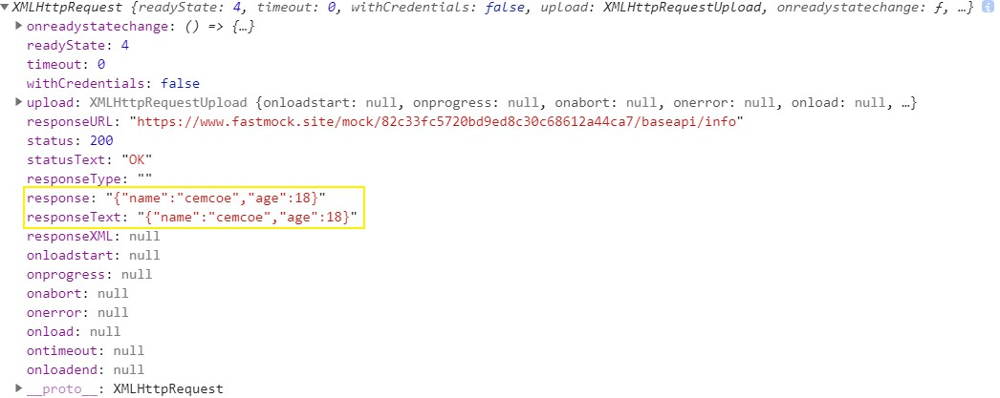
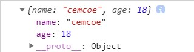

人类社会中消息的传递途径由古代的烽火狼烟，转变到信件到短信电话等，而今又转变到了各种 IM 。

网站开发中前端和后端的信息传递方式也在不断发展。想要搞懂这里的道道，为此有一些词儿要了解一下。我就罗列一波，不展开BB，毕竟理解这些东西还是 MDN 更靠谱。


## 前置术语
下面这些术语可以去 MDN 了解一波:
- JSON 一种数据结构
- Promise
- Generator
- Thunk
- async
- await


## 技术选型
### 请求的方案有哪些？
究竟有什么方案可供我们选择哩？
- Ajax 异步请求，牛的
- axios request 开源库
- fetch 妄图取代 Ajax
- form 表单，刷新页面


### 使用这些方案时要注意哪些东西？
- 请求接口的地址 api url
- 传给后端的请求参数及类型 
- 设置请求头
- 获取响应方式
- 获取响应头，响应状态，响应结果
- 异常处理
- 携带cookie设置
- 跨域请求

## 挑哪个呢？
为什么会出现那么多方案？那麽多方案，我要如何取舍？

### Ajax 究竟什么鬼？
来推导一波：
> Ajax === Asynchronous JavaScript + XML

那么问题又来了，冒出来的 XML 又是什么鬼？

> XML === Extentsible Markup Language

XML 是类似于 HTML的标记语言，但没有预设标记。

有了上面的两个式子，我们又可以推导一波了。

> Ajax === Asynchronous JavaScript + Extentsible Markup Language

所以 Ajax 直译就是异步 JavaScript 和 类似于 HTML 的标记语言？

想翻译成中文还有点难呢？意译就是用 JavaScript 执行异步网络请求。

Ajax 并非只包含上文提到 J 和 X，现在 X 有被另一个 J（JSON）赶上的趋势，Ajax => Ajaj 或许更符合趋势，虽然看上去有点怪怪的。

Ajax 是2005年被 [Jesse James Garrett](https://twitter.com/jjg) 提出的一个术语，用来描述一种使用现有技术集合的新方法，把一些旧东西糅到一起搞成的一个有点意思的新玩意儿。

这些现有的技术包括：
- XMLHttpRequest obj
- The Document Object Model
- XML
- XSLT
- HTML
- CSS
- JavaScript

平常使用时也是重点关注 `XMLHttpRequest` 不妨来 `XMLHttpRequest` 有什么内容？IE6 啥的就不考虑了。


为了模拟，我搞了个接口，跨域啥的就可以先不管了：
```md
https://www.fastmock.site/mock/82c33fc5720bd9ed8c30c68612a44ca7/baseapi/info
```

接口内容如下：
```js
// mock
{
  "name": "cemcoe",
  "age": 18
}
```


不妨使用构造函数先来 new 一个 xhr 对象，并把它打到终端看一波构造。
```js
const xhr = new XMLHttpRequest();
console.log(xhr)
```


一个最简化的实际的例子：
```js
const xhr = new XMLHttpRequest()

xhr.onreadystatechange = () => { // 状态发生变化，函数回调
  if (xhr.readyState === 4) {
    // 判断响应
    if (xhr.status === 200) {
      // 成功，拿数据
      const result = xhr
      console.log(result)
    } else {
      // 失败
      return
    } 
  } else {
    // HTTP 请求还在继续
  }
}

// 发送请求
xhr.open("POST", 'https://www.fastmock.site/mock/82c33fc5720bd9ed8c30c68612a44ca7/baseapi/info')
// 设置请求头，open 和 send 之间。请求头又有哪些？
xhr.setRequestHeader("Content-type","application/x-www-form-urlencoded");
xhr.send()
```



注意一波 `response` && `responseText`。

可以使用 `Promise`进行封装，这就是另外的故事了。

### fetch 砸场子
使用上文的接口来再请求一波。
一个简短的例子。
```js
const options = {
  method: "GET",
  headers: {'Content-type': 'application/json'},
}

fetch('https://www.fastmock.site/mock/82c33fc5720bd9ed8c30c68612a44ca7/baseapi/info', options)
  .then(response => response.json())
  .then(result => console.log(result))
  .catch(err => console.log(err))
```
fetch 方法会返回一个 Promise 对象。


## 跨域那些事
什么是跨域？
跨域会对网络请求产生什么影响？
有什么方法来解决因跨域产生的问题？

- nginx 反向代理
- corns
- WebScoket
- jsonp

有空填坑


## 参考资料
- [全面分析前端的网络请求方式](https://juejin.im/post/5c9ac607f265da6103588b31)
- [浅谈前端与网络请求](https://juejin.im/post/5a2a8f6c5188253edc7fd6cf)
- [MDN Fetch](https://developer.mozilla.org/zh-CN/docs/Web/API/Fetch_API/Using_Fetch)


