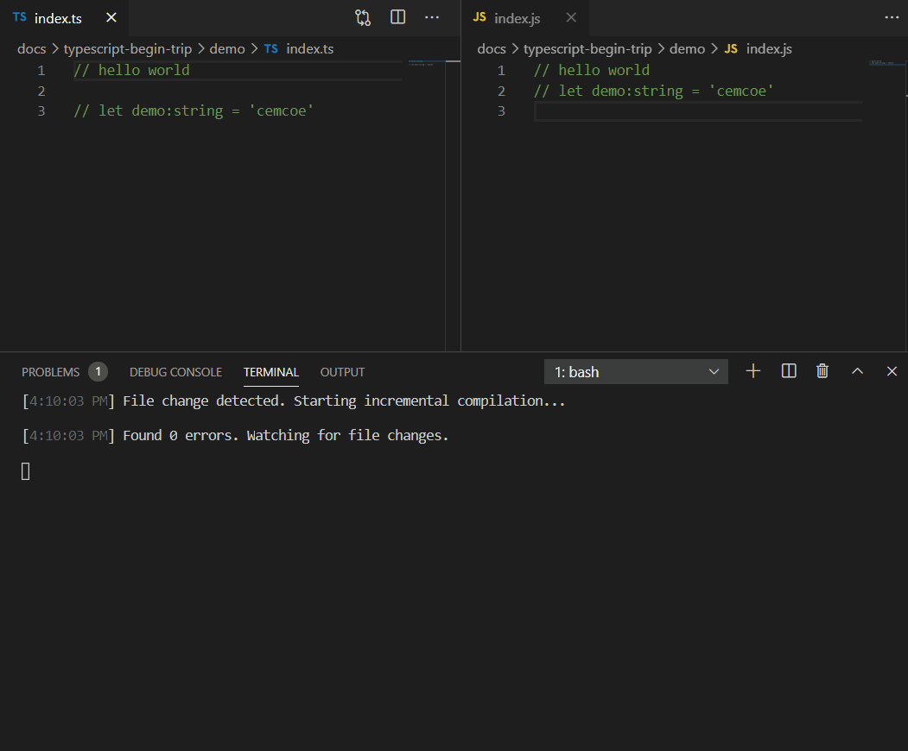

## TypeScript是个什么玩意
[https://www.typescriptlang.org/](https://www.typescriptlang.org/)

> TypeScript extends JavaScript by adding types.
By understanding JavaScript, TypeScript saves you time catching errors and providing fixes before you run code.
Any browser, any OS, anywhere JavaScript runs. Entirely Open Source.

官网介绍的很明白了，这里可以简单地理解是给 JavaScript 增加了类型限制。最终还是要转换成 js 代码运行的。

## 安装typescript

```md
npm install -g typescript
```


## 如何将写的ts代码转成js代码
```ts
// index.ts
console.log('hello world')
```

安装完typescript后，我们就可以使用 `tsc` 命令将ts文件转为js文件。

```md
tsc index.ts
```

## 如何将转化过程自动化
写一句代码使用tsc转化一次实在是没有效率，有没有什么方法让我们保存代码后就自动将ts代码转化成js代码嘞？


其实很简单，加一个参数就好。

```
tsc --watch index.ts
```


## 数据类型
typescript的核心是type，也就是类型的校验，定义的类型有
布尔类型 boolean
数字类型 number
字符串 string
数组 array
元组 tuple
枚举 enum
任意 any
null 和 undefined
void 
never


