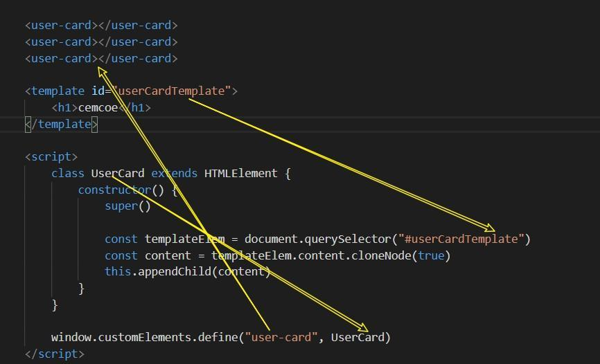
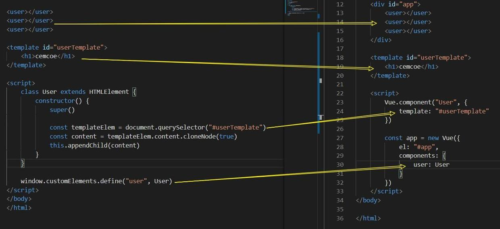

来个目录：
- 瞎掰组件概念
- web components 是个什么东西
- 用 web components 来写一个简单的组件 demo
- Vue 中的组件化是一个怎样的流程
- 局部组件 && 全局组件 || 父组件 && 子组件

---

作为前端工程化的重要一环，组件化在原生的实现上看上去不是很好。

那什么是组件化嘞？


数据看不到，有点虚。不妨看一看上面的工艺流程图，组件就是上图的各种反应容器，本文主要实现各种罐的创建和使用，至于物料的运输，即各个组件间数据的传递，有空再填。

其实使用 Vue 创建一个应用大概就是上图的步骤，先将各个组件完成，接着连通物流（组件之间数据传递），同时可能还会监控物流的理化性质（监控数据类型），监控各个罐的状态（Vuex）。。。我编不下去了。大概就那么个意思。做饮料啥的总不能都莽到一个反应釜里吧。


---

组件化就是大事化小，将一个复杂的工程拆解成众多的小任务，再分配给众多小人物。

这样如果某个组件发生了问题，不至于影响整个工程。


在看 Vue 的组件化之前不妨先看看原生的实现方案。

这里就要提到 web components 了，至于它的概念，优缺点啥的不多介绍，若想了解直达 [官网](https://www.webcomponents.org/introduction)。

这个东西支持使用原生的 js 来定义和使用组件。不用引入额外的文件。拎包开发。。。

直接看怎么用，一些要点：
- 自定义组件 custom element 必须短线连接
- 将定义的类和标签关联
- 使用自定义的组件

一个简单的小栗子
```html
<user-card></user-card>
<user-card></user-card>
<user-card></user-card>

<template id="userCardTemplate">
    <h1>cemcoe</h1>
</template>

<script>
    class UserCard extends HTMLElement {
        constructor() {
            super()

            const templateElem = document.querySelector("#userCardTemplate")
            const content = templateElem.content.cloneNode(true)
            this.appendChild(content)
        }
    }
    
    window.customElements.define("user-card", UserCard)
</script>
```

有点小复杂，来个指向图如下：



嗯，不出意外的话，网页上会显示三个字符串。

使用 web components 来使用组件大概就是这样的一个流程。

更多功能请自行探索。

---

下面来看一下 Vue 的组件化思想。


---具体代码如何写---
直接进入注册组件的流程
- 创建组件构造器 Vue.extend()
- 注册组件 Vue.component()
- 使用组件 

emm，是不是和 web components 很像？有点。具体的实现上可能有一些差异。

来看代码：
```
3. 使用组件
<div id="app">
    <my-cpn></my-cpn>
</div>
//---js----
// 1. 创建组件构造器对象
const cpnContructor = Vue.extend({
    template: `
    <div>
        <h1>我是cemcoe</h1>
        <p>我今年18岁</p>
        <p>嘤嘤嘤</p>
    </div>
    `
})
// 2.注册组件两个参数 标签名 构造器
Vue.component('my-cpn', cpnContructor)
```
然而，上面这种全局组件用的不多。

------------------
全局和局部就是字面意思，可以配合全局作用域和局部作用域理解。

开发中常用局部组件，将组件放到特定的实例下进行注册。

使用 components 字段：
```html
// 1. 构造器
const cpnConstructor = Vue.extend({
   template: `
   <div><h1>cemcoe</h1></div>
   `
})
const app = new Vue({
   el: "#app",
   // 2. 注册局部组件，在特定实例中定义
   components: {
       cpn: cpnConstructor 
   }
}) 
```


----------------
来看另一对概念父组件和子组件，emm，还是字面意思，不多解析。

```html
<div id="app">
    <cp2></cp2>    
</div>
// 创建组件
const cpnC1 = Vue.extend({
   template: `<div><h1>cem</h1></div>`
})
const cpnC2 = Vue.extend({
   template: `<div><h1>coe</h1><cp1></cp1></div>`,
   components: {
       cp1: cpnC1
   }
})
const app = new Vue({
   el: "#app",
   components: {
       cp2: cpnC2
   }
})
```
cp1 在 cp2 中注册，cp2 在 Vue 实例中注册，在 html 使用时只需添加 cp2 标签。cp2 是父组件，cp1 是子组件。

---

我想偷懒，下面来看语法糖：
---语法糖---
```html
// 创建组件
// const cpnC1 = Vue.extend()
Vue.component('cp1', {
   template: `<div><h1>cem</h1></div>`
})
```
将构造器放入注册操作中，实际还是调用 extend。


嵌套太多，抽离。。。使用 template 标签定义模板。
```html
<div id="app"> 
</div>
<template id="cpn">
    <div>
        <h1>cemcoe</h1>
    </div>
</template>
// ---data---
Vue.component('cp1', {
   template: '#cpn'
})
```

大概就是这样了。

---

这里的 web components 和 Vue 的关系，其实和 [CSS | CSS Variable | CSS变量](https://www.jianshu.com/p/7cf3f99698f2) 与那些 less sass 预处理器的关系一样一样的。

如果搞得完善的话，肯定是原生的 web components 性能肯定是刚刚的，期待ing。


最后来一个 web components && Vue components 的对比图。

