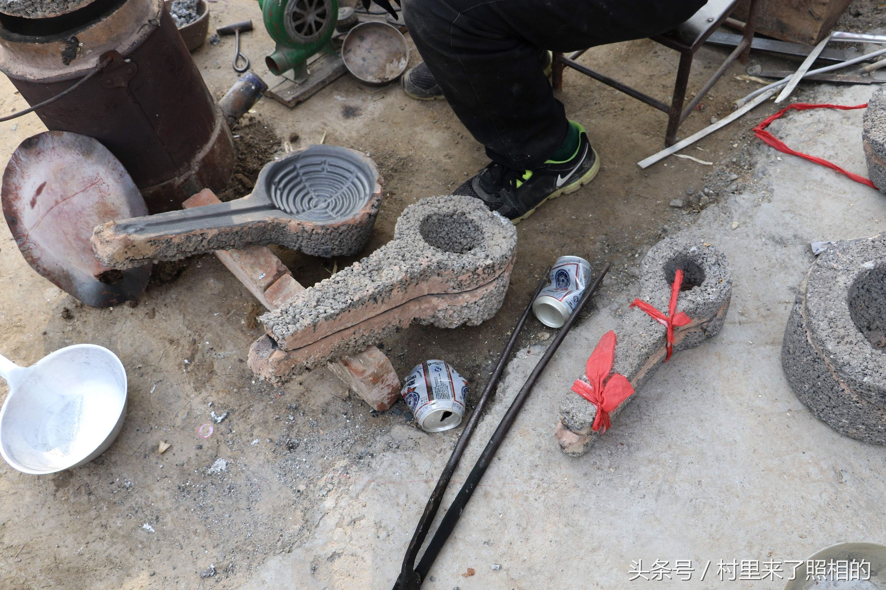
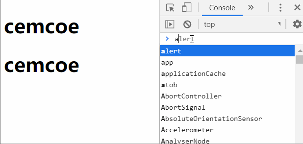
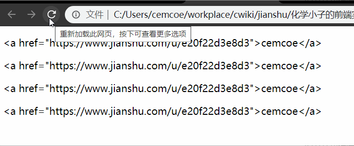

来瞧一瞧 Vue 中的插值操作，所谓的插值操作，换成人话讲就是将数据放入到一个模板中，进而拼凑成一个新玩意儿。


## 生活中的例子
数据总是有些冰冷，不妨找一找现实中的例子。来看一个看得见的例子。小时候，常常见到师傅拿易拉罐制勺子，当时觉得真他喵的神奇。其实就是一个从固态变液态再到固态的过程。




其实，这里就跟插值操作类似，数据就是易拉罐，而 HTML 就是模具。

现在的问题就是把易拉罐倒进模具需要几步的问题。

高温加热易拉罐，当温度到达熔点后，易拉罐变成液态铝，这时就可以倒进模具里了。

---
## 编码
来看具体的代码
插值操作，将 data 中的数据插入到 DOM 中。

这里需要用到 mustache 语法，俗称双大括号语法。被双大括号包裹的可以是变量，也可以是表达式。

下面要用到的易拉罐即 data 为：
```js
data: {
    name: "cemcoe",
    age: 18,
    num: 3,
    site: "https://www.jianshu.com/u/e20f22d3e8d3"
}
```
这个 data 中，定义了名字，年龄永远18，num和链接。


---

## 测试
下面格式假定是 mustache 紧跟对应的解析结果，下面是一些测试：

```html
Hello, {{name}}
```
> Hello, cemcoe


来个表达式
```html
{{age + num}}
```
> 21


## Vue 中的指令

接下来进入激动人心的指令环节。

首先是 `v-once` ，一生只够爱一人，一旦定义便不再改变。

```html
<h1>{{name}}</h1>
<h1 v-once>{{name}}</h1>
```


通过对比测试可以发现 `v-once` 可以保证在 data 中的数据发生更改时，可以使页面展示保持原有的值，屏蔽掉双向绑定效果。


来看另一个指令 v-html
```html
<p>{{site}}</p>
<p v-html="site"></p>
```


明显，数据会被当成 html 进行渲染，而非简单地当成字符串进行解析。

---


最后拉看一个 `v-cloak` 斗篷指令，它地应用场景主要是防止闪动的出现，闪动是指 js 代码卡住了，双括号显示出来。



解决：
```html
<div id="app" v-cloak>
    <p>{{site}}</p>
    <p>{{site}}</p>
    <p>{{site}}</p>
    <p>{{site}}</p>
</div>
```

同时使用属性选择器将其 display 设为 none。
```css
[v-cloak] {
    display: none;
}
```
当 Vue 加载完毕时，v-clock 会被删除，此时 p 标签可以显示了。

工作中解决闪动问题使用虚拟DOM。


