如何从零封装一个 Vue 组件哩？


## 哪里可以看到例子？

今天来封装一个 tabbar 组件，在 [CSS 效果 | tab 选项卡](https://www.jianshu.com/p/fdd58caea73f) 中讲了使用原生 JavaScript 进行开发的方法，采用的是面向过程的编程思想。今天来用 Vue 封装一个类似的 tabbar 组件。

这个 tabbar 效果在移动端很常见，下面是一些例子。

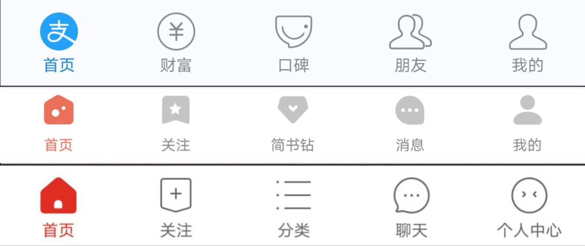


---
## 准备工作

### 为什么要封装组件？
组件封装是为了复用，换成大白话就是，同样的事情我不想做第二遍，节省出来的时间用来看动漫不香吗？

好的，那怎么偷懒呢，根据杠杆原理，想要后期偷懒，前期就要尽可能地多考虑到会出现的各种情况。

先分析上面的图，从中早找出他们的共性和特性。
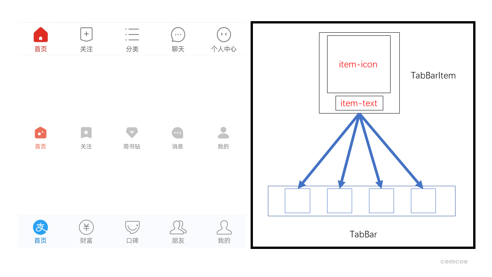


共性是一个 TabBar 组件包含若干 TabBarItem 组件，数目一般不超过 6 个不少于 2 个，每个 TabBarItem 中包含一个 icon 和一行 text。特性是每个 TabBarItem 包含的 icon 和 text 的具体值是不同的，可以使用插槽。瞎掰完毕。

---

### 准备 icon
不妨使用上图的 jianshu 作为测试，封装一下 TabBar 组件。
在开始莽代码前，准备一波。

前期准备： [icon图准备](https://www.iconfont.cn/)，使用的是阿里巴巴矢量图标库，根据 jianshu 的 TabBar 截图来看需要准备 5*2 个 svg icon，这应该是美工的活，如果有美工的话。
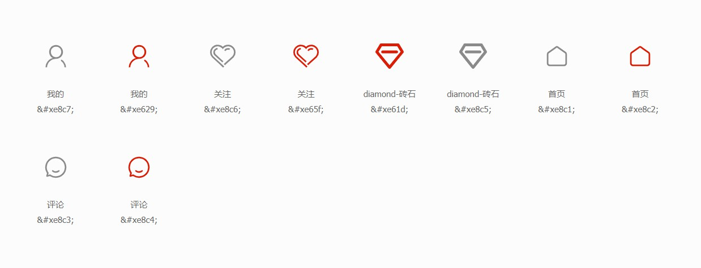
灰色 icon 是默认展示的，红色 icon 是被点击激活后展示的。

---

### 思路分析
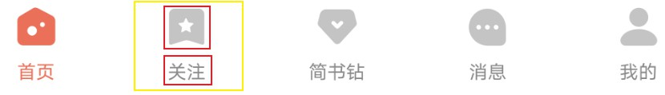
整个看到的是一个大组件，大组件里有并列的 item，即上图中黄框部分，而每个 item 又可以抽离成小组件。

大组件定义插槽，传入小组件。小组件定义插槽传入图标和文字。

----

下面进入激动人心的编码环节。

## 文件结构的确立
不妨先在 `App.vue` 中编写:
```html
<template>
  <router-view></router-view>
  <div id="app">
    <div id="tab-bar">
      <div class="tab-bar-item">首页</div>
      <div class="tab-bar-item">关注</div>
      <div class="tab-bar-item">简书砖</div>
      <div class="tab-bar-item">消息</div>
      <div class="tab-bar-item">我的</div>
    </div>
  </div>
</template>

<style scoped>
  #tab-bar {
    display: flex;
    position: fixed;
    left: 0;
    right: 0;
    bottom: 0;
    height: 49px;
    background-color: #f5efef;
  }
  .tab-bar-item {
    flex: 1;
    text-align: center;
  }
</style>
```

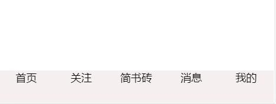

主要进行的基础结构的编写，基础布局是 TabBar 固定到底部，TabBarItem 平均布局，文字居中。

---

### 第一次抽离
不妨建个文件抽离主要逻辑`components/tabbar/TabBar.vue`
```html
<template>
  <div id="tab-bar">
    <div class="tab-bar-item">首页</div>
    <div class="tab-bar-item">关注</div>
    <div class="tab-bar-item">简书砖</div>
    <div class="tab-bar-item">消息</div>
    <div class="tab-bar-item">我的</div>
  </div>
</template>
<script>
export default {
  name: "TabBar"
}
</script>

<style scoped>
#tab-bar {
  display: flex;
  position: fixed;
  left: 0;
  right: 0;
  bottom: 0;
  height: 49px;
  background-color: #f5efef;
}
.tab-bar-item {
  flex: 1;
  text-align: center;
}
</style>
```
与之对应 `App.vue` 就精简很多
```html
<template>
  <div id="app">
    <router-view></router-view>
    <tab-bar>
      
    </tab-bar>
  </div>
</template>
<script>
import TabBar from '@/components/tabbar/TabBar'

export default {
  components: { TabBar }
}
</script>

<style scoped>

</style>
```

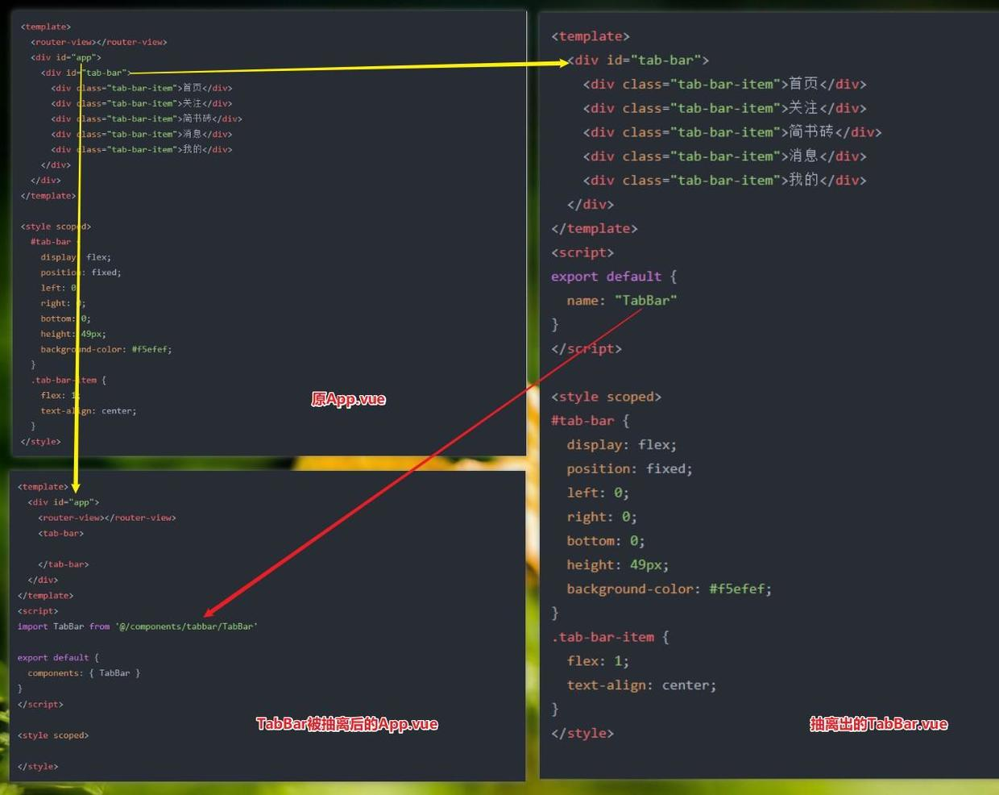

好的我们完成了第一次组件抽离，将 `App.vue` 拆成了 `App.vue` 和 `TabBar.vue`。


---
### 第二次抽离
不妨将准备好的 icon 放到 assets/img/tabbar 文件夹下，对于 icon 的命名有两种，一种是灰色 icon 采用英文命名，红色 icon 在对应的英文命名的基础上添加 `_active`的后缀，便于区分。下面就将准备好的 icon 引入到 `Tabbar.vue` 文件中吧。

```html
<template>
  <div id="tab-bar">
    <div class="tab-bar-item">
      
      首页
    </div>
    <div class="tab-bar-item">
      关注
    </div>
    <div class="tab-bar-item">
      
      简书砖
    </div>
    <div class="tab-bar-item">
      
      消息
    </div>
    <div class="tab-bar-item">
      
      我的
    </div>
  </div>
</template>
<script>
export default {
  name: "TabBar"
}
</script>

<style scoped>
#tab-bar {
  display: flex;
  position: fixed;
  left: 0;
  right: 0;
  bottom: 0;
  height: 49px;
  background-color: #f5efef;
}
.tab-bar-item {
  flex: 1;
  text-align: center;
}

.tab-bar-item img {
  width: 24px;
  height: 24px;
}
</style>
```

明显，现在 `TabBar.vue` 文件也有些臃肿，下面进行第二次抽离即对 `TabBar` 进行抽离。
```html
<template>
  <div id="tab-bar">
    <slot></slot>
  </div>
</template>
<script>
export default {
  name: "TabBar"
}
</script>

<style scoped>
#tab-bar {
  display: flex;
  position: fixed;
  left: 0;
  right: 0;
  bottom: 0;
  height: 49px;
  background-color: #f5efef;
}
</style>
```

不妨建个文件抽离主要逻辑 `components/tabbar/TabBarItem.vue` 并微调样式。
```html
<template>
    <div class="tab-bar-item">
      
      首页
    </div>
</template>
<script>
export default {
  name: "TabBarItem"
}
</script>

<style scoped>
.tab-bar-item {
  flex: 1;
  text-align: center;
  font-size: 14px;
}

.tab-bar-item img {
  width: 24px;
  height: 24px;
  margin-top: 3px;
  vertical-align: middle;
}
</style>
```

这时可以在 `App.vue` 中进行使用。
```html
<template>
  <div id="app">
    <router-view></router-view>
    <tab-bar>
      <tab-bar-item></tab-bar-item>
      <tab-bar-item></tab-bar-item>
      <tab-bar-item></tab-bar-item>
      <tab-bar-item></tab-bar-item>
      <tab-bar-item></tab-bar-item>
    </tab-bar>
  </div>
</template>
<script>
import TabBar from '@/components/tabbar/TabBar'
import TabBarItem from '@/components/tabbar/TabBarItem'

export default {
  components: {
    TabBar,
    TabBarItem
  }
}
</script>

<style scoped>

</style>
```

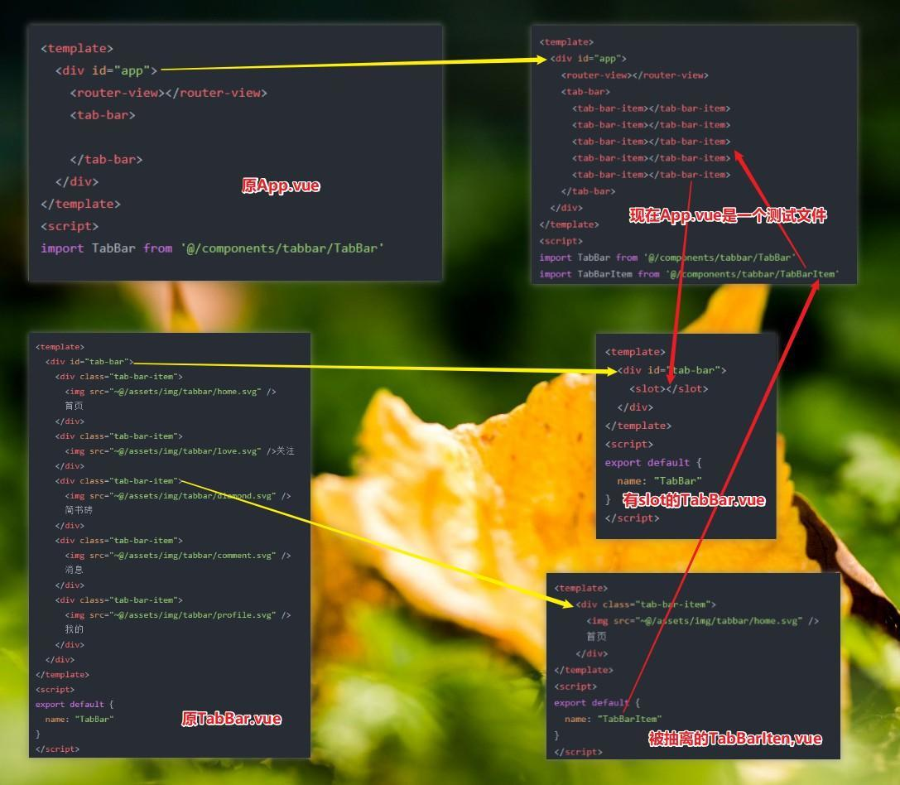

是不是有点内味了？此时的效果图如下。
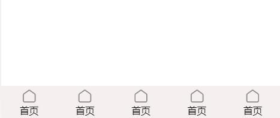

好嘞，第二次抽离结束，今天组件的大致文件结构就是现在的样子了，如果需要更加个性化的操作，可能还会对其进行抽离，今天就先这样。

现在我们有三个文件，其中 `App.vue` 已经成为了测试文件，用来检验我们的组件，现在的重点是处理 `TabBar.vue` 和 `TabBarItem.vue`。

---


先缓一缓，将精力暂时先集中到 `TabBarItem.vue` 文件上，它是来处理单个 item 的，从上面的效果图来看，每个 item 都长得一样，很明显不符合我们的需求，不够个性化，明显我要传值进来，这就需要在 `TabBarItem.vue` 中定义一些插槽。

看图可以发现需要搞两个插槽，不妨分别给它们起名： item-icon item-text。

```html
<!-- TabBarItem.vue -->
<div class="tab-bar-item">
  <!-- 
  <div>首页</div> -->
  
  <slot name="item-icon"></slot>
  <slot name="item-text"></slot>
</div>
```

在测试文件 `App.vue` 里进行插值操作测试。
```html
<tab-bar>
  <tab-bar-item>
    
    <div slot="item-text">首页</div>
  </tab-bar-item>
  <tab-bar-item>
    
    <div slot="item-text">关注</div>
  </tab-bar-item>
  <tab-bar-item>
    
    <div slot="item-text">简书砖</div>
  </tab-bar-item>
  <tab-bar-item>
    
    <div slot="item-text">消息</div>
  </tab-bar-item>
  <tab-bar-item>
    
    <div slot="item-text">我的</div>
  </tab-bar-item>
</tab-bar>
```
经过一番倒腾，组件的外在已经有那么回事了。
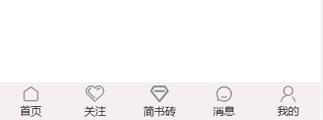

---


## 功能代码
现在组件的外在搞好了，是一个纸片人的状态，下面让它动起来，响应我们的交互。
### 功能点1：点击变色


这时就要用到我们准备的另外一组图片了，在 item 被点击时，我们给它换张图片，再搞一个插槽 item-icon-active 用来存储 item 被激活的 icon 。
```html
<!-- TabBarItem.vue -->
<div class="tab-bar-item">
  <slot name="item-icon"></slot>
  <slot name="item-icon-active"></slot>
  <slot name="item-text"></slot>
</div>
```

有了新的插槽，我们就可以在 `App.vue` 中测试了，这里拿首页进行举例。
```html
<!-- App.vue -->
<tab-bar-item>
  
  
  <div slot="item-text">首页</div>
</tab-bar-item>
```
此时的效果图如下：

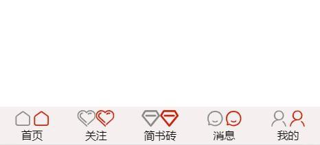

嗯，连 icon 都成双成对的。。。

我们的使命是破坏它们，只能显示一个，要么是灰色 icon 要么是红色 icon 。

当 item 处于激活状态是要换成红色的 icon，同时文字也要变成红色。

也就是说现在的任务是条件展示，会涉及到 v-if 和动态绑定 class 的相关知识。
```html
<!-- TabBarItem.vue -->
<template>
  <div class="tab-bar-item">
    <!-- 两个插槽显示一个 -->
    <slot v-if="!isActive" name="item-icon"></slot>
    <slot v-else name="item-icon-active"></slot>
    <div :class="{active: isActive}">
      <slot name="item-text"></slot>
    </div>
  </div>
</template>
<script>
export default {
  name: "TabBarItem",
  data() {
    return {
      isActive: true
    }
  }
}
</script>

<style scoped>
.tab-bar-item {
  flex: 1;
  text-align: center;
  font-size: 14px;
}
.tab-bar-item img {
  width: 24px;
  height: 24px;
  margin-top: 3px;
  vertical-align: middle;
}
.active {
  color: #f40;
}
</style>
```
效果展示如下：
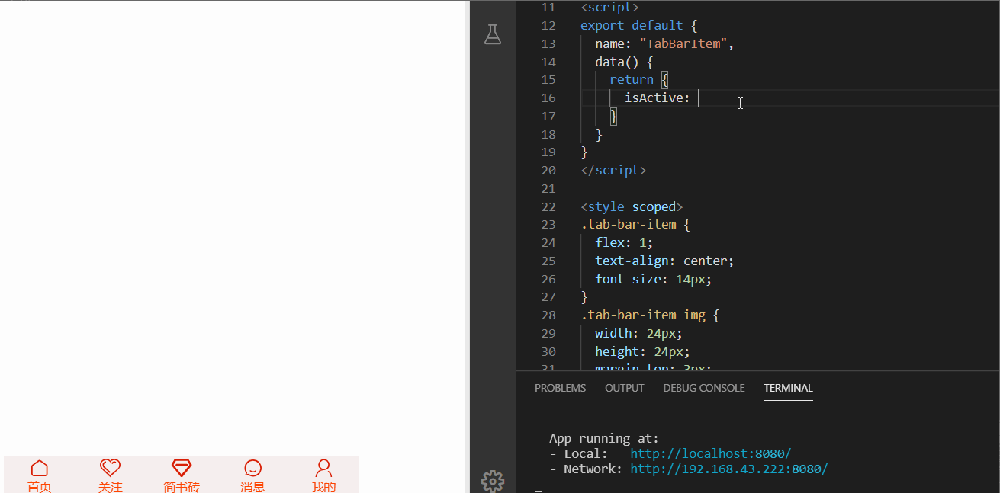

好的现在我们通过控制 `isActive` 的值来模拟 item 被激活的情况，通过 `v-if` 控制 icon 的切换，通过给文字动态添加类名并通过 CSS 来改变文字的颜色。

通过测试图可以发现一变全变，这个问题留在后面解决，肯定不能手动改 `isActive` 的值。


---

### 功能点2：路由跳转

来人呀，上路由。

准备工作：编写各个组件，放到 views 文件夹中，下面是 `Profile.vue` 的示例代码。
```html
<template>
  <div class="profile">
    <h1>cemcoe的页面</h1>
  </div>
</template>
```

下面是配置的路由表。
```js
const routes = [
  {
    path: '',
    redirect: '/home'
  },
  {
    path: "/home",
    component: Home
  },
  {
    path: '/love',
    component: Love
  },
  {
    path: '/diamond',
    component: Diamond
  },
  {
    path: '/comment',
    component: Comment
  },
  {
    path: '/profile',
    component: Profile
  }
]
```

去 `TabBarItem.vue` 文件中去监听点击事件并进行调转功能的实现。
```js
// 核心代码
this.$router.replace(this.path)
```
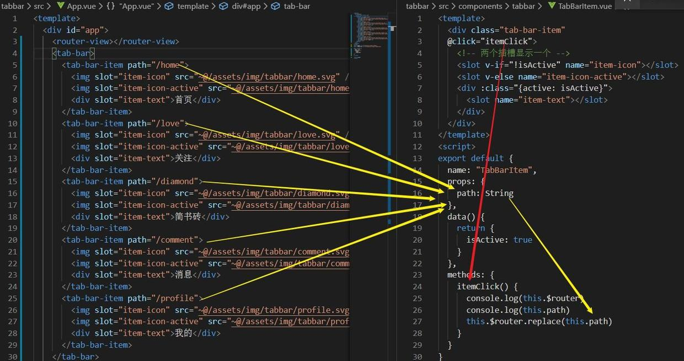

`App.vue` 文件通过 `path="/home"` 将对应的跳转路径传给 `TabBarItem.vue` 通过监听组件的点击执行 `itemClick()` 跳转到对应的组件。

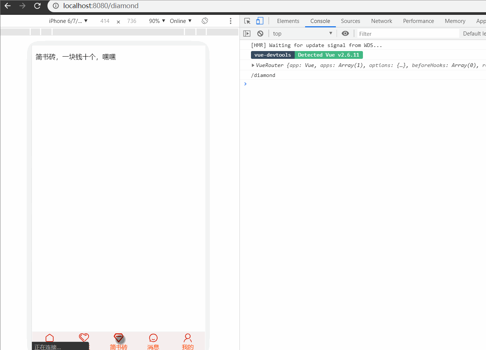

第二个功能点实现。

---
### 完善功能点1
目前功能点1还有一些问题，路由切换时，图片和文字没有改变，这是因为之前 `isActive` 是写死的，下面进行动态变化。

现在要解决的问题是如何知道当前哪个 item 处于活跃状态，知道之后我们就可以对 `isActive` 进行动态的赋值。这里要用到 `this.$route`。
```js
// TabBarItem.vue
computed: {
  isActive() {
    // return this.$route.path.indexOf(this.path) !== -1
    return this.$route.path.includes(this.path)
  }
}
```
这里使用 `indexOf()` 和 `includes` 都是可以实现相应功能，但后者语义化更强。

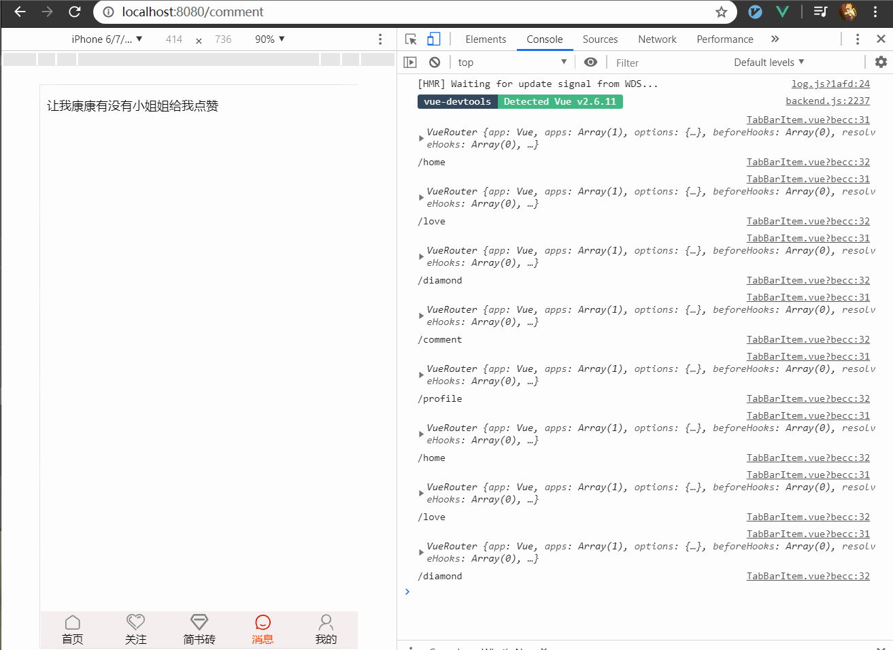

经过一番的倒腾，这个 TabBar 组件就封装好了。下面是一些边角料。

---

## 边角料

更加个性化的操作，活跃时字体的颜色可能并不是红色。我们可以动态设置。
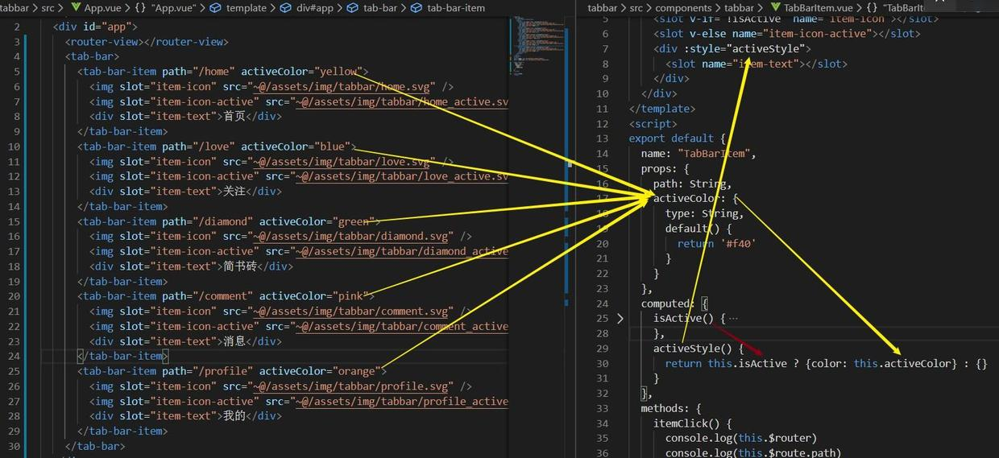

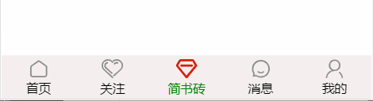

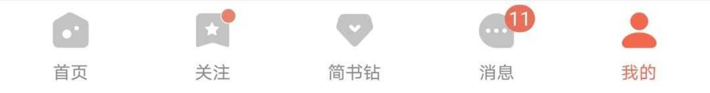

其实可以个性化的地方还有很多，如上图可能需要显示红点或者未读信息的数目等。比如整个大的背景色，TabBar 的位置可能在页面的上方区域。

本文是对 TabBar 组件的简单封装，具体哪些需要个性化可能需要考虑具体项目，个性化的地方也不是越多越好，暴露的接口越多，稳定性等方面可能会有一定程度的减低，维护成本也会增多，一句俗话：适合自己的才是最好的。
