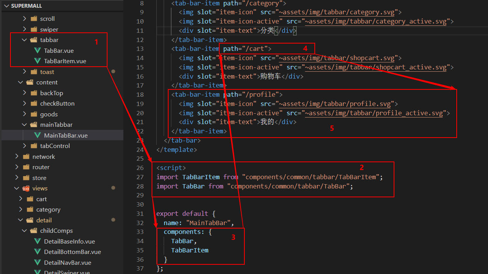

插件也是组件化的一部分。今天来写一个 toast 插件。

什么是插件？其实 vue-router 就是 Vue 的一个插件，插件通常用来为 Vue 添加全局功能。

今天的 toast 就是一个全局要使用的功能，比如用户下单时对用户进行提示，或者在用户删除操作时对用户进行提示。

这个 toast 的功能点是
- 显示特定信息
- 在特定时间内销毁


当然可以使用组件化的思想封装一个toast组件。
比如像这样 [Vue 组件 | 如何从零封装一个tabbar组件](https://www.jianshu.com/p/f51ebf976dda)，从这里我们可以知道流程是下面的样子。

- 编写组件
- 导入组件
- 将值传给组件
- 注册组件
- 使用组件



这种方式一是步骤多，二是使用组件时代码分散，代码要写在文件的不同部分。使用时有点麻烦。要照顾数据和 DOM，有没有可能只关注数据，这里是要展示的信息和展示的时间。

使用过 vue-router 的，可以知道 vue-router 可以这样使用：
```js
this.$router.push('/detail/' + this.goodsItem.iid)
```

如果我们可以这样使用 toast 就好了：
```js
this.$toast.show('toast 加载成功' , 2000)
```

那么重点来了，搞一个插件的流程是什么？

首先，明确一点我们先将 DOM 搞出来，一个居中的框，里面有提示文字，不妨写在一个 Vue 文件中。

```html
<!-- Toast.vue -->

<template>
  <div class="toast" v-show="isShow">
    <div>{{message}}</div>
  </div>
</template>

<style scoped>
/* fixed 居中 */
.toast {
  position: fixed;
  top: 50%;
  left: 50%;
  transform: translate(-50%, -50%);
  padding: 8px 10px;
  color: aliceblue;

  z-index: 9999;

  background-color: rgba(0, 0, 0, 0.75);
}
</style>
```

下面是功能代码，一定时间消失，可以使用setTimeout()并设置默认事件2000毫秒。
```html
<!-- Toast.vue -->
<script>
export default {
  name: "Toast",
  data() {
    return {
      message: "",
      isShow: false
    };
  },
  methods: {
    show(message, duration = 2000) {
      this.isShow = true;
      this.message = message;

      setTimeout(() => {
        this.isShow = false;
        this.message = "";
      }, duration);
    }
  }
};
</script>
```

第一步创建组件成功，和组件化创建区别不大。

---

下面进入第二步，一开始就将 toast 组件的 模板 挂到 DOM 中，这样我们在使用插件时就不用管 DOM 了，也就是省了将标签写到 template 中的步骤，也是和组件化不同的重要一点。

```js
// index.js
import Toast from './Toast'

const obj = {}

obj.install = function (Vue) {
  console.log('toast install')
  // 1.创建组件构造器
  const toastContrustor = Vue.extend(Toast)
  // 2.new，根据组件构造器，创建一个组件对象
  const toast = new toastContrustor()
  // 3.将组件对象挂载到元素上
  toast.$mount(document.createElement('div'))
  // 4.toast.$el对应的是div
  document.body.appendChild(toast.$el)

  Vue.prototype.$toast = toast
}

export default obj
```

---

到 main.js 中全局安装 toast 插件。
```js
// main.js
import toast from 'components/common/toast'
// 安装toast插件
Vue.use(toast)
```


使用，随便使用：
```js
this.$toast.show('toast 加载成功' , 2000)
this.$toast.show('cemcoe' , 4000)
```

这样使用起来就简单了。我们要使用相应功能时只用一句就搞定了，和组件化相比确实简洁了很多。

插件的使用场景是DOM样式变化不大的，并且会频繁使用的地方。‘


当我们要实现轻提示功能时，只需传入要传入的展示信息和展示时间就好了。


