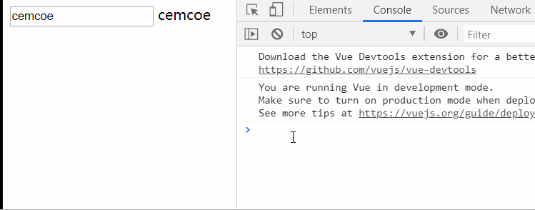
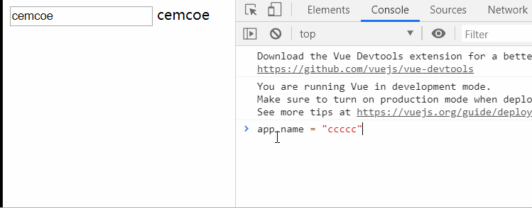
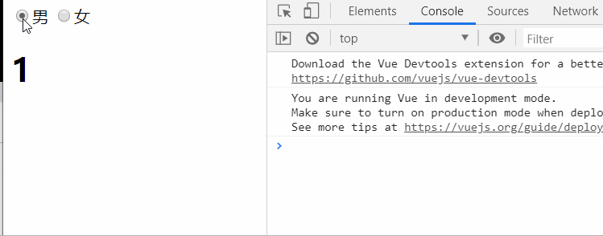
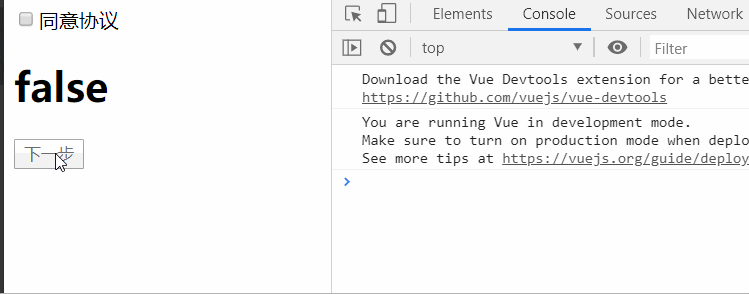
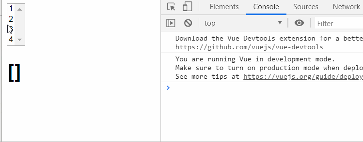
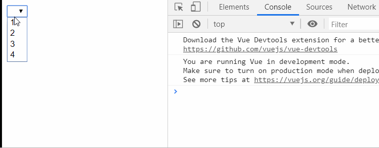
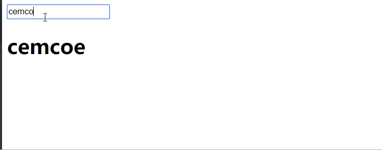

和 v-on v-bind 等类似 v-model 也是 Vue 中常用的一种指令。

v-model 常常和表单配合一起使用。

应用场景主要有 用户注册页面，购物车多选功能等。

来看一看目录
- v-model 的基本操作
- 如何使用学过的东西来模拟 v-model 
- 什么是值绑定
- v-model 的修饰符


进入基本操作
```html
<input type="text" v-model="name">
{{name}}
//---data---
name: "cemcoe"
```


可以看到更改 data 中的数据时，DOM 中的文本会发生变化，同时更改输入时 data 中的数据也会随之改变。

双向指页面中显示的信息和 vue 中定义的 data 字段。

-----------------

不如使用学过的东西来动手实现一下 v-model。

先来实现 data 到 DOM 的单向绑定，可以使用 v-bind 指令。

```html
<input type="text" v-bind:value="name">
{{name}}
//---data---
name: "cemcoe"
```


data 中的 name 改动会影响数据的显示，但 DOM 中的数据改变，并不会触发 data 中 name 的改变，目前来讲，这个绑定是单向的。

无动于衷的大猪蹄子。

接下来实现 DOM 中的数据改变触发 data 中 的数据变化，要用到事件监听。

input 有个 input 事件，监听用户输入，只要输入就会触发事件。来使用该事件来进行另一向的绑定。

```html
<input type="text" v-bind:value="name" v-on:input="valueChange">
{{name}}
//---data---
data: {
    name: "cemcoe"
},
methods: {
    valueChange(event) {
        this.name = event.target.value
    }
}
```
methos 通过监听 input 事件获得 input 的实时值，并将结果放到了 data 中的 name。

到这里就实现了双向绑定，图呢，就不放了，和 v-model 一样一样的。

总结一下：
双向绑定是两个指令的结合体
- v-bind 绑定 value || data 对 DOM 的绑定
- v-on 监听 input event 获取实时的 input value || DOM 对 data 的绑定

----

下面来看一看 v-model 和 各类表单的结合。

v-model && radio
```html
<label for="male">
    <input type="radio" id="male" name="sex" value="1" v-model="sex">男
</label>
<label for="female">
    <input type="radio" id="female" name="sex" value="0" v-model="sex">女
</label>
<h1>{{sex}}</h1>
//---data---
sex: ''
```



向服务器传递用户选择对应的 value 值，一般为数字。

-------------

v-model && checkbox
- 单选
- 多选

添加 label 可以点文字选择。

```html
<label for="agree">
    <input type="checkbox" name="" id="agree" v-model="isAgree">同意协议
</label>
<h1>{{isAgree}}</h1>
<button v-bind:disabled="!isAgree">下一步</button>
//----data---
isAgree: false
```


button 不能同意协议不能进行下一步，一个变量控制两个东西的状态。

---

来看 checkbox 多选框
```html
<input type="checkbox" value="1" v-model="nums">1
<input type="checkbox" value="2" v-model="nums">2
<input type="checkbox" value="3" v-model="nums">3
<input type="checkbox" value="4" v-model="nums">4
<input type="checkbox" value="5" v-model="nums">5
<input type="checkbox" value="6" v-model="nums">6
<h1>喜欢的数字：{{nums}}</h1> 
//---data---
nums: []
```



使用场景如购物车选择结算。

单选框对应布尔值，多选框对应数组

-------------------------------------------------
v-model && select
同样分为单选和多选
```html
<select name="" id="" v-model="num">
    <option value="1">1</option>
    <option value="2">2</option>
    <option value="3">3</option>
    <option value="4">4</option>
</select>
<h1>{{num}}</h1>
//---data---
num: ''
```



下面是多选的例子：
```html
<select name="" id="" v-model="nums" multiple>
    <option value="1">1</option>
    <option value="2">2</option>
    <option value="3">3</option>
    <option value="4">4</option>
</select>
<h1>{{nums}}</h1>
// --data--
nums: []
```


添加 multiple，按住 Ctrl 键进行多选。


---概念---
值绑定 这他喵的什么玩意？选项不写死，从服务器请求遍历。
```html
<input type="checkbox" value="1" v-model="nums">1
<input type="checkbox" value="2" v-model="nums">2
<input type="checkbox" value="3" v-model="nums">3
<input type="checkbox" value="4" v-model="nums">4
<input type="checkbox" value="5" v-model="nums">5
<input type="checkbox" value="6" v-model="nums">6
<h1>喜欢的数字：{{nums}}</h1> 
//---data---
nums: []
```

使用值绑定以后的代码：
```html
<label v-for="item in originNumbers" :for="item">
    <input type="checkbox" v-model="nums" :value="item">{{item}}
</label>
<h1>喜欢的数字：{{nums}}</h1> 
//---data---
nums: [],
originNums: [1, 2, 3, 4, 5, 6]
```

这样上面的方式写法有点憨憨了。
开发中也是服务器给个列表，毕竟每个人的购物车是不一样的。。。

值不要写死，要动态绑定。

---

看看 v-model 的修饰符，v-model 实时更改是有点消耗资源的。

可参考函数的节流防抖问题，有空写一些。

拿一个 lazy 修饰符举个例子：
```html
<input type="text" v-model.lazy="name">
<h1>{{name}}</h1>
//---data---
name: "cemcoe"
```



可以发现数据不再实时进行更改，而是失去焦点再进行更改，在一定程度上节约了计算机资源。


下面有一些可能会用到的修饰符：
- number 数据类型固定为 number
- trim 将前后空格去除

以上就是对 v-model && form 的瞎掰了。

美好的周末又开始了。

